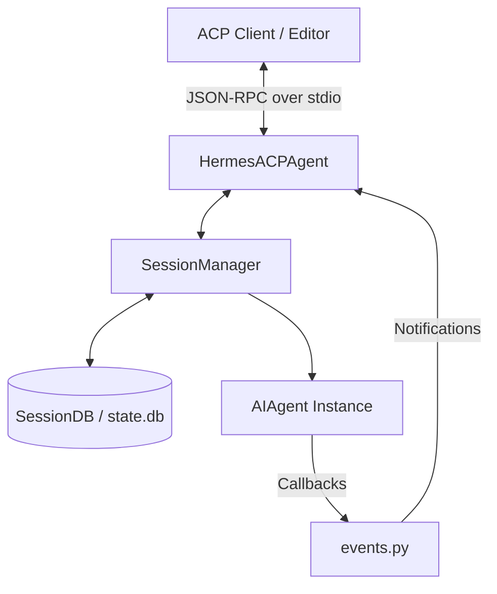

# acp_adapter

# acp_adapter

The `acp_adapter` module implements the **Agent Communication Protocol (ACP)** for `hermes-agent`. It acts as a bridge between the Hermes AI agent and external editors (such as Zed) that support the ACP specification. The adapter handles JSON-RPC transport over `stdio`, manages persistent agent sessions, and translates Hermes-specific events into ACP-compliant notifications.

## Architecture Overview

The adapter sits between the ACP client (the editor) and the core `AIAgent` logic. Because `AIAgent` is primarily synchronous and runs in worker threads, the adapter manages the transition to the asynchronous `asyncio` environment required by the ACP server.



## Key Components

### HermesACPAgent (`server.py`)
The central class inheriting from `acp.Agent`. It implements the ACP lifecycle methods:
- **`initialize`**: Advertises agent capabilities (multimodal support, session forking, etc.) and detects available auth providers.
- **`new_session` / `load_session` / `resume_session`**: Orchestrates the creation or restoration of agent instances via the `SessionManager`.
- **`prompt`**: The primary execution loop. It extracts text and images from ACP content blocks, handles slash commands, and runs the `AIAgent` inside a `ThreadPoolExecutor`.
- **`set_session_model`**: Allows the editor to switch models/providers dynamically.

### SessionManager (`session.py`)
Manages the lifecycle of `SessionState` objects. 
- **Persistence**: Sessions are backed by the shared Hermes `SessionDB` (`~/.hermes/state.db`). This allows sessions to survive process restarts and appear in global session searches.
- **WSL Path Translation**: Includes logic (`_translate_acp_cwd`) to convert Windows drive paths (sent by Windows-based editors) into WSL mount paths when Hermes is running in a Linux environment.
- **Agent Factory**: Creates `AIAgent` instances with specific configurations, including `hermes-acp` toolsets and redirected output (routing agent `stdout` to `stderr` to keep the ACP transport clean).

### Event Bridging (`events.py`)
Since `AIAgent` runs in a background thread, `events.py` provides factory functions to create thread-safe callbacks. These callbacks use `asyncio.run_coroutine_threadsafe` to push updates back to the main event loop:
- **`make_tool_progress_cb`**: Emits `ToolCallStart` notifications.
- **`make_step_cb`**: Emits `ToolCallProgress` (completion) notifications, including diff snapshots for file edits.
- **`make_thinking_cb`**: Streams internal reasoning/thought text.
- **`make_message_cb`**: Streams the final assistant response text.

### Tool Mapping (`tools.py`)
Maps Hermes tool definitions to ACP `ToolKind` (e.g., `read_file` -> `read`, `terminal` -> `execute`). It also contains logic for:
- **Diff Generation**: Translates Hermes internal edit formats (V4A patches) into ACP-compliant diff blocks.
- **Title Generation**: Creates human-readable labels for tool invocations (e.g., "terminal: npm install").

### Permissions (`permissions.py`)
Bridges Hermes' internal `approval_callback` system to the ACP `request_permission` protocol. When a tool requires manual approval (like a terminal command), the adapter suspends the agent thread and sends a permission request to the editor, resuming only after the user provides an outcome.

## Session Lifecycle and Persistence

Sessions are identified by a UUID. When a client calls `load_session` or `resume_session`, the `SessionManager`:
1. Queries the SQLite database for existing history.
2. Reconstructs the `AIAgent` with the previously used model and provider.
3. Replays the conversation history to the client using `user_message_chunk` and `agent_message_chunk` notifications so the editor UI stays in sync with the server state.

## Slash Commands

The adapter intercepts messages starting with `/` to provide "headless" control over the agent without invoking the LLM. Supported commands include:
- `/model`: Switch the active model or provider.
- `/context`: Show message counts and token pressure.
- `/compact`: Manually trigger context compression.
- `/steer`: Inject guidance into an active turn.
- `/reset`: Clear the current session history.

## Execution and Logging

The module is executed via `acp_adapter.entry`. 

- **Logging**: All logs are routed to `stderr`. This is critical because `stdout` is reserved for the JSON-RPC protocol.
- **Environment**: Loads variables from `~/.hermes/.env` via `hermes_cli.env_loader`.
- **Liveness Probes**: The `_BenignProbeMethodFilter` suppresses noisy tracebacks caused by common liveness checks (like `ping` or `health`) that are not part of the formal ACP schema but are frequently sent by bridge utilities.

To run the adapter manually:
```bash
python -m acp_adapter
```
Or via the Hermes CLI:
```bash
hermes acp
```