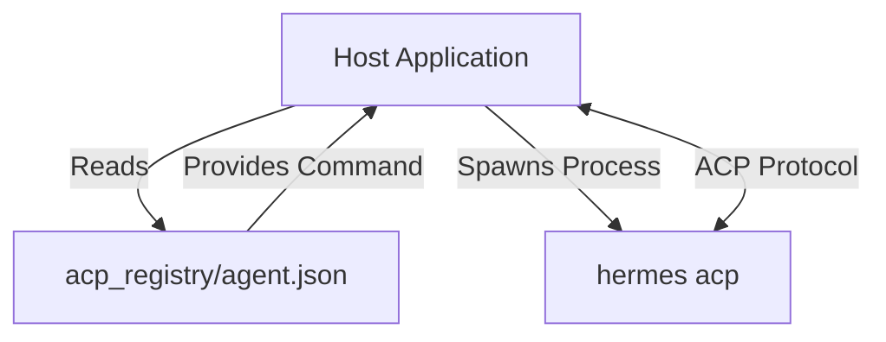

# acp_registry

# ACP Registry

The `acp_registry` module serves as the discovery and configuration layer for the Hermes Agent within the Agent Control Protocol (ACP) ecosystem. It provides the static metadata required by host applications to identify the agent's capabilities and establish a communication channel via the command-line interface.

## Module Overview

This module is primarily data-driven, centered around a standardized manifest file that defines the agent's identity and execution parameters. It acts as the entry point for any system attempting to orchestrate the Hermes Agent.

### The Agent Manifest (`agent.json`)

The core of the registry is the `agent.json` file. This file follows the ACP schema version 1 and contains the following key sections:

| Field | Value | Description |
| :--- | :--- | :--- |
| `name` | `hermes-agent` | The unique identifier for the agent within the registry. |
| `display_name` | `Hermes Agent` | The human-readable name used in UIs. |
| `description` | *Varies* | Highlights key features: 90+ tools, persistent memory, and multi-platform support. |
| `distribution` | `object` | Defines how the host should launch the agent process. |

## Distribution and Execution

The registry specifies a `command` distribution type. This indicates that the agent does not run as a persistent background service by default, but is instead invoked as a subprocess by the host application.

### Execution Pattern

To initialize the Agent Control Protocol session, the host executes the following command pattern derived from the registry:

```bash
hermes acp
```

When invoked with the `acp` argument, the `hermes` binary enters a mode where it listens for JSON-RPC or similar protocol messages over standard input/output (STDIN/STDOUT), allowing the host to leverage the agent's toolset and memory.



## Integration Details

*   **Tooling:** The registry signals that the agent provides a high-density tool environment (90+ tools). The specific schemas for these tools are typically negotiated over the protocol once the `hermes acp` process is active.
*   **Persistence:** The agent manages its own persistent memory; the registry ensures the host knows this capability is available, though the host does not need to manage the underlying database files directly.
*   **Iconography:** The `icon` field references `icon.svg`, which should be co-located with the manifest for use in graphical client interfaces.

## Contributing

When modifying the registry:
1.  Ensure the `schema_version` remains compatible with the target ACP host.
2.  If the CLI entry point changes, update the `distribution.args` array to reflect the new command structure.
3.  Keep the `description` concise as it is often rendered in constrained UI components (e.g., sidebars or marketplace cards).