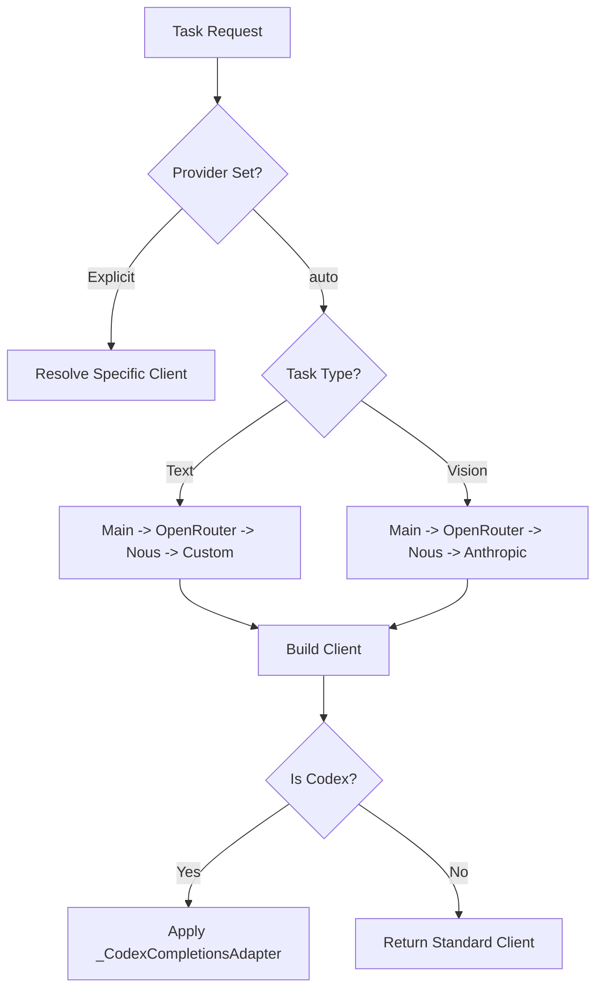

# agent — agent

# Agent Internals Module

The `agent` module provides the core infrastructure for interacting with LLM providers, managing account usage, and routing auxiliary tasks. Originally extracted from the monolithic `run_agent.py`, these sub-modules isolate provider-specific logic, authentication flows, and fallback strategies.

## Anthropic Adapter (`anthropic_adapter.py`)

This module acts as a comprehensive translation layer between Hermes's internal OpenAI-style message format and the Anthropic Messages API. It handles the nuances of Claude models, including "thinking" blocks, token limits, and complex authentication.

### Model Normalization and Constraints
The adapter manages model-specific behaviors through several utility functions:
- `normalize_model_name`: Converts dots to hyphens (e.g., `claude-3.5` to `claude-3-5`) while preserving AWS Bedrock namespace separators.
- `_get_anthropic_max_output`: Maps model families to their specific output token ceilings (e.g., 128k for Opus 4.6/4.7).
- `_resolve_anthropic_messages_max_tokens`: Ensures `max_tokens` is a positive finite integer, preventing API 400 errors.

### Message Conversion Logic
The `convert_messages_to_anthropic` function transforms message arrays while enforcing Anthropic's strict protocol requirements:
1.  **Role Alternation**: Merges consecutive messages of the same role.
2.  **System Prompt Extraction**: Separates system messages into a standalone parameter.
3.  **Thinking Block Management**: 
    - Strips Anthropic-proprietary signatures when routing to third-party endpoints (Azure, Bedrock, MiniMax) to avoid validation failures.
    - Preserves unsigned thinking blocks for Kimi and DeepSeek endpoints which require them for history validation.
    - Downgrades unsigned thinking to plain text for native Anthropic calls to prevent data loss.
4.  **Orphan Handling**: Removes `tool_use` blocks that lack corresponding `tool_result` blocks (and vice versa) to prevent 400 errors during context compression.

### Authentication and OAuth
The module supports three primary authentication paths:
- **Standard API Keys**: `sk-ant-api...` keys used with the `x-api-key` header.
- **Claude Code Integration**: Detects and refreshes credentials from `~/.claude/.credentials.json` or the macOS Keychain.
- **Hermes-Native OAuth**: Implements a PKCE flow (`run_hermes_oauth_login_pure`) for Claude Pro/Max subscriptions, storing tokens in `~/.hermes/.anthropic_oauth.json`.

## Auxiliary Client (`auxiliary_client.py`)

The Auxiliary Client provides a unified interface for "side tasks" such as context compression, vision analysis, and session search. It implements a robust fallback chain to ensure these tasks succeed even if the primary provider is unavailable.

### Resolution Strategy
When a task is set to `auto`, the client follows a prioritized resolution order:
1.  **Main Provider**: The user's primary model.
2.  **OpenRouter**: Using `OPENROUTER_API_KEY`.
3.  **Nous Portal**: Using credentials from `auth.json`.
4.  **Custom/Native**: Fallbacks to direct Anthropic or OpenAI endpoints.

### Codex Responses Shim
Since auxiliary tasks expect an OpenAI-compatible `chat.completions` interface, the `_CodexCompletionsAdapter` class shims the OpenAI Codex Responses API. It translates multimodal content blocks (e.g., `image_url` to `input_image`) and handles the streaming event differences between the two protocols.

### Key Functions
- `resolve_provider_client`: Returns a configured OpenAI or Anthropic client based on the task type.
- `call_llm` / `async_call_llm`: High-level wrappers that execute completions with automatic retry logic and jittered backoff.
- `_fixed_temperature_for_model`: Enforces model-specific temperature constraints (e.g., omitting temperature for Kimi models that manage it server-side).

## Account Usage (`account_usage.py`)

This module tracks and renders rate limits and credit balances across different providers.

### Data Structures
- `AccountUsageSnapshot`: A point-in-time record of a provider's status, including the plan type and fetched timestamp.
- `AccountUsageWindow`: Represents a specific limit (e.g., "Session" or "Weekly") with usage percentages and reset times.

### Provider Support
- **OpenAI Codex**: Fetches from the `/wham/usage` or `/api/codex/usage` endpoints.
- **Anthropic**: Requires OAuth-backed tokens to access the `/api/oauth/usage` endpoint.
- **OpenRouter**: Queries both `/credits` and `/key` endpoints to provide a combined view of balance and key-specific quotas.

## Execution Flow: Auxiliary Task Resolution

## Tool Guardrails (`tool_guardrails.py`)

This sub-module provides safety and idempotency checks for tool execution.
- `before_call`: Checks if a tool call is idempotent or requires explicit user approval.
- `after_call`: Uses `classify_tool_failure` to determine if a tool error is terminal or retryable based on the JSON response or exit code.
- `canonical_tool_args`: Normalizes tool arguments to ensure consistent hashing for idempotency checks.

## Subdirectory Hints (`subdirectory_hints.py`)

Optimizes prompt context by scanning for relevant directories.
- `_extract_directories`: Parses shell commands to find path references.
- `_load_hints_for_directory`: Integrates with `prompt_builder.py` to inject directory-specific context into the system prompt, improving the agent's situational awareness of the project structure.