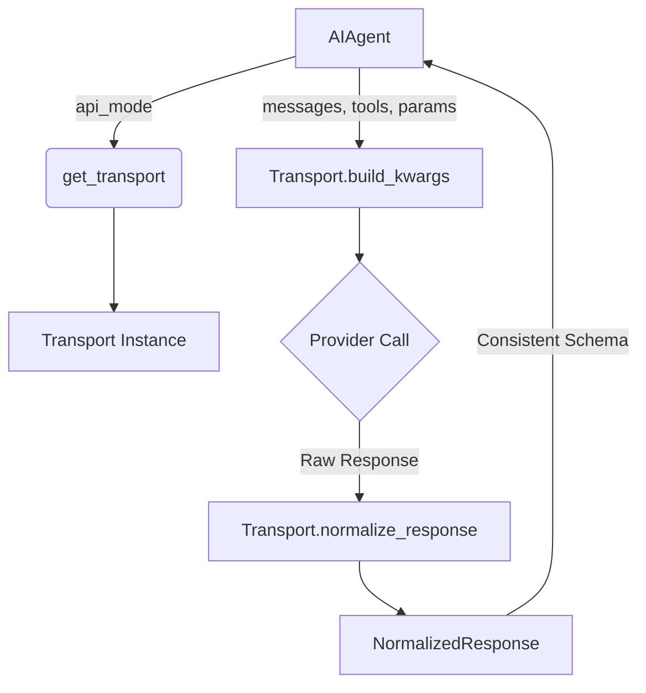

# agent — transports

# Agent Transports Module

The `agent.transports` module provides a unified interface for interacting with diverse LLM providers. It abstracts the complexities of message formatting, tool definition conversion, and response normalization into a consistent API, allowing the core agent logic to remain provider-agnostic.

## Core Architecture

The module follows a registry pattern where transport implementations are mapped to specific `api_mode` strings.

### The Transport Registry
Transports are managed via `agent.transports.__init__.py`. The registry supports lazy discovery to ensure that all available transports are loaded regardless of import order.

*   `get_transport(api_mode: str)`: The primary entry point. It returns an instance of the requested transport or `None` if not found.
*   `register_transport(api_mode: str, transport_cls: type)`: Used by individual transport modules to register themselves (typically called at the bottom of the module).

### ProviderTransport (ABC)
All transports must inherit from `ProviderTransport` in `agent.transports.base.py`. A transport is responsible for the data transformation path but does **not** manage client lifecycles, network calls, or retry logic.

| Method | Purpose |
| :--- | :--- |
| `convert_messages` | Transforms OpenAI-format messages into provider-native structures. |
| `convert_tools` | Transforms OpenAI tool schemas into provider-native tool definitions. |
| `build_kwargs` | The main assembly point. Combines messages, tools, and model parameters into a dictionary ready for the provider's SDK. |
| `normalize_response` | Converts a raw provider response into a `NormalizedResponse` object. |
| `validate_response` | Performs structural checks to ensure the response is usable. |

## Data Normalization

The module defines canonical types in `agent.transports.types.py` to ensure downstream consumers receive consistent data.

### NormalizedResponse
This dataclass represents the final output of any transport.
*   `content`: The primary text response.
*   `tool_calls`: A list of `ToolCall` objects.
*   `finish_reason`: Normalized to one of: `"stop"`, `"tool_calls"`, `"length"`, or `"content_filter"`.
*   `reasoning`: Raw reasoning/thinking text (if supported).
*   `provider_data`: A dictionary for protocol-specific metadata that doesn't fit the global schema (e.g., Anthropic's `reasoning_details`).

### ToolCall
Standardizes tool invocations across providers.
*   `id`: The canonical identifier used for tool result mapping.
*   `name`: The function name.
*   `arguments`: A JSON-encoded string of arguments.
*   `provider_data`: Stores critical protocol-specific fields, such as Gemini's `thought_signature` or Codex's `call_id`, which must be replayed in subsequent turns.

## Implementation Details

### ChatCompletionsTransport
Located in `agent/transports/chat_completions.py`, this is the most complex transport. It serves as the default path for ~16 OpenAI-compatible providers (OpenRouter, DeepSeek, Ollama, etc.).

Key responsibilities:
*   **Gemini Thinking:** Translates reasoning configurations into Gemini's specific `thinking_config` or `thinking_level` parameters.
*   **Moonshot/Kimi Sanitization:** Invokes `sanitize_moonshot_tools` to handle strict JSON schema requirements.
*   **Codex Leak Prevention:** Strips internal Codex fields (`codex_reasoning_items`) from messages before sending them to standard Chat Completion endpoints.
*   **Reasoning Extraction:** Handles various reasoning fields like `reasoning_content` (DeepSeek) and `reasoning_details` (OpenRouter).

### AnthropicTransport
Wraps `agent/anthropic_adapter.py`. It handles the conversion between OpenAI's message list and Anthropic's `(system, messages)` tuple. It specifically manages the normalization of `thinking` blocks and `tool_use` blocks into the unified `NormalizedResponse`.

### BedrockTransport
Interfaces with the AWS Bedrock Converse API. It handles the specific dictionary structure required by `boto3` and maps Bedrock-specific stop reasons (like `guardrail_intervened`) to standard finish reasons.

### ResponsesApiTransport (Codex)
Manages the OpenAI Responses API (Codex). Unlike standard chat completions, it handles `instructions` as a top-level parameter and manages complex `include` arrays for encrypted reasoning content. It also handles `prompt_cache_key` mapping for session persistence.

## Execution Flow

The following diagram illustrates how the agent uses a transport to execute a request:



## Usage Example

```python
from agent.transports import get_transport

# 1. Get the transport
transport = get_transport("anthropic_messages")

# 2. Prepare the request payload
api_kwargs = transport.build_kwargs(
    model="claude-3-5-sonnet-latest",
    messages=[{"role": "user", "content": "Hello"}],
    tools=my_tools,
    max_tokens=1024
)

# 3. Execute call (handled by agent/client, not transport)
raw_response = client.messages.create(**api_kwargs)

# 4. Normalize
result = transport.normalize_response(raw_response)

print(result.content)
print(result.finish_reason)
```

## Adding a New Transport

1.  Create a new file in `agent/transports/`.
2.  Define a class inheriting from `ProviderTransport`.
3.  Implement the abstract methods, delegating to provider-specific adapters where appropriate.
4.  Register the transport at the end of the file:
    ```python
    from agent.transports import register_transport
    register_transport("my_new_api", MyNewTransport)
    ```
5.  Add the module to the `_discover_transports()` function in `agent/transports/__init__.py`.