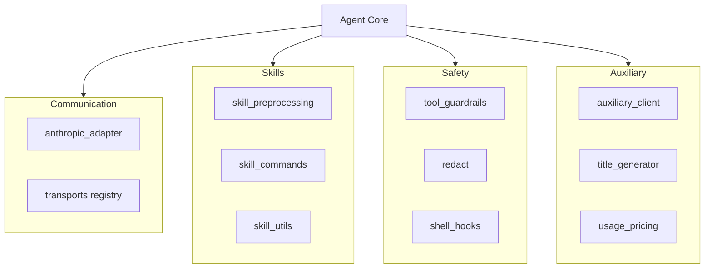

# agent

# Agent Module

The `agent` module serves as the central orchestration layer for Hermes. It abstracts the complexities of multi-provider LLM communication, enforces safety protocols through guardrails and redaction, and manages the lifecycle of "skills" (agent tools).

## Core Architecture

The module is designed around a decoupled execution flow where the core agent logic remains provider-agnostic by relying on specialized sub-modules for transport, safety, and auxiliary processing.

## Key Sub-Modules

### Communication & Transports
The agent interacts with LLMs through a unified interface provided by the [Transports](agent-transports.md) module. This system uses a registry pattern to resolve specific provider implementations (like Bedrock or Anthropic) at runtime.
*   **[Agent Internals](agent-agent.md):** Manages the high-level interaction logic and model normalization.
*   **Anthropic Adapter:** A specialized layer within the agent internals that translates internal message formats to the Anthropic Messages API, handling "thinking" blocks and token constraints.

### Skill & Context Management
Skills are the functional tools available to the agent. The module handles their discovery, preprocessing, and injection into the model context.
*   **[Skill Utilities & Preprocessing](agent-skill-utils.md):** Manages directory discovery for skills and expands inline shell commands or dynamic content before they reach the LLM.
*   **[Subdirectory Hints](agent-subdirectory-hints.md):** Provides filesystem context to the agent, helping it navigate project structures more effectively.

### Safety & Governance
To ensure secure execution, the module intercepts inputs and outputs to sanitize data and enforce permissions.
*   **[Tool Guardrails](agent-tool-guardrails.md):** Enforces constraints on tool execution, such as argument coercion and result hashing.
*   **[Redaction](agent-redact.md):** Automatically scrubs PII, query strings, and sensitive form data from logs and transmissions.
*   **[Shell Hooks](agent-shell-hooks.md):** Implements an approval workflow for shell command execution, utilizing allowlists to skip manual intervention for trusted commands.

### Economics & Auxiliary Services
The module tracks the "cost of intelligence" and offloads non-critical tasks to secondary LLM instances.
*   **[Usage & Pricing](agent-usage-pricing.md):** Resolves billing routes and estimates costs by cross-referencing [Model Metadata](agent-model-metadata.md).
*   **[Auxiliary Client](agent-auxiliary-client.md):** Provides a dedicated client for background tasks like [Title Generation](agent-title-generator.md), ensuring that secondary processing does not interfere with the primary conversation state.

### State Maintenance
*   **[Curator Backup](agent-curator-backup.md):** Provides snapshot and rollback capabilities for agent skills, ensuring that automated modifications to the agent's capabilities can be reverted if they lead to regressions.