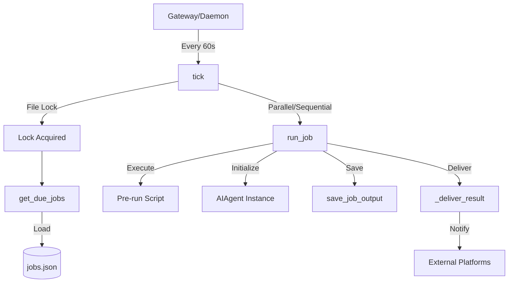

# cron

# Cron Module

The `cron` module provides a robust scheduling system for the Hermes Agent. It allows for automated task execution using cron expressions, fixed intervals, or one-shot timestamps. Jobs are executed in isolated sessions, ensuring that scheduled tasks do not pollute the primary user conversation history while still having access to the agent's full toolset and skills.

## Architecture Overview

The module is split into two primary concerns:
1.  **Job Management (`jobs.py`)**: Handles the persistence, CRUD operations, and schedule parsing.
2.  **Execution Engine (`scheduler.py`)**: Manages the lifecycle of a "tick," including job selection, parallel execution, and result delivery.

## Job Management

Jobs are stored as a JSON array in `~/.hermes/cron/jobs.json`. Each job definition includes the prompt, schedule, delivery configuration, and metadata.

### Schedule Parsing
The `parse_schedule` function supports four formats:
-   **Duration**: `30m`, `2h` (One-shot execution after delay).
-   **Interval**: `every 30m`, `every 1d` (Recurring execution).
-   **Cron**: `0 9 * * *` (Standard 5 or 6 field cron expressions via `croniter`).
-   **Timestamp**: `2026-02-03T14:00:00` (One-shot execution at specific time).

### Persistence and Safety
-   **Atomic Writes**: `save_jobs` uses `atomic_replace` to prevent database corruption during power failure or crashes.
-   **Concurrency**: An in-process `threading.Lock` (`_jobs_file_lock`) protects the load-modify-save cycle during parallel execution.
-   **At-Most-Once Semantics**: For recurring jobs, `advance_next_run` is called *before* execution. This ensures that if the agent crashes or the process is killed, the job does not enter an infinite loop on restart.

## Execution Engine

The `tick()` function is the entry point for execution, typically invoked by the Hermes Gateway daemon.

### The Tick Lifecycle
1.  **Locking**: Acquires a file-based lock (`.tick.lock`) using `fcntl` (Unix) or `msvcrt` (Windows) to prevent duplicate execution from overlapping processes.
2.  **Selection**: `get_due_jobs()` identifies jobs whose `next_run_at` is in the past. It includes a "grace window" logic to fast-forward stale recurring jobs rather than firing a burst of missed events.
3.  **Partitioning**: 
    -   **Parallel**: Standard jobs run in a `ThreadPoolExecutor`.
    -   **Sequential**: Jobs with a defined `workdir` are run one-by-one because they mutate the process-global `TERMINAL_CWD` environment variable.
4.  **Cleanup**: Invokes `_kill_orphaned_mcp_children` to reap any leaked Model Context Protocol subprocesses.

### Agent Execution (`run_job`)
Each job spawns a fresh `AIAgent` instance. Key configurations include:
-   **Inactivity Timeout**: Controlled by `HERMES_CRON_TIMEOUT` (default 600s). If the agent stops producing tokens or calling tools, it is forcibly interrupted.
-   **Context Discovery**: If `workdir` is set, the agent discovers project-specific context (e.g., `CLAUDE.md`, `.cursorrules`) and sets the base directory for terminal/file tools.
-   **Session Isolation**: Uses a unique `session_id` (prefixed `cron_`) and its own SQLite session store.

## Advanced Features

### Pre-run Scripts and Wake Gates
Jobs can specify a `script` path. This Python script runs before the agent:
-   **Context Injection**: The script's `stdout` is prepended to the agent's prompt.
-   **Wake Gates**: If the script outputs JSON containing `{"wakeAgent": false}`, the execution is short-circuited. No LLM call is made, and no delivery occurs. This is ideal for "poll and notify" tasks where the agent only wakes if data has changed.

### Context Chaining
The `context_from` field allows a job to ingest the most recent output of another job. This enables pipeline architectures (e.g., Job A scrapes data, Job B analyzes the output of Job A).

### Delivery Routing
The `_deliver_result` function handles multi-target delivery:
-   **Origin**: Returns the result to the platform/chat where the job was created.
-   **Local**: Saves to `~/.hermes/cron/output/` only.
-   **Platform-Specific**: Supports `telegram`, `discord`, `slack`, etc.
-   **Silent Marker**: If the agent's response starts with `[SILENT]`, delivery is suppressed (though the output is still saved locally).

### Curator Integration
`rewrite_skill_refs` allows the `curator` module to update cron jobs when skills are renamed, consolidated, or deleted. This prevents scheduled tasks from failing when their underlying instructions are reorganized.

## Configuration

| Environment Variable | Description |
| :--- | :--- |
| `HERMES_CRON_TIMEOUT` | Seconds of inactivity before killing a job (default: 600). |
| `HERMES_CRON_MAX_PARALLEL` | Max simultaneous jobs in the thread pool. |
| `HERMES_CRON_SCRIPT_TIMEOUT` | Max execution time for pre-run scripts (default: 120). |
| `HERMES_CRON_SESSION` | Set to `1` during execution to signal "cron mode" to internal systems. |

## Key Functions

-   `create_job(...)`: Primary API for scheduling new tasks.
-   `tick(adapters, loop)`: The main loop; accepts live gateway adapters for E2EE-compatible delivery.
-   `parse_schedule(str)`: Converts human-readable strings into structured schedule dicts.
-   `run_job(job)`: Orchestrates the `AIAgent` lifecycle for a single execution.