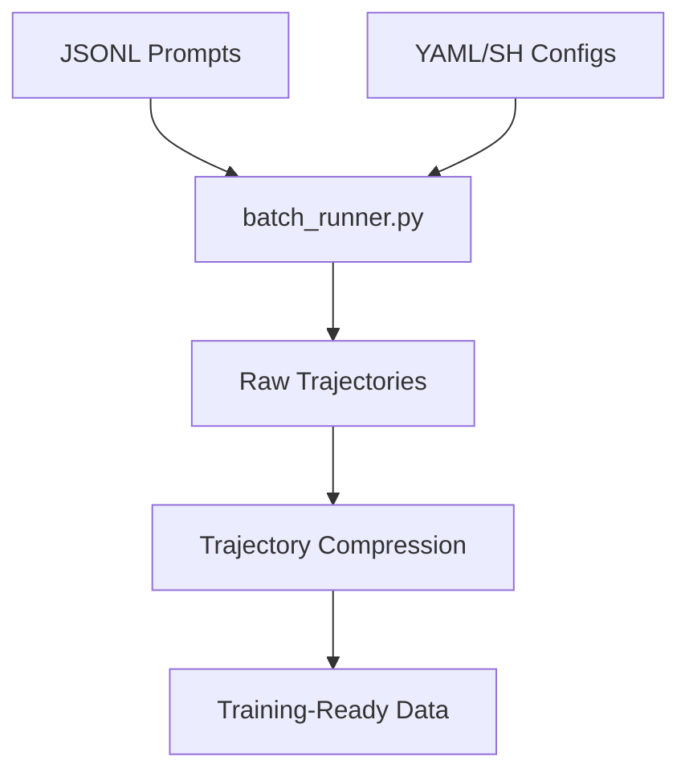

# datagen-config-examples

# datagen-config-examples

The `datagen-config-examples` module provides a suite of configuration templates, shell scripts, and sample datasets designed to orchestrate synthetic data generation via the `batch_runner.py` engine. These examples demonstrate how to configure agent environments, toolsets, and post-processing pipelines to create high-quality trajectories for model training.

## Module Overview

This module acts as the configuration layer for the data generation pipeline. It defines how the agent should behave in specific environments (Browser, Web Research) and how the resulting data should be refined for training.



## Browser Automation Tasks

The browser automation examples focus on generating trajectories where an agent interacts with a live web environment using tools like `browser_snapshot`, `click`, and `type`.

### `run_browser_tasks.sh`
This script wraps `batch_runner.py` with specific parameters optimized for browser-based agents. Key configurations include:
*   **Tool Distribution:** Heavily weighted toward `browser` (97%) and `web` (20%).
*   **System Prompt Logic:** Includes explicit instructions for handling common automation hurdles:
    *   **Anti-Bot Mitigation:** Instructs the agent to use `web_search` for initial discovery rather than direct Google searches.
    *   **State Management:** Mandates taking a `browser_snapshot` after dismissing cookie/privacy dialogs.
    *   **Error Recovery:** Provides a fallback strategy for timeouts and blocked elements.

### `example_browser_tasks.jsonl`
Contains seed prompts for the browser agent, ranging from data extraction (Hacker News, GitHub Trending) to form interaction (httpbin) and multi-step navigation (Books to Scrape).

## Web Research Configuration

The `web_research.yaml` file provides a declarative configuration for the `WebResearchEnv`. This is used when the goal is to generate multi-step factual research trajectories.

*   **Environment:** Sets `environment: web-research`.
*   **Toolsets:** Restricts the agent to `web` and `file` tools, preventing unnecessary browser overhead while allowing for data persistence.
*   **Model Selection:** Defaults to high-reasoning models like `hermes-3-llama-3.1-405b` via OpenRouter to ensure research quality.
*   **Evaluation:** Configures `eval_every` and `eval_size` to perform periodic validation of the generated trajectories against a held-out set.

## Trajectory Compression

The `trajectory_compression.yaml` file defines the post-processing logic required to fit long agent trajectories into the context windows of training LLMs. It uses a "head-and-tail" preservation strategy combined with LLM-based summarization.

### Tokenization and Targets
*   **Tokenizer:** Uses `moonshotai/Kimi-K2-Thinking` for precise token counting.
*   **Budgeting:** Targets a `target_max_tokens` (e.g., 29,000) and a specific `summary_target_tokens` (750) for the middle sections of the conversation.

### Protected Turns
To maintain the structural integrity of the trajectory, the configuration defines "protected turns" that the compression engine will never summarize:
*   `first_system`: Preserves the tool definitions and system instructions.
*   `first_human`: Preserves the original user intent.
*   `first_gpt` & `first_tool`: Preserves the initial action and its result to establish the starting state.
*   `last_n_turns`: Preserves the final 4 turns (typically the conclusion and final tool calls) to ensure the model learns how to successfully terminate a task.

### Summarization Pipeline
When a trajectory exceeds the budget, the module utilizes an external model (configured as `google/gemini-3-flash-preview`) to summarize the non-protected middle turns. 
*   **Concurrency:** Supports `max_concurrent_requests: 50` for high-throughput post-processing.
*   **Notice Injection:** If `add_summary_notice` is true, it appends a disclaimer to the system message indicating that parts of the history have been summarized, preventing the training model from being confused by "jumpy" context.

## Usage in Data Generation

To run a generation batch using these examples:

1.  **Browser Tasks:**
    ```bash
    bash datagen-config-examples/run_browser_tasks.sh
    ```

2.  **Web Research:**
    ```bash
    python batch_runner.py --config datagen-config-examples/web_research.yaml --run_name my_research_run
    ```

3.  **Compression:**
    The compression logic is typically invoked after a run completes, pointing to the `trajectories.jsonl` output of the `batch_runner.py`.