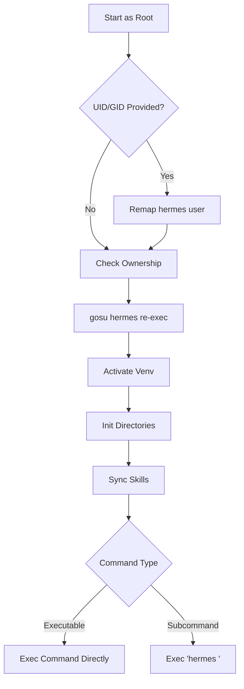

# docker

# Docker Module

The `docker` module provides the containerization logic and runtime environment setup for the Hermes agent. It ensures that the application runs with correct permissions, initialized configuration files, and a consistent directory structure regardless of the host environment (Docker or Podman).

## Entrypoint Lifecycle (`entrypoint.sh`)

The `entrypoint.sh` script is the primary bootstrap mechanism. It handles the transition from the container's initial root state to the unprivileged `hermes` user while maintaining host-volume compatibility.

### 1. Privilege Management and UID/GID Remapping
To avoid permission mismatches when mounting host directories, the script dynamically adjusts the internal `hermes` user to match the host user's identity:

*   **Remapping:** If `HERMES_UID` or `HERMES_GID` environment variables are provided, the script uses `usermod` and `groupmod` to update the container's `hermes` user.
*   **Ownership Correction:** It performs a recursive `chown` on `$HERMES_HOME` if the UID has changed or if the top-level directory ownership is incorrect.
*   **Privilege Dropping:** Once permissions are aligned, it uses `gosu` to re-execute itself as the `hermes` user.

### 2. Environment Initialization
After dropping privileges, the script prepares the runtime environment:
*   **Virtual Environment:** Activates the Python environment located at `${INSTALL_DIR}/.venv`.
*   **Directory Structure:** Ensures essential subdirectories exist within `$HERMES_HOME`:
    *   `cron/`, `sessions/`, `logs/`, `hooks/`, `memories/`, `skills/`, `skins/`, `plans/`, `workspace/`
    *   `home/`: A dedicated home directory for subprocesses (git, ssh, npm) to prevent them from writing to the ephemeral `/root`.

### 3. Configuration Bootstrapping
The script ensures the agent has a valid configuration by copying templates if files are missing:
*   `config.yaml`: Copied from `cli-config.yaml.example`.
*   `SOUL.md`: Copied from the module's persona template.

### 4. Skill Synchronization
If bundled skills exist in the installation directory, the script executes `tools/skills_sync.py`. This utility synchronizes built-in skills into the user's data volume while preserving manual edits via manifest-based tracking.

## Persona Configuration (`SOUL.md`)

The `SOUL.md` file defines the agent's personality, tone, and communication style. 

*   **Dynamic Loading:** The application loads this file fresh for each message, allowing developers to modify the agent's persona without restarting the container.
*   **Customization:** It serves as a system prompt override. If the file is deleted or empty, the agent reverts to its default personality.

## Execution Patterns

The entrypoint supports two primary invocation patterns to accommodate both standard usage and sandbox environments:

1.  **Wrapped Execution (Default):** If the arguments do not resolve to a known system executable, they are passed as subcommands to the `hermes` CLI.
    *   *Example:* `docker run hermes chat -q "hello"` executes `hermes chat -q "hello"`.
2.  **Direct Execution:** If the first argument is an executable on the `PATH` (like `bash` or `sleep`), it is executed directly. This is used by the launcher to maintain long-lived sandbox containers.
    *   *Example:* `docker run hermes sleep infinity` executes `sleep infinity` directly.

## Environment Variables

| Variable | Description | Default |
| :--- | :--- | :--- |
| `HERMES_HOME` | The data volume mount point. | `/opt/data` |
| `HERMES_UID` | Host User ID to map to the `hermes` user. | `10000` |
| `HERMES_GID` | Host Group ID to map to the `hermes` group. | `10000` |
| `INSTALL_DIR` | Location of the application source and venv. | `/opt/hermes` |