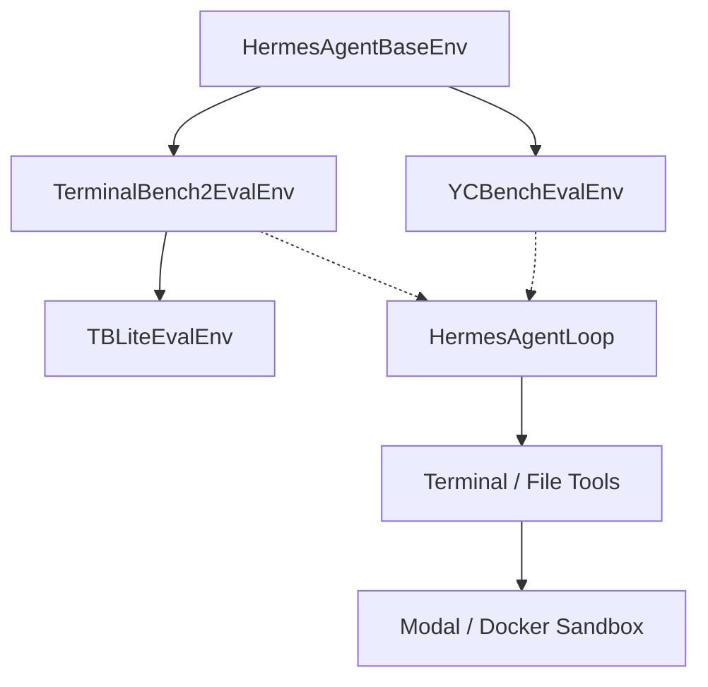

# environments — benchmarks

# Environments — Benchmarks

The `environments.benchmarks` module provides specialized evaluation environments for measuring the performance of agentic LLMs across diverse task types, ranging from short-horizon terminal coding tasks to long-horizon strategic simulations.

These environments are "eval-only," meaning they are designed to be invoked via the `evaluate` subcommand rather than used for training. They inherit from `HermesAgentBaseEnv` and utilize the `HermesAgentLoop` to drive agent interactions.

## Module Architecture

The module is structured into three primary benchmark suites:

1.  **Terminal-Bench 2.0 (TB2):** 89 complex terminal-based coding and system administration tasks.
2.  **OpenThoughts-TBLite:** A difficulty-calibrated, 100-task subset of TB2 designed for faster iteration and higher signal on smaller models.
3.  **YC-Bench:** A long-horizon simulation where the agent acts as a startup CEO, managing resources over hundreds of turns.



---

## Terminal-Bench 2.0 & TBLite

These environments evaluate an agent's ability to solve real-world software engineering problems using a terminal.

### Core Logic: `TerminalBench2EvalEnv`
The evaluation flow for a single task follows these steps:
1.  **Image Resolution:** `_resolve_task_image` determines if a pre-built Docker Hub image exists or if a local build from a `Dockerfile` (extracted via `_extract_base64_tar`) is required.
2.  **Sandbox Setup:** `register_task_env_overrides` configures the terminal backend (usually Modal) to use the specific task image.
3.  **Agent Execution:** `HermesAgentLoop` runs the agent until completion or the `max_agent_turns` limit is reached.
4.  **Verification:** `_run_tests` uploads a test suite, executes `test.sh`, and downloads the `/logs/verifier/reward.txt` file to determine success.

### TBLite Specialization
`TBLiteEvalEnv` is a thin subclass of `TerminalBench2EvalEnv`. It uses the same execution logic but points to the `NousResearch/openthoughts-tblite` dataset. It is calibrated across four difficulty tiers (Easy, Medium, Hard, Extreme) based on reference model pass rates.

### Concurrency and Deadlock Prevention
Because TB2/TBLite tasks are resource-intensive, the environment uses an `asyncio.Semaphore` controlled by `max_concurrent_tasks`. This is critical when using the Modal backend to prevent deadlocks caused by simultaneous blocking calls to the Modal API within thread pool workers.

---

## YC-Bench

`YCBenchEvalEnv` evaluates long-term strategic coherence. The agent manages a simulated AI startup over a 1-3 year horizon.

### Simulation Mechanics
Unlike the coding benchmarks, YC-Bench is a discrete-event simulation driven by a CLI tool (`yc-bench`).
*   **Initialization:** The environment calls `yc-bench sim init` to set up a deterministic SQLite-backed world based on a `preset` and `seed`.
*   **Interaction:** The agent uses the `terminal` tool to run subcommands like `market browse`, `task accept`, and `sim resume`.
*   **Persistence:** A "scratchpad" tool allows the agent to maintain state across context window truncations.

### Scoring Logic
The environment calculates a composite score via `_compute_composite_score`:
*   **Survival (50%):** A binary metric indicating if the company avoided bankruptcy.
*   **Normalized Funds (50%):** A log-scale score based on final cash reserves relative to the initial $250,000 capital.

---

## Key Components

### Configuration Classes
Each environment uses a Pydantic-based configuration class extending `HermesAgentEnvConfig`:
*   `TerminalBench2EvalConfig`: Includes `task_filter`, `test_timeout`, and `max_concurrent_tasks`.
*   `TBLiteEvalConfig`: Inherits from TB2, defaulting to the TBLite dataset and a shorter `task_timeout` (1200s).
*   `YCBenchEvalConfig`: Includes `presets`, `seeds`, and weights for `survival` vs `funds`.

### Execution Flow: `evaluate()`
The `evaluate()` method in these classes manages the high-level orchestration:
1.  **Logging Setup:** Redirects standard logging through `tqdm` to maintain a clean progress bar.
2.  **Parallel/Sequential Execution:** TB2 runs tasks in parallel (subject to the semaphore), while YC-Bench runs runs sequentially to avoid environment variable conflicts.
3.  **Result Streaming:** Results are written to a timestamped `.jsonl` file in real-time via `_save_result` to prevent data loss during crashes.
4.  **Cleanup:** Calls `cleanup_all_environments()` and shuts down the `_tool_executor` to ensure no orphaned sandboxes or threads remain.

## Usage Examples

### Running TB2 with Task Filtering
```bash
python environments/benchmarks/terminalbench_2/terminalbench2_env.py evaluate \
    --env.task_filter "fix-git,pandas-etl" \
    --openai.model_name "anthropic/claude-3-5-sonnet"
```

### Running YC-Bench with Specific Seeds
```bash
python environments/benchmarks/yc_bench/yc_bench_env.py evaluate \
    --env.presets '["medium"]' \
    --env.seeds '[1, 2, 3, 4, 5]'
```

### Local Development (Docker Backend)
For local testing without cloud costs, use the `local.yaml` configurations which switch the `terminal_backend` from `modal` to `docker`.
```bash
python environments/benchmarks/tblite/tblite_env.py evaluate \
    --config environments/benchmarks/tblite/local.yaml
```