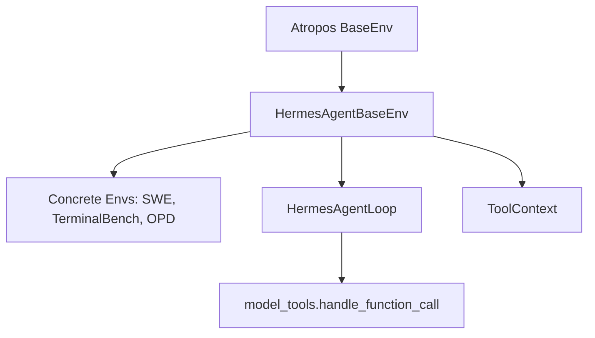

# environments — environments

# Hermes-Agent Atropos Environments

The `environments` module serves as the integration layer between the **hermes-agent** tool-calling framework and the **Atropos** Reinforcement Learning (RL) library. It enables agentic LLMs to perform multi-turn reasoning and tool execution within isolated sandboxes, while providing the infrastructure to score trajectories and feed data into RL training pipelines.

## Architecture Overview

The module follows a hierarchical inheritance structure, starting from the Atropos `BaseEnv` and specializing into agent-specific logic.



### Core Components

1.  **`HermesAgentBaseEnv`**: An abstract base class that manages server communication, tool resolution via `registry.py`, and trajectory collection.
2.  **`HermesAgentLoop`**: The multi-turn engine that orchestrates the conversation. It handles API calls, extracts reasoning, and dispatches tool calls.
3.  **`ToolContext`**: A per-rollout handle provided to reward functions. it allows verifiers to execute commands and inspect files in the exact same sandbox used by the agent.
4.  **`ToolCallParsers`**: A suite of client-side parsers used in Phase 2 (VLLM ManagedServer) to extract structured tool calls from raw model output.

---

## The Agent Loop (`HermesAgentLoop`)

The `HermesAgentLoop` is the primary execution engine. It replicates the logic found in `run_agent.py` but is optimized for the Atropos rollout lifecycle.

### Execution Flow
1.  **Prompt Construction**: Combines system prompts and user tasks.
2.  **API Interaction**: Calls `server.chat_completion()`.
3.  **Reasoning Extraction**: Uses `_extract_reasoning_from_message` to capture thinking blocks across various provider formats (OpenRouter, OpenAI, VLLM).
4.  **Tool Dispatch**: If `tool_calls` are present, it executes them via `model_tools.handle_function_call()`.
5.  **Thread Management**: Tool calls are executed in a global `ThreadPoolExecutor` (managed via `resize_tool_pool`). This prevents deadlocks when backends like Modal or Docker use `asyncio.run()` internally.
6.  **Persistence**: Large tool results are persisted to the sandbox via `maybe_persist_tool_result` to keep the context window manageable.

---

## Server Operation Phases

The module supports two distinct operational phases based on the training/evaluation stage:

### Phase 1: OpenAI-Compatible API (Evaluation/SFT)
Uses standard `chat_completion` with the `tools=` parameter. The server (VLLM, SGLang, or OpenAI) handles tool call parsing natively.
*   **Use Case**: Evaluation, SFT data generation.
*   **Data**: Returns `ChatCompletion` objects; Atropos generates placeholder tokens.

### Phase 2: ManagedServer (RL Training)
Uses the Atropos `ManagedServer` to interact with VLLM's `/generate` endpoint. This provides exact token IDs and logprobs required for RL algorithms like PPO or GRPO.
*   **Use Case**: Full RL training.
*   **Parsing**: Uses client-side parsers (e.g., `hermes_parser.py`, `deepseek_v3_parser.py`) to reconstruct tool calls from raw text.

---

## Reward Verification with `ToolContext`

`ToolContext` provides an unrestricted interface for `compute_reward` functions to verify the agent's work. It uses the same `task_id` as the rollout, ensuring it connects to the same persistent sandbox (Modal container, Docker image, etc.).

```python
async def compute_reward(self, item, result, ctx: ToolContext):
    # Run a command in the agent's sandbox
    test_run = ctx.terminal("python3 test_solution.py")
    
    # Inspect files created by the agent
    if ctx.read_file("solution.py").get("content"):
        return 1.0 if test_run["exit_code"] == 0 else 0.5
    
    return 0.0
```

**Key Methods:**
*   `terminal(command, timeout)`: Execute shell commands.
*   `read_file(path)` / `write_file(path, content)`: Direct filesystem access.
*   `download_file(remote, local)`: Pull artifacts for local validation.
*   `browser_snapshot()`: Capture state from the browser tool if active.

---

## On-Policy Distillation (`AgenticOPDEnv`)

The `AgenticOPDEnv` implements **On-Policy Distillation**, a technique where next-state signals (tool results or error traces) are used to generate "hindsight hints."

1.  **Trajectory Collection**: Runs a standard agent rollout.
2.  **Hint Extraction**: An LLM judge (`_extract_hint`) analyzes (Assistant Response, Tool Result) pairs to determine if the response could have been improved with hindsight.
3.  **Teacher Scoring**: If a hint is found, the environment builds an "enhanced prompt" (Original + Hint) and uses `server.get_logprobs` to see how a teacher model would have distributed probability.
4.  **Distillation Fields**: Populates `distill_token_ids` and `distill_logprobs` in the `ScoredDataGroup`, allowing the trainer to optimize the student model against the teacher's hindsight-augmented distribution.

---

## Configuration (`HermesAgentEnvConfig`)

Environments are configured via Pydantic models. Key fields include:

| Field | Description |
| :--- | :--- |
| `enabled_toolsets` | List of tools (e.g., `['terminal', 'file']`) available to the agent. |
| `distribution` | Name of a probabilistic toolset distribution from `toolset_distributions.py`. |
| `terminal_backend` | The sandbox type: `local`, `docker`, `modal`, `daytona`, or `ssh`. |
| `max_agent_turns` | Hard limit on the number of tool-calling iterations. |
| `tool_call_parser` | The parser used for Phase 2 (e.g., `hermes`, `llama3_json`). |
| `extra_body` | Dictionary passed to the OpenAI client for provider-specific features (e.g., OpenRouter transforms). |

---

## Creating a New Environment

To implement a new task, inherit from `HermesAgentBaseEnv` and define the following:

1.  **`setup()`**: Initialize your dataset (e.g., via HuggingFace `load_dataset`).
2.  **`get_next_item()`**: Logic to iterate through your task data.
3.  **`format_prompt(item)`**: Convert your data item into a string instruction for the agent.
4.  **`compute_reward(item, result, ctx)`**: Use the `ToolContext` to score the agent's performance.
5.  **`evaluate()`**: Define how to log periodic metrics to WandB or local JSONL files.