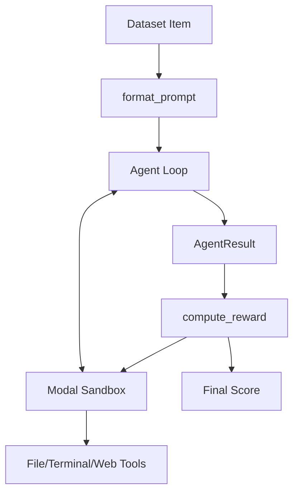

# environments — hermes_swe_env

# environments — hermes_swe_env

The `hermes_swe_env` module provides a concrete implementation of a Software Engineering (SWE) environment designed for agentic workflows. It facilitates tasks where an LLM must solve coding problems by interacting with a filesystem, executing terminal commands, and searching the web.

This environment is specifically built to use **Modal sandboxes** for cloud-isolated execution, ensuring that agent-generated code runs in a secure, reproducible environment that persists across the agent's reasoning steps and the final reward evaluation.

## Core Architecture

`HermesSweEnv` inherits from `HermesAgentBaseEnv`. It manages the lifecycle of a SWE task: loading the dataset, initializing the sandbox, executing the agent loop, and verifying the solution.



### Key Components

#### 1. HermesSweEnv Class
The primary environment class. It orchestrates the interaction between the dataset, the agent, and the tool execution context.

*   **`setup()`**: Initializes the dataset (defaulting to `bigcode/humanevalpack`) and resets reward buffers.
*   **`get_next_item()`**: Iterates through the dataset to provide the next task.
*   **`format_prompt(item)`**: Prepares the input for the agent. It extracts the coding prompt and appends any available test information (from fields like `test`, `test_code`, or `tests`) to guide the agent.

#### 2. Reward Mechanism (`compute_reward`)
The reward function is the critical component for Reinforcement Learning (RL) or evaluation. Unlike static environments, `HermesSweEnv` performs **dynamic verification**:

1.  **Test Execution**: It retrieves the test suite from the dataset item.
2.  **Sandbox Persistence**: It uses the `ToolContext` to access the *same* Modal sandbox the agent used. This ensures that any files created or modified by the agent are present during testing.
3.  **Scoring Logic**:
    *   **1.0 (Success)**: The test code executes via `ctx.terminal` and returns an exit code of `0`.
    *   **0.1 (Partial Credit)**: If the tests fail or are missing, the environment checks if the agent at least created new `.py` files in the `/workspace` directory (using a timestamp marker).
    *   **0.0 (Failure)**: No files created and tests failed.

#### 3. Configuration (`HermesSweEnvConfig`)
Configuration is handled via `HermesSweEnvConfig`, which defines:
*   **Toolsets**: Defaults to `["terminal", "file", "web"]`.
*   **Backend**: Defaults to `modal` for terminal execution.
*   **Agent Constraints**: `max_agent_turns` (default 30) and `max_token_length` (default 4096) are tuned for complex SWE tasks.

## Tooling and Sandbox Integration

The environment relies on `environments.tool_context.ToolContext` to bridge the gap between the model's tool calls and the remote execution environment.

*   **Terminal Backend**: When `terminal_backend` is set to `"modal"`, every rollout gets a dedicated, isolated container.
*   **File Tools**: The agent can read, write, and edit files within the `/workspace` directory of the sandbox.
*   **Web Tools**: Provides the agent with search capabilities to look up documentation or libraries.

## Usage and Execution

The module is designed to be run as a standalone service or integrated into a training pipeline.

### Phase 1: Evaluation/Inference
To run the environment with an OpenAI-compatible server (e.g., vLLM) for evaluation:

```bash
python environments/hermes_swe_env/hermes_swe_env.py serve \
    --config environments/hermes_swe_env/default.yaml \
    --openai.base_url http://localhost:8000/v1 \
    --env.dataset_name "bigcode/humanevalpack"
```

### Phase 2: RL Training
For full RL training, the `server_type` is typically switched to `vllm` within the config or via CLI to allow for tighter integration with the training loop.

## Metrics and Logging

The environment tracks performance via `wandb_log`:
*   **`train/avg_reward`**: The mean reward across the current buffer.
*   **`train/pass_rate`**: The percentage of tasks where the agent successfully passed the test suite (reward == 1.0).

These metrics are cleared after every logging interval to provide a rolling window of agent performance.