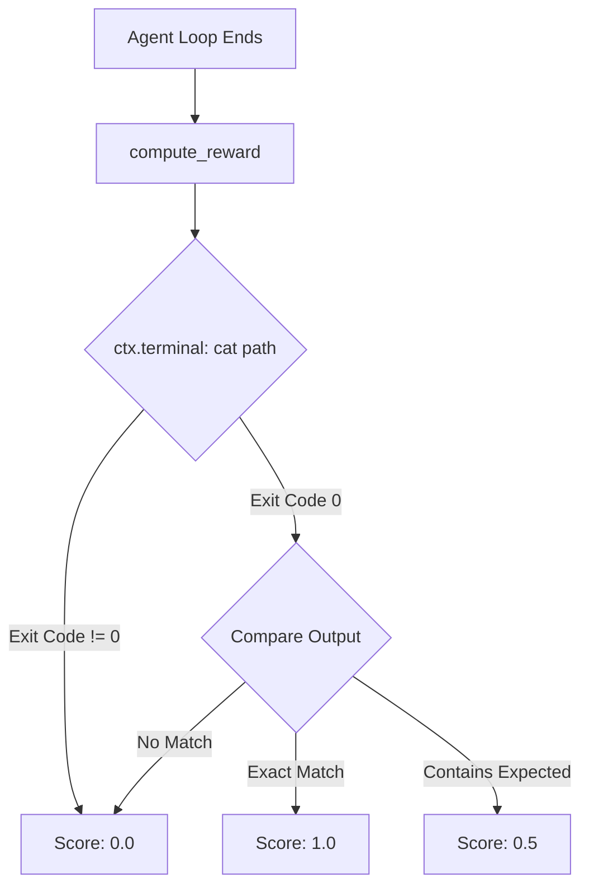

# environments — terminal_test_env

# Terminal Test Environment

The `terminal_test_env` module provides a self-contained, end-to-end validation environment for the Atropos and Hermes Agent stack. It is designed to verify that the agent loop, tool execution (specifically terminal and file tools), and reward verification logic are functioning correctly without requiring external datasets.

## Overview

`TerminalTestEnv` implements a "smoke test" scenario where an agent is tasked with creating specific files in a terminal environment. The environment uses the **Modal** terminal backend for isolated sandboxing and **OpenRouter** (typically Claude) for inference.

### Key Features
- **Zero External Dependencies**: Tasks are defined inline within the module.
- **Tool Integration**: Enables `terminal` and `file` toolsets.
- **Automated Verification**: Uses the `ToolContext` to execute terminal commands (`cat`) to verify the agent's work.
- **Scoring**: Provides granular rewards (1.0 for exact matches, 0.5 for partial matches).

## Task Definitions

The environment cycles through a fixed set of tasks defined in `TRAIN_TASKS` and `EVAL_TASKS`.

| Task Type | Objective | Verification Path | Expected Content |
| :--- | :--- | :--- | :--- |
| **Train** | Create greeting file | `~/greeting.txt` | "Hello from Hermes Agent" |
| **Train** | List numbers 1-5 | `~/count.txt` | "1\n2\n3\n4\n5" |
| **Train** | Simple addition | `~/answer.txt` | "579" |
| **Eval** | Simple multiplication | `~/result.txt` | "42" |

## Core Components

### TerminalTestEnv Class
Inherits from `HermesAgentBaseEnv`. It manages the lifecycle of the test, from task distribution to reward calculation.

- `get_next_item()`: Cycles through the `TRAIN_TASKS` list.
- `format_prompt()`: Extracts the prompt string from the task dictionary.
- `compute_reward()`: The primary validation logic. It uses the `ToolContext` to interact with the same terminal the agent used.

### Reward Verification Flow
The reward logic is unique because it uses the agent's own tools to inspect the environment state.



### Configuration (`TerminalTestEnvConfig`)
The environment is configured via `default.yaml` or the `config_init` method. Key defaults include:
- **Backend**: `modal` (provides a fresh containerized terminal for every rollout).
- **Parser**: `hermes` (expects XML-style tool tags).
- **Agent Constraints**: `max_agent_turns: 10`, `group_size: 3`.

## Execution and Usage

The module supports two primary execution modes via the Atropos CLI.

### 1. Server Mode (Serve)
Used for active training or interactive testing where the environment acts as a task provider for the Atropos API.
```bash
# Start the Atropos API first
run-api

# Run the environment
python environments/terminal_test_env/terminal_test_env.py serve \
    --config environments/terminal_test_env/default.yaml
```

### 2. Process Mode
Used for generating offline datasets of rollouts and scores without a running API server.
```bash
python environments/terminal_test_env/terminal_test_env.py process \
    --env.data_path_to_save_groups output.jsonl
```

## Metrics and Logging
The environment tracks performance via `reward_buffer` and logs to Weights & Biases (W&B) if enabled.
- `train/avg_reward`: Mean score across rollouts.
- `train/accuracy`: Percentage of tasks with a 1.0 score.
- `train/partial_match_rate`: Percentage of tasks with a 0.5 score.