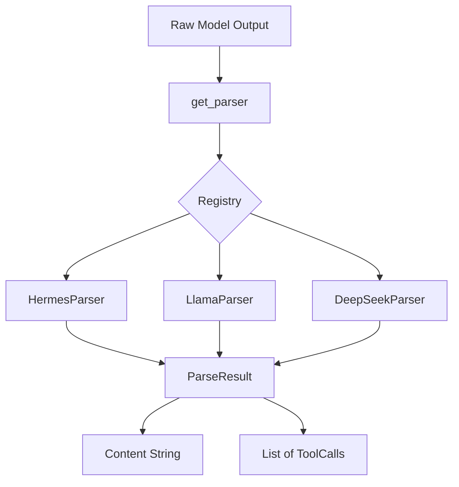

# environments — tool_call_parsers

# environments — tool_call_parsers

The `tool_call_parsers` module provides a client-side registry of parsers designed to extract structured tool calls from raw model output text. This is primarily used in environments where the model server (such as a VLLM instance using the `/generate` endpoint) returns raw text containing model-specific markup rather than pre-parsed tool call objects.

Each parser is a standalone implementation of the extraction logic used by specific model families, producing OpenAI-compatible `ChatCompletionMessageToolCall` objects.

## Core Architecture

The module uses a registry pattern to map model family names to specific parser implementations.

### ToolCallParser Base Class
All parsers inherit from the `ToolCallParser` abstract base class and must implement the `parse` method.

```python
class ToolCallParser(ABC):
    @abstractmethod
    def parse(self, text: str) -> ParseResult:
        """
        Returns a tuple of (content, tool_calls).
        - content: The message text with tool markup stripped.
        - tool_calls: A list of ChatCompletionMessageToolCall objects or None.
        """
```

### Parser Registry
Parsers are registered using the `@register_parser(name)` decorator. This allows the `get_parser(name)` factory function to instantiate the correct parser at runtime based on the model configuration.



## Usage

To extract tool calls from a model response:

```python
from environments.tool_call_parsers import get_parser

# 1. Get the appropriate parser
parser = get_parser("hermes")

# 2. Parse the raw text
content, tool_calls = parser.parse(raw_text)

if tool_calls:
    for call in tool_calls:
        print(f"Function: {call.function.name}")
        print(f"Args: {call.function.arguments}")
```

## Supported Parser Implementations

The module includes specialized parsers for various model families, each handling unique delimiters and serialization formats:

| Parser Name | Format Description |
| :--- | :--- |
| `hermes` / `qwen` | Wraps JSON in `<tool_call>...</tool_call>` tags. |
| `llama3_json` | Extracts JSON objects containing `name` and `arguments`/`parameters` keys, often following a `<\|python_tag\|>`. |
| `deepseek_v3` | Uses special unicode tokens (e.g., `<｜tool▁calls▁begin｜>`) and markdown JSON blocks. |
| `deepseek_v3_1` | A variant of V3 using `<｜tool▁call▁begin｜>name<｜tool▁sep｜>args<｜tool▁call▁end｜>`. |
| `mistral` | Supports both pre-v11 (JSON array) and v11+ (interleaved `[TOOL_CALLS]` tokens) formats. |
| `glm45` / `glm47` | Uses XML-like tags: `<tool_call>`, `<arg_key>`, and `<arg_value>`. |
| `qwen3_coder` | Uses nested XML tags: `<tool_call><function=name><parameter=key>val</parameter></function></tool_call>`. |
| `kimi_k2` | Uses section tokens and a specific `function_name:index` ID format. |

## Implementation Details

### Robust JSON Extraction
Several parsers (notably `LlamaToolCallParser` and `MistralToolCallParser`) utilize `json.JSONDecoder().raw_decode()` to find and extract JSON objects embedded within larger strings of text. This allows the parsers to handle cases where the model provides conversational thought before the actual tool call.

### Value Deserialization
For models that do not output standard JSON (like GLM or Qwen3-Coder), the module provides internal utility functions:
- `_deserialize_value` (GLM): Attempts `json.loads`, then `ast.literal_eval`, then falls back to a raw string.
- `_try_convert_value` (Qwen3): Handles nulls, booleans, and numbers specifically before falling back to JSON/AST parsing.

### ID Generation
Since raw text outputs rarely include unique call IDs, the parsers generate them locally to satisfy the OpenAI type requirements:
- Most parsers use `uuid.uuid4().hex[:8]`.
- `MistralToolCallParser` uses a custom 9-character alphanumeric generator.
- `KimiK2ToolCallParser` preserves the ID format provided in the model's text (e.g., `func:0`).

## Adding a New Parser

1. Create a new file in `environments/tool_call_parsers/`.
2. Define a class inheriting from `ToolCallParser`.
3. Decorate the class with `@register_parser("your_model_name")`.
4. Implement the `parse` logic.
5. Import your new module in `environments/tool_call_parsers/__init__.py` to ensure it is registered when the package is loaded.