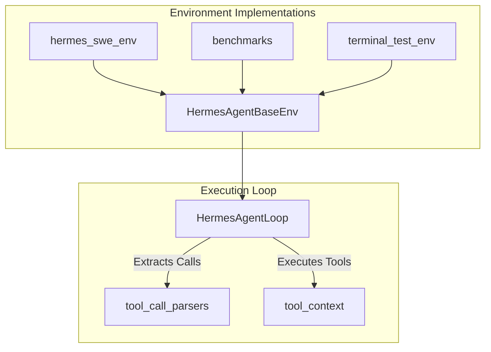

# environments

# Environments

The `environments` module serves as the integration layer between the **hermes-agent** tool-calling framework and the **Atropos** Reinforcement Learning (RL) library. It provides the infrastructure necessary for agentic LLMs to interact with isolated sandboxes, execute tools, and generate trajectories that can be scored for evaluation or RL training.

## Core Architecture

The module is built around a hierarchical structure that abstracts the complexities of multi-turn reasoning and tool execution.

*   **`HermesAgentBaseEnv`**: The foundational class that bridges Atropos `BaseEnv` with the Hermes agent logic. It handles tool resolution, trajectory collection, and integration with managed model servers.
*   **`HermesAgentLoop`**: The execution engine that drives the interaction between the LLM and the environment. It manages the state machine of "Prompt -> Generate -> Parse -> Execute -> Observe."

## Sub-modules

### Execution & Sandboxing
These modules provide concrete implementations of environments where agents perform work.
*   **[hermes_swe_env](hermes_swe_env.md)**: A specialized environment for Software Engineering tasks. It utilizes **Modal sandboxes** to provide secure, isolated filesystems and terminal access for long-horizon coding tasks.
*   **[terminal_test_env](terminal_test_env.md)**: A zero-dependency "smoke test" environment used to validate the integrity of the tool-calling stack, terminal backends, and reward verification logic.

### Evaluation & Benchmarking
*   **[benchmarks](benchmarks.md)**: A collection of "eval-only" suites, including Terminal-Bench 2.0 and OpenThoughts-TBLite. These environments are optimized for the `evaluate` subcommand to measure model performance across diverse system administration and coding scenarios.

### Infrastructure & Parsing
*   **[tool_call_parsers](tool_call_parsers.md)**: A registry of model-specific parsers (e.g., for Qwen, Kimi, or GLM families). These parsers allow the `HermesAgentLoop` to extract structured tool calls from raw text generated by model servers that do not natively support OpenAI-style tool objects.

## Key Workflows

1.  **Trajectory Collection**: The `HermesAgentBaseEnv` initiates a `HermesAgentLoop`. The loop requests completions from a model, uses a `tool_call_parser` to identify actions, and executes those actions within a `tool_context` (often a Modal container).
2.  **Tool Resolution**: Environments resolve tool definitions by mapping toolset aliases to the central tool registry. This ensures that the agent is presented with the correct schema for the tools available in its specific sandbox.
3.  **Reward Evaluation**: After a task reaches a terminal state (success, failure, or max turns), the environment invokes task-specific logic—such as running test suites in `hermes_swe_env` or LLM-based grading in `web_research_env`—to calculate a final reward.