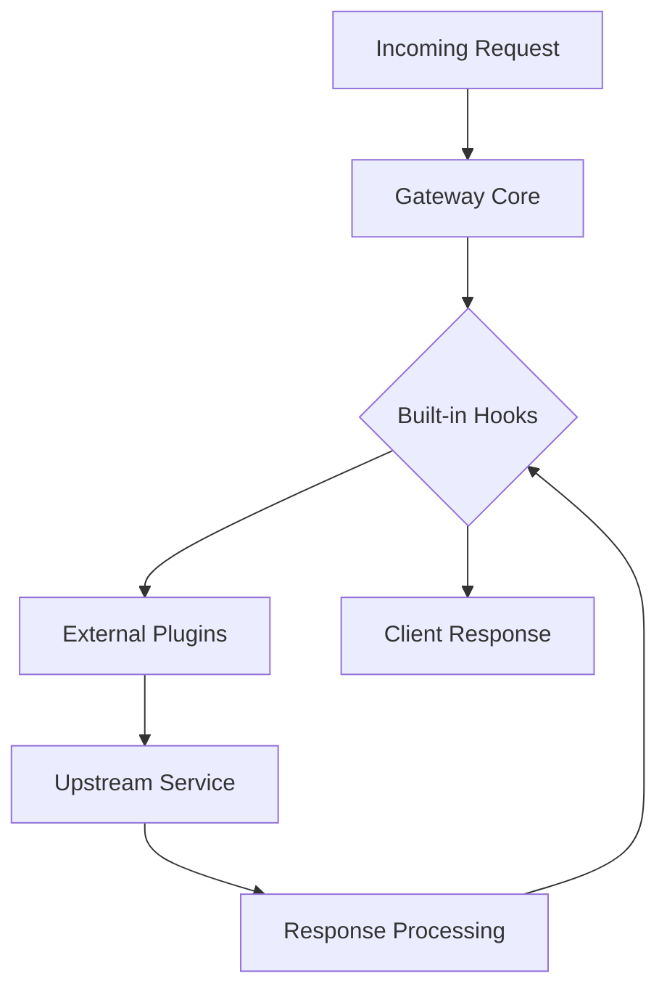

# gateway — builtin_hooks

# Gateway Built-in Hooks

The `gateway.builtin_hooks` module serves as the central container for core interceptors and lifecycle events that are natively supported by the gateway. Unlike external plugins or optional middleware, hooks defined within this package are intended to be "always-on" or registered by default during the gateway's initialization sequence.

## Overview

In a gateway architecture, hooks allow for the injection of logic at specific stages of a request's lifecycle (e.g., `pre_request`, `post_request`, `on_error`). The `builtin_hooks` package is reserved for logic that is fundamental to the gateway's operation, such as:

*   Core telemetry and logging.
*   Standardized header manipulation.
*   Internal routing logic.
*   Security defaults.

## Architecture and Lifecycle

Built-in hooks are integrated directly into the gateway's execution pipeline. Because they are registered at the package level, they typically execute before any user-defined or third-party plugins to ensure the environment is correctly bootstrapped.

## Registration Pattern

While the `__init__.py` file currently acts as a namespace declaration, the module is designed to aggregate hooks from submodules. The gateway engine typically discovers these hooks through one of two patterns:

1.  **Explicit Import**: The gateway core imports `gateway.builtin_hooks` to trigger the registration of hooks defined in sub-packages.
2.  **Automated Discovery**: The gateway iterates through the members of this module to identify functions or classes decorated with hook markers.

## Contributing New Hooks

When adding functionality to this module, follow these guidelines:

### 1. Submodule Organization
Do not place complex logic directly in `__init__.py`. Create a new submodule for each logical hook group:
- `gateway/builtin_hooks/telemetry.py`
- `gateway/builtin_hooks/auth_defaults.py`

### 2. Statelessness
Built-in hooks should be stateless. They receive the current request context and should modify it or perform side effects (like logging) without maintaining internal state that could interfere with concurrent requests.

### 3. Error Handling
Since built-in hooks run for every request, they must be highly resilient. Ensure that any hook implementation includes robust try-except blocks to prevent a failure in a non-critical hook (e.g., a metrics counter) from dropping the entire request.