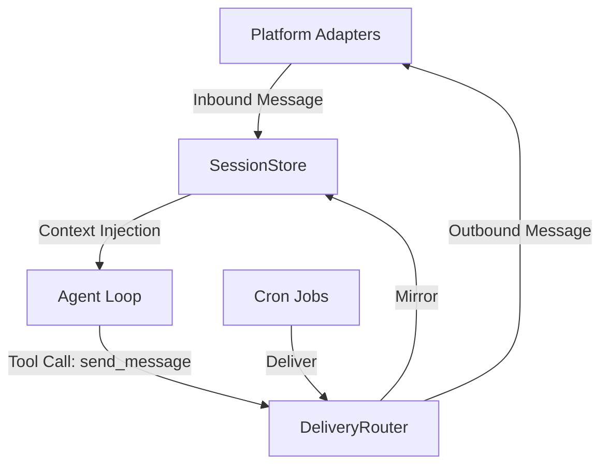

# gateway — gateway

# Hermes Gateway

The **Gateway** module is the multi-platform integration layer for the Hermes agent. It provides a unified interface for connecting the agent to messaging platforms (Telegram, Discord, Slack, WhatsApp, etc.) while managing persistent session contexts, message routing, and platform-specific capabilities.

## Core Architecture

The gateway acts as a bridge between external messaging adapters and the internal agent logic. It ensures that regardless of the platform, the agent receives a consistent session context and can route responses or cron outputs to the correct destination.

## Configuration Management

Configuration is handled by `gateway/config.py` and is aggregated from three sources (in priority order):
1.  **Environment Variables**: (e.g., `TELEGRAM_BOT_TOKEN`)
2.  **`~/.hermes/config.yaml`**: The primary user-facing configuration.
3.  **`~/.hermes/gateway.json`**: Legacy configuration support.

### Platform Definition
The `Platform` enum defines supported services. It supports dynamic plugin discovery via `_missing_`, allowing new platform adapters to be registered at runtime without modifying the core enum.

### Home Channels
Each platform can define a `HomeChannel`. This is the default destination for automated outputs (like cron jobs) when a specific chat ID is not provided.

## Session Management

The gateway maintains conversation state through `SessionStore` and `SessionContext`.

### Session Reset Policies
`SessionResetPolicy` determines when a conversation's context is cleared. This prevents the LLM context window from becoming cluttered with stale information.
- **Modes**: `daily` (fixed hour), `idle` (inactivity timeout), `both`, or `none`.
- **Isolation**: Controlled by `group_sessions_per_user` and `thread_sessions_per_user` settings in `GatewayConfig`.

### Context Injection
When an agent processes a message, `build_session_context_prompt` generates a system-level description of the current environment, including:
- The platform and channel name.
- The current user's identity.
- Available platform-specific tools.

## Delivery and Routing

The `DeliveryRouter` handles dispatching messages to one or more `DeliveryTarget` objects.

### Target Resolution
Targets are parsed from strings using `DeliveryTarget.parse()`:
- `origin`: Routes back to the source of the current session.
- `local`: Saves the output to `~/.hermes/cron/output/`.
- `platform`: Routes to the platform's home channel (e.g., `telegram`).
- `platform:id`: Routes to a specific chat or thread (e.g., `discord:123456789`).

### Session Mirroring
`gateway/mirror.py` provides `mirror_to_session()`. When the agent sends a message via a tool (like `send_message`) or a cron job fires, the content is "mirrored" back into the session's transcript. This ensures the agent "remembers" what it sent to the user, even if the message was generated outside the standard chat loop.

## Channel Discovery

The `channel_directory.py` module maintains a cached map of reachable contacts and channels.
- **Building**: `build_channel_directory()` queries active adapters (Discord guilds, Slack conversations) and scans `sessions.json` for historical contacts.
- **Resolution**: `resolve_channel_name()` allows developers and users to use human-friendly names (e.g., `#general`) which are resolved to platform-specific numeric IDs.
- **Persistence**: The directory is saved to `~/.hermes/channel_directory.json` and refreshed periodically.

## Display and Verbosity

`gateway/display_config.py` manages how information is presented across different platforms using a tiered capability system:
- **Tier 1 (High)**: Supports message editing and streaming (Telegram, Discord).
- **Tier 2 (Medium)**: Supports editing but is workspace-facing (Slack, Mattermost).
- **Tier 3 (Low)**: No edit support; progress messages are permanent (Signal, WhatsApp).
- **Tier 4 (Minimal)**: Non-interactive delivery (Email, SMS).

The `resolve_display_setting()` function determines settings like `tool_progress` and `show_reasoning` based on these tiers and user overrides.

## Event Hooks

The `HookRegistry` in `gateway/hooks.py` implements an asynchronous event system. Hooks are discovered from `~/.hermes/hooks/`.

### Lifecycle Events
- `gateway:startup`: Fired when the gateway process begins.
- `session:start` / `session:reset`: Fired during session lifecycle changes.
- `agent:start` / `agent:step` / `agent:end`: Fired during the LLM reasoning loop.
- `command:*`: Fired when a slash command is executed.

Hooks consist of a `HOOK.yaml` manifest and a `handler.py` containing an `async def handle(event_type, context)` function.

## Security and Pairing

For platforms where the bot's identity is public (like Telegram or WhatsApp), `gateway/pairing.py` manages unauthorized access.
- **PairingStore**: Tracks approved users and pending requests.
- **Flow**: Unknown users receive a one-time 8-character pairing code. The owner must approve this code via the Hermes CLI to authorize the user.
- **Rate Limiting**: Includes lockout mechanisms after failed attempts and expiration for pending codes.