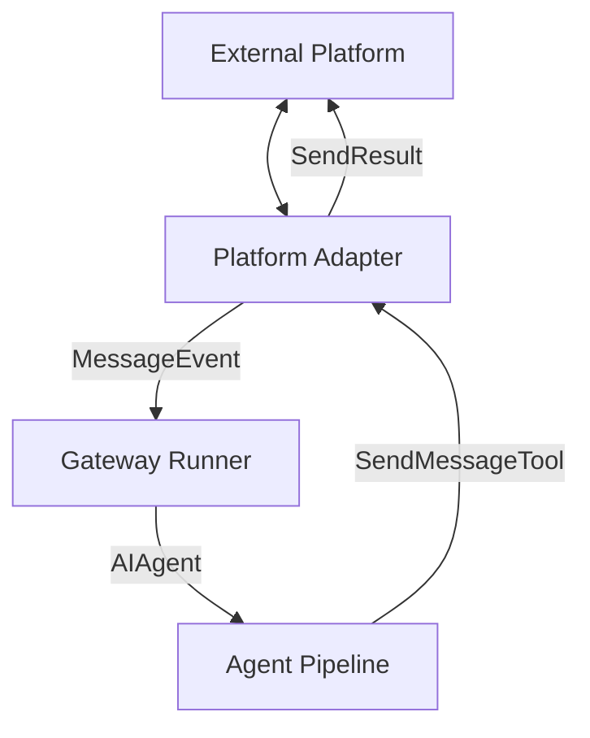

# gateway — platforms

# Gateway Platforms

The **gateway platforms** module is the integration layer between the Hermes gateway and external messaging services. It provides a standardized interface for receiving messages, sending responses, and handling media across diverse protocols (HTTP, WebSockets, Protobuf, etc.).

## Architecture Overview

The module follows a provider pattern where a central `BasePlatformAdapter` defines the contract, and specific implementations (e.g., `TelegramAdapter`, `DiscordAdapter`, `APIServerAdapter`) handle the platform-specific wire protocols.

## Core Components

### BasePlatformAdapter (`gateway/platforms/base.py`)
All platform integrations must inherit from this class. It provides the lifecycle methods and utility functions required for gateway integration.

*   **`connect()` / `disconnect()`**: Manage the lifecycle of the connection (e.g., starting a WebSocket or an HTTP server).
*   **`handle_message(event: MessageEvent)`**: The primary ingress point. Adapters convert platform-specific payloads into a `MessageEvent` and pass it to this method to trigger the agent pipeline.
*   **`send(...)`**: The primary egress point. Sends text and optional media to a specific `chat_id`.
*   **`build_source(...)`**: Constructs a `SessionSource` object to track user identity and platform context.

### API Server Adapter (`gateway/platforms/api_server.py`)
The `APIServerAdapter` is a specialized built-in platform that exposes an OpenAI-compatible REST API. This allows external UIs (like Open WebUI or LibreChat) to use Hermes as a backend.

#### Key Endpoints
*   `POST /v1/chat/completions`: Standard stateless chat endpoint. Supports streaming via SSE.
*   `POST /v1/responses`: A stateful "Responses API" that supports `previous_response_id` for conversation chaining.
*   `GET /v1/runs/{run_id}/events`: Provides a structured SSE stream of agent lifecycle events (tool starts, reasoning, completion).
*   `GET /health/detailed`: Returns rich status information, including PID and connected platform states.

#### Session Continuity
The API server uses `_derive_chat_session_id` to generate stable session IDs based on the first user message and system prompt. Clients can also explicitly provide an `X-Hermes-Session-Id` header to persist state across turns in a specific sandbox.

### Resource Management (`gateway/platforms/_http_client_limits.py`)
To prevent file-descriptor exhaustion (especially on macOS), the module uses `platform_httpx_limits()`. This helper configures `httpx.AsyncClient` with:
*   `max_keepalive_connections=10`: Limits per-adapter connection overhead.
*   `keepalive_expiry=2.0`: Aggressively recycles idle sockets to avoid `CLOSE_WAIT` accumulation.

## Message Normalization

The module handles the complexity of multimodal inputs through normalization functions:

*   **`_normalize_chat_content`**: Flattens OpenAI-style content arrays (text parts) into plain strings for text-only pipelines.
*   **`_normalize_multimodal_content`**: Validates and converts various image/text formats into a canonical internal representation. It supports `data:image/` URIs and standard URLs while enforcing security checks via `is_safe_url`.

## Integration Points

Adding a new platform requires updates across several Hermes subsystems:

1.  **`gateway/config.py`**: Add the platform to the `Platform` enum and update environment variable loading.
2.  **`gateway/run.py`**: Register the adapter in `_create_adapter` and update authorization maps in `_is_user_authorized`.
3.  **`agent/prompt_builder.py`**: Add a `PLATFORM_HINTS` entry to inform the agent of platform-specific capabilities (e.g., Markdown support).
4.  **`tools/send_message_tool.py`**: Implement a standalone `_send_<platform>` function to allow the agent and cron jobs to send messages outside the main adapter loop.
5.  **`cron/scheduler.py`**: Map the platform name for scheduled delivery.

## Security and Redaction

Adapters are responsible for protecting user privacy:
*   **Redaction**: Sensitive identifiers (tokens, phone numbers) must be masked in logs. The `agent/redact.py` module provides regex patterns for this purpose.
*   **Authorization**: Adapters must check `_is_user_authorized` before processing messages, respecting the `ALLOWED_USERS` and `ALLOW_ALL_USERS` environment variables.
*   **URL Safety**: Media downloads must be validated against `tools/url_safety.py` to prevent SSRF attacks.