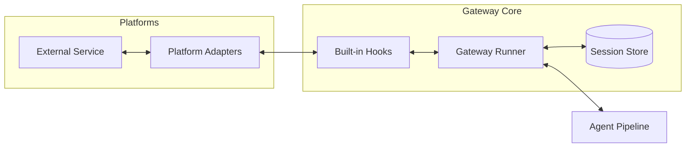

# gateway

# Gateway Module

The **Gateway** module serves as the unified integration and orchestration layer for the Hermes agent. It abstracts the complexities of various messaging protocols into a standardized interface, allowing the agent to communicate across multiple platforms while maintaining consistent session state and execution logic.

## Module Hierarchy

The gateway is composed of three primary functional areas:

*   **[Gateway Core](gateway.md)**: The central orchestrator that manages the `Gateway Runner`, `SessionStore` for context persistence, and the `DeliveryRouter` for outbound message dispatching.
*   **[Platforms](platforms.md)**: The adapter layer containing specific implementations (e.g., `TelegramAdapter`, `DiscordAdapter`) that handle low-level wire protocols like WebSockets, Protobuf, and HTTP.
*   **[Built-in Hooks](builtin_hooks.md)**: A middleware system that injects "always-on" logic—such as telemetry, security defaults, and header manipulation—into the request lifecycle.

## Integrated Workflow

The gateway facilitates a bidirectional flow between external users and the internal agent pipeline. When a message is received, the sub-modules interact as follows:

1.  **Ingress**: A platform-specific adapter in `platforms` receives raw data and transforms it into a standardized `MessageEvent`.
2.  **Interception**: The `builtin_hooks` execute lifecycle events (e.g., `pre_request`), performing core logging and security validation.
3.  **Contextualization**: The `gateway` core uses the `SessionStore` to inject historical context into the event before passing it to the Agent Loop.
4.  **Egress**: When the agent generates a response, the `DeliveryRouter` identifies the correct platform adapter to transmit the message back to the user.

## Runtime Management

Beyond message routing, the module includes critical system utilities in `gateway/status.py`. These utilities manage runtime locks and PID tracking, which are utilized by external tools (such as the Hermes CLI) to monitor gateway health and prevent concurrent execution conflicts during uninstallation or profile switching.