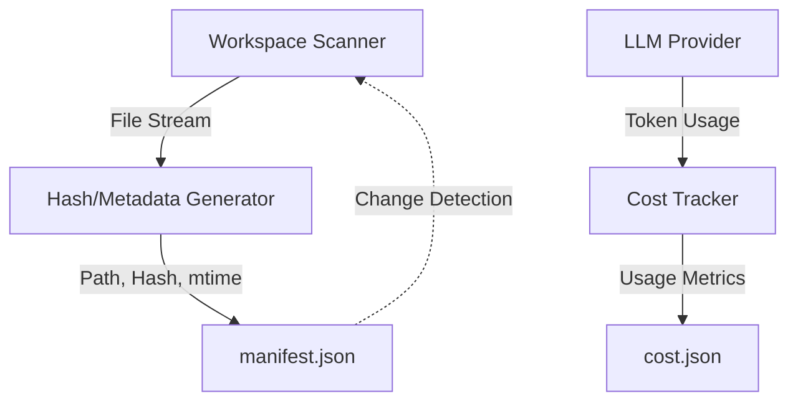

# graphify-out

# graphify-out

The `graphify-out` module serves as the persistence and metadata layer for the Hermes Agent's workspace analysis. It stores structured data regarding file integrity, modification states, and resource consumption metrics. This module is critical for incremental processing, ensuring the agent only re-analyzes files that have changed and providing an audit trail for LLM token usage.

## Core Components

The module consists of two primary JSON artifacts that represent the state of the project at a specific point in time.

### 1. manifest.json
This file acts as the project's "fingerprint." It contains a comprehensive mapping of every file within the agent's scope to its respective metadata.

*   **Key**: The absolute file path on the local system.
*   **mtime**: The Unix timestamp of the last modification.
*   **hash**: A unique identifier (typically MD5 or SHA-256) representing the file's content.

**Developer Usage:**
The agent uses this manifest to perform change detection. Before a "graphing" or indexing operation, the system compares the current `mtime` and `hash` of local files against the values stored in `manifest.json`. If the values match, the agent skips the file to save compute resources.

### 2. cost.json
This file tracks the operational overhead of the agent's runs. It provides a historical log of resource usage, which is essential for monitoring API costs and processing efficiency.

*   **date**: ISO 8601 timestamp of the execution run.
*   **input_tokens / output_tokens**: The volume of LLM traffic generated during the run.
*   **files**: The total number of files processed or indexed in that specific session.
*   **total_input_tokens / total_output_tokens**: Aggregated totals across all recorded runs.

## Execution Flow

The `graphify-out` artifacts are updated at the end of a workspace analysis cycle. The following diagram illustrates how the data is generated and persisted:

## Integration with Hermes Agent

The module is tightly coupled with the core agent logic in the following ways:

1.  **Incremental Indexing**: The `manifest.json` allows the agent to maintain a "hot" state of the codebase. Without this module, the agent would be forced to re-process the entire 2,600+ file repository on every launch.
2.  **Budgeting and Quotas**: The `cost.json` data is consumed by the CLI's status and quota commands (e.g., `gquota`) to inform the user of their current spending and remaining limits.
3.  **Integrity Verification**: During `doctor` or `setup` commands, the agent references the manifest to ensure that the local environment hasn't been corrupted or desynchronized from the expected state.

## Maintenance

These files are automatically managed by the agent. However, if the workspace state becomes inconsistent, developers can safely delete the `graphify-out` directory. This will force the agent to perform a full, non-incremental re-indexing of the project on the next run, regenerating both the manifest and the cost baseline.