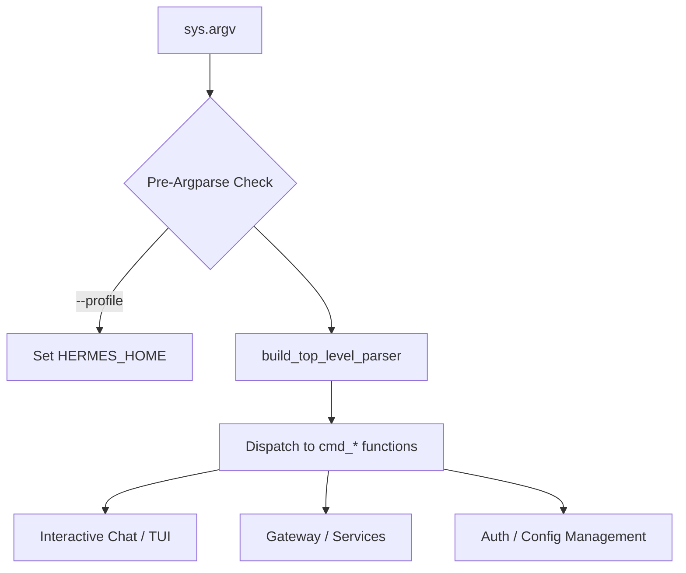

# hermes_cli

# hermes_cli

The `hermes_cli` module serves as the unified entry point and command-line interface for the Hermes Agent. It handles command parsing, multi-provider authentication, configuration management, and service orchestration (gateway, web server, and cron).

## Command Architecture

The CLI is built on `argparse`, but uses a decoupled structure to allow for dynamic command dispatch and "relaunch" capabilities.

### Parser Construction (`_parser.py`)
The top-level parser is constructed in `build_top_level_parser()`. It distinguishes between standard arguments and **Inherited Flags**.

*   **Inherited Flags**: Marked via `_inherited_flag`, these arguments are tagged with `inherit_on_relaunch = True`. This allows the `hermes_cli.relaunch` module to introspect the parser and carry these flags over when the CLI re-executes itself (e.g., after a session picker or setup wizard completes).
*   **Pre-Argparse Flags**: Flags like `--profile` or `-p` are consumed by `main._apply_profile_override` before the main parser runs to set the `HERMES_HOME` environment variable.

### Execution Flow

## Authentication System (`auth.py`)

The authentication system is a multi-provider engine supporting OAuth 2.0 (Device Code and PKCE flows), API keys, and external credential pooling.

### Provider Registry
All supported providers are defined in the `PROVIDER_REGISTRY` using the `ProviderConfig` dataclass. This registry maps provider IDs (e.g., `nous`, `anthropic`, `openai-codex`) to their specific authentication requirements and base URLs.

### Credential Resolution Logic
The `resolve_provider()` function determines the active inference source based on a strict priority:
1.  **Active Provider**: The provider currently marked as active in `~/.hermes/auth.json`.
2.  **Explicit CLI Overrides**: `--api-key` or `--base-url` passed directly.
3.  **Environment Variables**: Presence of `OPENAI_API_KEY`, `ANTHROPIC_API_KEY`, etc.
4.  **Auto-Detection**: Probing for local servers (LM Studio) or specific key prefixes (e.g., `sk-kimi-` for Kimi Coding).

### Persistence and Locking
Auth state is stored in `~/.hermes/auth.json`. To prevent corruption during concurrent access (e.g., a background gateway and a foreground chat session both refreshing tokens), the module implements a cross-process advisory lock:
*   **Unix**: Uses `fcntl.flock`.
*   **Windows**: Uses `msvcrt.locking`.
*   **Reentrancy**: The `_auth_store_lock` context manager is thread-local aware and supports reentrant calls within the same process.

### Specialized Auth Flows
*   **Nous Portal**: Implements OAuth Device Code flow and "Agent Key" minting (short-lived keys for inference).
*   **OpenAI Codex**: Manages a separate session from the official Codex CLI to avoid refresh token rotation conflicts.
*   **Spotify**: Implements a local loopback HTTP server (`_SpotifyCallbackHandler`) to handle OAuth PKCE redirects for tool authorization.

## Configuration and Environment

The CLI manages several files within `HERMES_HOME` (defaulting to `~/.hermes`):
*   `config.yaml`: User preferences, model assignments, and toolset toggles.
*   `.env`: Local environment variables and API keys.
*   `auth.json`: Persisted OAuth tokens and active provider state.
*   `gateways.json`: Configuration for messaging platform integrations.

## Internal Web Server (`web_server.py`)

The module includes a lightweight web server used primarily by the TUI and external integrations to:
*   **Status Monitoring**: Retrieve system health, running PIDs, and active sessions via `get_status()`.
*   **Session Management**: Search and retrieve message history using `hermes_state`.
*   **OAuth Orchestration**: Provides endpoints like `_start_anthropic_pkce` to facilitate browser-based logins that feed credentials back into the CLI's `credential_pool`.

## Plugin and Hook System (`plugins.py`)

The CLI supports a hook system that allows external modules to intercept agent actions.
*   **`invoke_hook(hook_name, ...)`**: Triggers registered shell hooks or Python plugins.
*   **Tool Approval**: The `--yolo` flag and `hooks_auto_accept` config setting bypass interactive prompts for dangerous tool executions.

## Key Functions for Contributors

| Function | Purpose |
| :--- | :--- |
| `resolve_runtime_provider()` | The main entry point for the agent to get a valid API key and base URL. |
| `build_top_level_parser()` | Where to add new global CLI flags or subcommands. |
| `_load_auth_store()` | Safely reads the auth JSON; handles migrations and corruption recovery. |
| `login_spotify_command()` | Reference implementation for adding new OAuth-based tool providers. |
| `detect_zai_endpoint()` | Example of dynamic endpoint probing based on API key capabilities. |