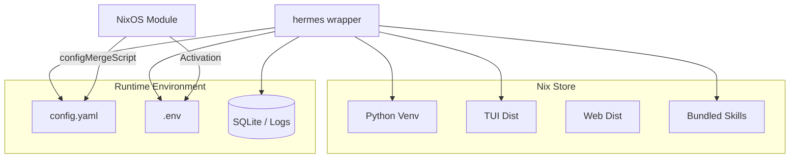

# nix

# Nix Infrastructure

The `nix` module provides the build, development, and deployment infrastructure for the Hermes Agent. It leverages `uv2nix` for reproducible Python environments, `buildNpmPackage` for frontend components, and provides a sophisticated NixOS module supporting both native systemd and OCI container execution modes.

## Core Packaging Architecture

The primary package is defined in `hermes-agent.nix`. It acts as an aggregator that bundles the Python virtual environment, the TUI, the Web dashboard, and bundled assets (skills and plugins).

### Python Environment (`python.nix`)
The Python environment is managed via `uv2nix`, which transforms `uv.lock` into a Nix-native dependency graph.
- **Platform Overrides**: `python.nix` contains specific overrides for `aarch64-darwin` (macOS Silicon). Since some wheels (like `onnxruntime` or `faster-whisper`) are unavailable or incompatible, it maps these to Nixpkgs-provided versions using `hacks.nixpkgsPrebuilt`.
- **Sealed Venv**: The environment is built as a sealed virtual environment, ensuring that the core agent dependencies are immutable and isolated.

### The Wrapper (`hermes-agent.nix`)
The `hermes` binary is a shell wrapper created via `makeWrapper`. It injects critical environment variables that the Python source uses to locate assets:
- `HERMES_BUNDLED_SKILLS`: Points to the immutable skills directory in the Nix store.
- `HERMES_BUNDLED_PLUGINS`: Points to the immutable plugins directory.
- `HERMES_TUI_DIR`: Points to the compiled Ink/React TUI.
- `HERMES_PYTHON`: Points to the specific Python interpreter in the venv.
- `PYTHONPATH`: Dynamically extended if `extraPythonPackages` are provided.

### Collision Detection
To prevent runtime errors when users add `extraPythonPackages` (e.g., for plugins), the derivation includes a `checkPackageCollisions` script. This script runs during the install phase, scanning the metadata of extra packages to ensure they do not overlap with the core sealed virtual environment.

## Frontend Builds

The agent includes two Node.js-based frontends, both managed via `lib.nix` helpers.

- **TUI (`tui.nix`)**: A React/Ink-based terminal interface. It handles complex `node_modules` structures, including local file dependencies like `@hermes/ink`.
- **Web (`web.nix`)**: A Vite/React dashboard.
- **Lockfile Management**: `lib.nix` provides `mkNpmPassthru`, which normalizes trailing newlines in `package-lock.json` to prevent `npmConfigHook` mismatches. It also provides the `fix-lockfiles` utility to automatically update Nix hashes when NPM dependencies change.

## NixOS Module (`nixosModules.nix`)

The NixOS module provides a declarative way to deploy the Hermes Agent. It supports two distinct execution modes:

### 1. Native Mode
Runs as a standard systemd service. The agent runs directly on the host, using tools provided in the service's `path` and `extraPackages`.

### 2. Container Mode
Runs the agent inside an OCI container (Docker or Podman).
- **Persistent Writable Layer**: Unlike standard Nix containers, this mode bind-mounts the Nix store read-only but allows the container's root filesystem to be writable. This enables the agent to use `apt`, `pip`, and `uv` to modify its own environment at runtime.
- **Provisioning**: The `containerEntrypoint` script handles first-boot setup, installing `nodejs`, `uv`, and creating a writable Python 3.12 venv at `~/.venv`.
- **Host Integration**: If `container.hostUsers` is set, the module creates symlinks from the host user's `~/.hermes` to the service's state directory, allowing the host CLI to transparently `exec` into the running container.

### Configuration Merging
The module uses `configMergeScript.nix` (a Python helper) during activation. This script performs a deep merge between the declarative Nix `settings` and the existing `config.yaml` on disk.
- **Priority**: Nix-defined keys always override existing values.
- **Preservation**: User-defined keys (like manually added skills or custom tool settings) are preserved.
- **Managed Guard**: The module creates a `.managed` file in `HERMES_HOME`. When `HERMES_MANAGED=true` is set, the Hermes CLI blocks mutation commands (like `config set`) to prevent drift from the Nix configuration.

## Development Environment (`devShell.nix`)

The development shell is designed to bridge the gap between Nix and imperative workflows:
- **Automatic Setup**: It uses `passthru.devShellHook` to automatically run `uv pip install` or `npm install` when entering the shell.
- **Stamp Checking**: Setup logic is wrapped in "stamps" (stored in `.nix-stamps/`). Dependencies are only re-installed if `pyproject.toml`, `uv.lock`, or `package-lock.json` have changed.

## Build-time Verification (`checks.nix`)

The `checks` attribute provides automated testing of the Nix infrastructure:
- **cross-eval**: Verifies that the package evaluates on Linux and Darwin without requiring a remote builder.
- **config-roundtrip**: A comprehensive test suite that runs the `configMergeScript` against seven different scenarios (fresh install, overrides, additive MCP merges, etc.) and verifies the result using the actual `hermes_cli.config.load_config` Python logic.
- **package-contents**: Ensures all entry points (`hermes`, `hermes-agent`, `hermes-acp`) are present and executable.

## Key Environment Variables
| Variable | Purpose |
| :--- | :--- |
| `HERMES_HOME` | Root directory for state, config, and logs. |
| `HERMES_MANAGED` | Disables CLI configuration mutations. |
| `HERMES_BUNDLED_SKILLS` | Path to read-only skills provided by the Nix package. |
| `HERMES_TUI_DIR` | Path to the compiled TUI assets. |
| `HERMES_NODE` | Path to the Node.js binary (required for TUI regex support). |