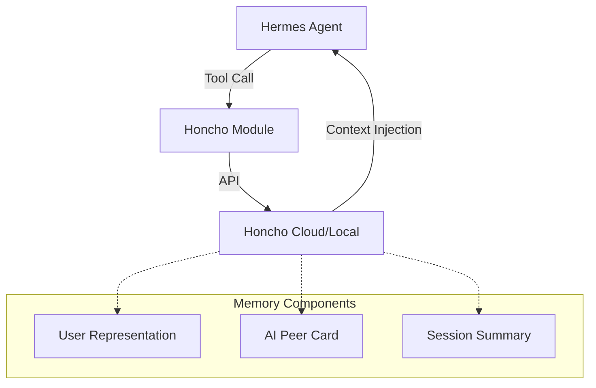

# optional-skills — autonomous-ai-agents

# Autonomous AI Agents Module

The `autonomous-ai-agents` module provides optional integrations for delegating complex tasks to external coding agents and managing sophisticated, cross-session memory. It extends the Hermes agent's capabilities by allowing it to act as an orchestrator for other specialized AI systems.

## Module Overview

This module consists of two primary integrations:
1.  **Blackbox CLI**: An external coding agent capable of multi-model reasoning and autonomous file manipulation.
2.  **Honcho**: An AI-native memory layer that provides cross-session user modeling, dialectic reasoning, and peer-based identity management.

---

## Blackbox CLI Integration

The Blackbox integration allows Hermes to delegate coding tasks to the [Blackbox AI CLI](https://github.com/blackboxaicode/cli). Blackbox is unique because it dispatches tasks to multiple LLMs (Claude, GPT-4, Gemini) and uses an internal "judge" to select the best implementation.

### Execution Patterns

#### 1. One-Shot Delegation
For simple tasks, use the `terminal` tool to invoke the CLI directly.
```python
# Example: Adding a feature to an existing codebase
terminal(
    command="blackbox --prompt 'Add JWT authentication with refresh tokens to the Express API'", 
    workdir="/path/to/project", 
    pty=true
)
```

#### 2. Background Execution (Long-Running Tasks)
For tasks that may take several minutes, use background mode to prevent blocking the main Hermes execution loop.
```python
# Start the task
terminal(
    command="blackbox --prompt 'Refactor the auth module'", 
    background=true, 
    pty=true
)

# Monitor via the process tool
process(action="poll", session_id="<id>")
process(action="log", session_id="<id>")
```

### Critical Requirements
*   **PTY Requirement**: The Blackbox CLI is an interactive terminal application. You **must** set `pty=true` in all `terminal` calls, or the process will hang indefinitely.
*   **Checkpoints**: Blackbox generates checkpoint tags (e.g., `task-abc123-2026-03-06`). These can be used with the `--resume-checkpoint` flag to continue a task in a later session.

---

## Honcho Memory System

Honcho provides persistent, cross-session memory. It models conversations as interactions between **Peers** (the User and the AI) within a shared **Workspace**.

### Architecture & Data Flow



### Recall Modes
The integration supports three modes of memory access, configured via `recallMode`:
*   **`hybrid` (Default)**: Automatically injects context into the system prompt and provides tools for explicit memory access.
*   **`context`**: Only uses auto-injection. Tools are hidden to save tokens and reduce complexity.
*   **`tools`**: No auto-injection. The agent must explicitly call Honcho tools to retrieve information.

### The Dialectic Engine
Honcho uses a "dialectic" reasoning engine to synthesize answers about the user. This is controlled by three orthogonal settings:
1.  **Cadence**: How often the engine fires (e.g., `dialecticCadence: 2` fires every other turn).
2.  **Depth**: How many rounds of reasoning are performed (1-3). Higher depth runs an internal audit/reconcile cycle.
3.  **Level**: The intensity of the reasoning (`minimal` to `max`).

### Toolset Reference

| Tool | Purpose |
| :--- | :--- |
| `honcho_profile` | Read/Update the Peer Card (name, role, preferences). No LLM cost. |
| `honcho_search` | Semantic search for raw excerpts from past conversations. |
| `honcho_context` | Retrieve a full snapshot: summary, representation, and recent messages. |
| `honcho_reasoning` | Ask a natural language question to be answered by the dialectic engine. |
| `honcho_conclude` | Write a persistent fact (Conclusion) to the user or AI representation. |

### Multi-Profile Peer Isolation
Each Hermes profile (e.g., `default`, `coder`, `researcher`) is assigned a unique **AI Peer**. 
*   **Shared Workspace**: All profiles see the same User Representation.
*   **Isolated Identity**: Each profile builds its own AI Peer Card and self-observations, allowing different agent personalities to maintain distinct self-knowledge while knowing the same user.

---

## Configuration & Setup

### Blackbox Setup
Requires the CLI and an API key:
1. `npm install -g @blackboxai/cli`
2. `blackbox configure`

### Honcho Setup
Honcho can be configured via the Hermes CLI:
```bash
hermes honcho setup    # Interactive wizard
hermes honcho status   # Verify connection and peer info
```

Settings are stored in `honcho.json`. Key configuration keys include:
*   `sessionStrategy`: Determines session boundaries (`per-directory`, `per-repo`, `global`).
*   `contextTokens`: An optional cap on the size of the injected context block to prevent prompt blowup.
*   `observation`: Booleans (`observeMe`, `observeOthers`) controlling what the agent learns from.