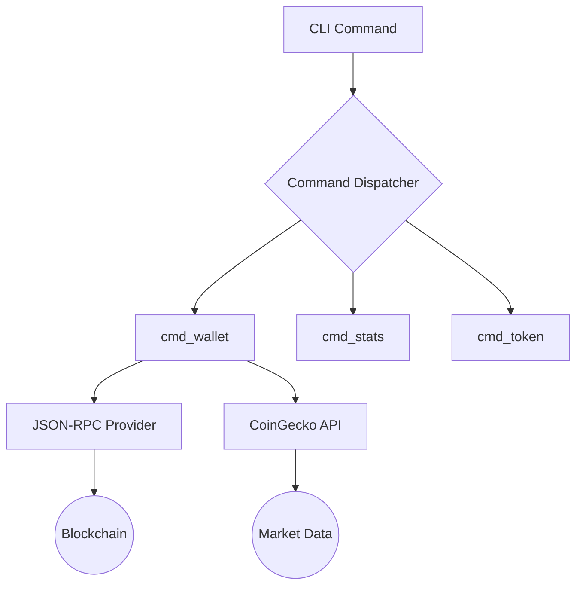

# optional-skills — blockchain

# Optional Skills — Blockchain Module

The `blockchain` module provides lightweight, zero-dependency CLI tools for querying on-chain data from the **Base (Ethereum L2)** and **Solana** networks. These tools are designed for the Hermes Agent to perform wallet audits, token lookups, and network health checks without requiring heavy libraries like `web3.py` or `solana-py`.

## Architecture Overview

Both sub-modules (`base` and `solana`) follow a similar architectural pattern:
1.  **JSON-RPC Interface:** Communicates directly with blockchain nodes using `urllib`.
2.  **Pricing Integration:** Enriches on-chain data with USD values via the CoinGecko Public API.
3.  **Zero-Dependency Design:** Uses only the Python standard library for maximum portability.
4.  **Batching & Retries:** Implements custom RPC batching and exponential backoff for rate-limited endpoints.



---

## Base (Ethereum L2) Module

The Base module interacts with the Ethereum L2 ecosystem. It handles EVM-specific logic such as ABI encoding for `eth_call` and EIP-1967 proxy resolution.

### Key Components

#### RPC & ABI Helpers
- `_rpc_call(method, params)`: The core transport layer for JSON-RPC.
- `rpc_batch(calls)`: Automatically chunks requests into groups of 10 to respect public RPC limits.
- `_eth_call(to, selector, args)`: Low-level helper to execute contract reads.
- `_decode_string(hex_data)` / `_decode_uint(hex_data)`: Manual ABI decoding for ERC-20 metadata (name, symbol, decimals).

#### Core Logic
- **`cmd_wallet`**: Queries ETH balance and iterates through `KNOWN_TOKENS` to call `balanceOf`. Note that unlike Solana, EVM chains require explicit contract addresses to find balances.
- **`cmd_contract`**: Inspects an address to determine if it is an EOA or a contract. It checks for ERC-20, ERC-721, and ERC-1155 interfaces using `supportsInterface` (ERC-165) and resolves EIP-1967 proxy implementation slots.
- **`cmd_gas`**: Provides L2 execution cost estimates. It calculates a 10-block trend for base fees and block utilization.

### Configuration
- **`BASE_RPC_URL`**: Environment variable to override the default `https://mainnet.base.org`.
- **`KNOWN_TOKENS`**: A hardcoded dictionary of high-liquidity tokens (USDC, AERO, DEGEN) used for fast lookups and fallback metadata.

---

## Solana Module

The Solana module handles the unique account-based model of the Solana blockchain, including SPL tokens and NFTs.

### Key Components

#### RPC Helpers
- `_rpc_call(method, params)`: Standard Solana JSON-RPC wrapper.
- `rpc_batch(calls)`: Supports batching multiple requests into a single HTTP POST.
- `lamports_to_sol(lamports)`: Utility to convert the native unit (10^9) to SOL.

#### Core Logic
- **`cmd_wallet`**: Uses `getTokenAccountsByOwner` to retrieve all SPL token holdings in a single call. This allows for comprehensive portfolio discovery, unlike the Base module which relies on a known-token list.
- **`cmd_nft`**: Implements a heuristic to identify NFTs by filtering for SPL accounts where `amount == 1` and `decimals == 0`.
- **`cmd_tx`**: Parses transaction signatures. It calculates balance changes by comparing `preBalances` and `postBalances` from the transaction metadata.
- **`cmd_whales`**: Scans the latest block for transactions exceeding a specific SOL threshold (default 1000 SOL).

### Configuration
- **`SOLANA_RPC_URL`**: Environment variable to override the default public mainnet-beta endpoint.
- **`KNOWN_TOKENS`**: Maps mint addresses to symbols (e.g., `So111...` to `SOL`).

---

## Common Implementation Patterns

### Pricing Engine
Both modules share a similar pricing strategy in `fetch_prices()`:
- It targets the CoinGecko `/simple/token_price` endpoint.
- Because the CoinGecko free tier is rate-limited, the scripts implement a 1-second sleep between individual token lookups.
- Users can pass `--no-prices` to skip these calls and return raw on-chain data immediately.

### Error Handling & Rate Limiting
The modules implement a robust retry mechanism in `_http_get_json` and `_rpc_call`:
- **HTTP 429 (Too Many Requests):** Triggers an exponential backoff (2.0s, 4.0s).
- **RPC Errors:** The scripts catch JSON-RPC error objects and exit gracefully with a descriptive message rather than a stack trace.

### Data Enrichment
Functions like `_token_label` and `resolve_token_name` provide a "best-effort" approach to human-readable data:
1.  Check `KNOWN_TOKENS` (Instant).
2.  Query on-chain metadata (RPC call).
3.  Query CoinGecko (API call).
4.  Fallback to abbreviated addresses (e.g., `0xabc...123`).

## Usage for Developers

When contributing to this module, ensure that any new commands follow the `cmd_<name>(args)` pattern and are registered in the `main()` dispatcher. 

### Adding a Known Token
To add a token to the fast-path lookup, update the `KNOWN_TOKENS` dictionary in the respective client script:
- **Base:** Requires `(symbol, name, decimals)`.
- **Solana:** Requires `(symbol, name)`.

### Testing
Verify connectivity and basic functionality using the `stats` command:
```bash
python3 base_client.py stats
python3 solana_client.py stats
```