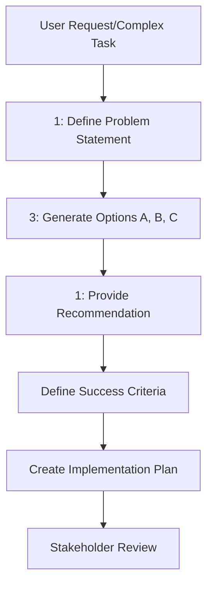

# optional-skills — communication

# Communication Module: 1-3-1 Rule

The `communication` module provides structured frameworks for decision-making and stakeholder reporting. Its primary component is the `one-three-one-rule`, a skill designed to transform complex technical trade-offs into actionable proposals.

## Overview

The **1-3-1 Rule** is a communication pattern used when a task has multiple viable paths. It prevents "analysis paralysis" by forcing a specific structure:
- **1** Clear Problem Statement
- **3** Distinct Options
- **1** Concrete Recommendation

This module is intended for use in architecture discussions, tool selection, refactoring strategies, and migration paths where stakeholders require a clear rationale for a chosen direction.

## Module Structure

### 1-3-1 Framework Components

| Component | Requirement | Description |
| :--- | :--- | :--- |
| **Problem** | Single Sentence | A concise statement of the core issue. It must focus on the *what*, avoiding implementation details or technology names. |
| **Options** | Exactly Three | Three distinct, viable strategies labeled A, B, and C. Each must include specific Pros and Cons. |
| **Recommendation** | Single Choice | A direct selection of one option based on professional judgment and the specific project context. |
| **Definition of Done** | Verifiable Criteria | A list of concrete outcomes that signal the recommended path is successfully completed. |
| **Implementation Plan** | Actionable Steps | The sequence of commands, tools, or code changes required to execute the recommendation. |

## Logic Flow

The module follows a linear progression from problem framing to execution planning. If the user rejects the initial recommendation in favor of one of the other two options, the `Definition of Done` and `Implementation Plan` must be dynamically updated to reflect the new choice.

## Usage Guidelines

### When to Trigger
The `one-three-one-rule` should be invoked when:
- The user explicitly requests a "1-3-1".
- The user asks for "options" or "choices" regarding a technical path.
- A task involves significant trade-offs (e.g., choosing between a library vs. custom implementation).
- The output needs to be forwarded to a team lead or stakeholder for approval.

### Constraints
- **No Hedging:** The recommendation must be decisive. Avoid "it depends" without picking a side.
- **Distinct Options:** Options must represent different strategies (e.g., "Buy vs. Build vs. Status Quo"), not minor configuration tweaks.
- **Atomicity:** The problem statement must address exactly one core issue. If "and" is required to describe the problem, the scope is likely too broad.

## Metadata and Integration

The skill is registered under the `communication` category with the following metadata:

- **Tags:** `communication`, `decision-making`, `proposals`, `trade-offs`
- **Version:** 1.0.0
- **License:** MIT

As an "optional-skill," it is designed to be layered onto standard task execution when the complexity of a decision warrants a formal proposal structure. It does not have external dependencies or outgoing calls, making it a pure logic/formatting framework.