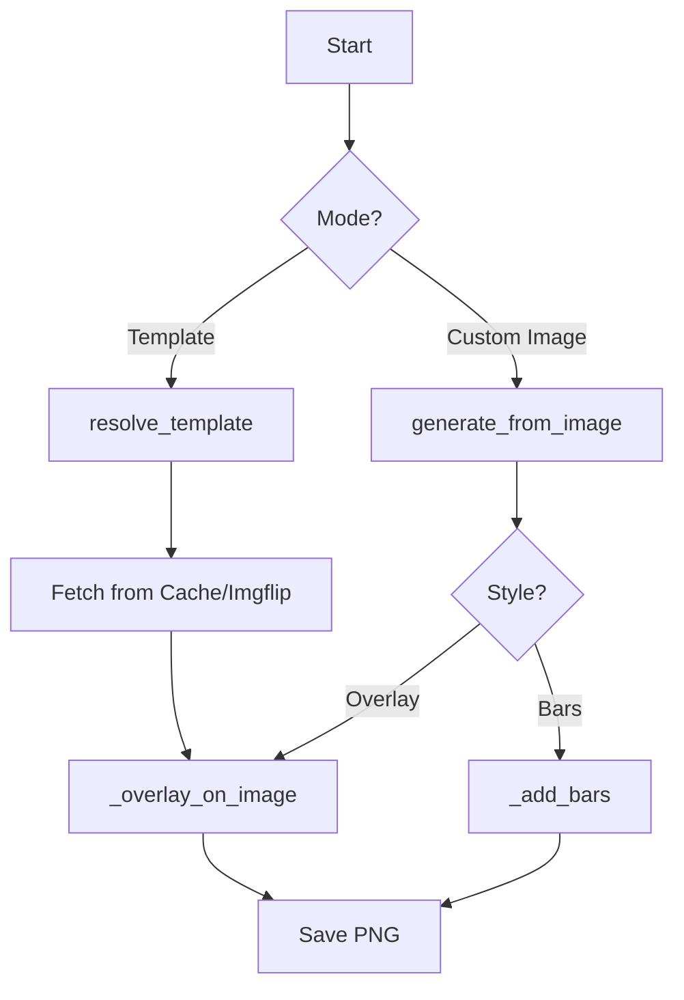

# optional-skills — creative

# Optional Skills: Creative Module

The `optional-skills/creative` module provides a suite of tools for generating visual assets and controlling 3D environments. It is divided into three primary sub-modules: **Blender MCP**, **Concept Diagrams**, and **Meme Generation**.

---

## Blender MCP

The Blender MCP sub-module enables remote control of a running Blender instance (version 4.3+) via a TCP socket connection. This allows the agent to programmatically model, animate, and render 3D scenes.

### Connection Protocol
Communication occurs over TCP port **9876** using plain UTF-8 JSON.
- **Host:** `localhost`
- **Port:** `9876`
- **Format:** `{"type": "<command>", "params": {<kwargs>}}`

### Core Commands
| Command | Description |
|:---|:---|
| `execute_code` | Runs arbitrary Python code using the `bpy` (Blender Python) API. |
| `get_scene_info` | Returns a list of all objects currently in the scene. |
| `get_object_info` | Provides detailed metadata for a specific named object. |
| `get_viewport_screenshot` | Captures the current Blender viewport as an image. |

### Python Integration
The module includes a `blender_exec` helper function to manage the socket lifecycle, handling connection, payload serialization, and buffered response reading.

```python
def blender_exec(code: str, host="localhost", port=9876):
    # Connects to Blender, sends JSON payload, and returns parsed result
    # Handles JSONDecodeError for partial chunks and socket timeouts
```

---

## Concept Diagrams

This sub-module generates minimal, educational-style SVG diagrams embedded in standalone HTML files. It uses a unified design system that automatically supports light and dark modes.

### Design System & CSS Classes
The module relies on `templates/template.html`, which contains a comprehensive CSS framework for SVGs.

- **Color Ramps:** 9 semantic ramps (`c-purple`, `c-teal`, `c-coral`, `c-pink`, `c-gray`, `c-blue`, `c-green`, `c-amber`, `c-red`). Each ramp automatically adjusts fill and stroke colors based on the user's system theme.
- **Typography:**
    - `.th`: Header text (14px, Medium weight).
    - `.ts`: Subtitle/Small text (12px, Regular weight).
    - `.t`: Standard body text (14px, Regular weight).
- **Shapes:** Standardized rounding (`rx="8"` for nodes) and stroke widths (`0.5px`).

### Workflow
1. **Load Template:** Read `templates/template.html`.
2. **Generate SVG:** Construct an SVG string using the provided boilerplate (including the `<marker id="arrow">` definition).
3. **Inject Content:** Replace placeholders `<!-- DIAGRAM TITLE HERE -->` and `<!-- PASTE SVG HERE -->`.
4. **Export:** Save as a `.html` file for browser viewing.

### Specialized Patterns
The module includes reference files for specific domains:
- `infrastructure-patterns.md`: Hub-spoke layouts, solar panels, wind turbines, and semantic line styles (e.g., `.data-line`, `.power-line`).
- `dashboard-patterns.md`: UI mockups with dark "screens" and status indicators.
- `physical-shape-cookbook.md`: Guidance for using `<path>` and `<polygon>` for complex physical objects like aircraft or anatomy.

---

## Meme Generation

The Meme Generation sub-module produces `.png` files by overlaying text on image templates using the `Pillow` library.

### Execution Flow
The primary entry point is `scripts/generate_meme.py`. It supports two distinct modes of operation:



### Template Resolution
The `resolve_template` function searches for templates in three stages:
1. **Curated:** Matches against `scripts/templates.json` (10 templates with hand-tuned text coordinates like `drake` or `distracted-boyfriend`).
2. **Slug Match:** Matches slugified names against curated IDs.
3. **Imgflip API:** Fetches popular templates from the Imgflip API, caching the metadata in `.cache/imgflip_memes.json` for 24 hours.

### Text Rendering Logic
- **`draw_outlined_text`**: Renders white text with a black outline for legibility. It includes an auto-scaling loop that reduces font size until the text fits the designated `w_pct` (width percentage) of the template.
- **`_wrap_text`**: Performs word-wrapping to ensure text does not overflow the horizontal bounds.
- **`_add_bars`**: Used for custom images where text might obscure the subject. It adds black bars to the top and bottom of the image, resizing the canvas to accommodate the text.

### CLI Usage
```bash
# Generate using a curated template
python generate_meme.py drake /tmp/meme.png "Option A" "Option B"

# Generate using a custom background image with bars
python generate_meme.py --image background.png --bars /tmp/meme.png "Top Caption" "Bottom Caption"

# Search for templates
python generate_meme.py --search "cat"
```

### Dependencies
- **Pillow:** Image processing and text rendering.
- **Requests:** (Optional) For fetching remote templates; falls back to `urllib`.
- **Fonts:** Searches for `Impact.ttf` or `LiberationSans-Bold.ttf` across standard Linux and macOS system paths.