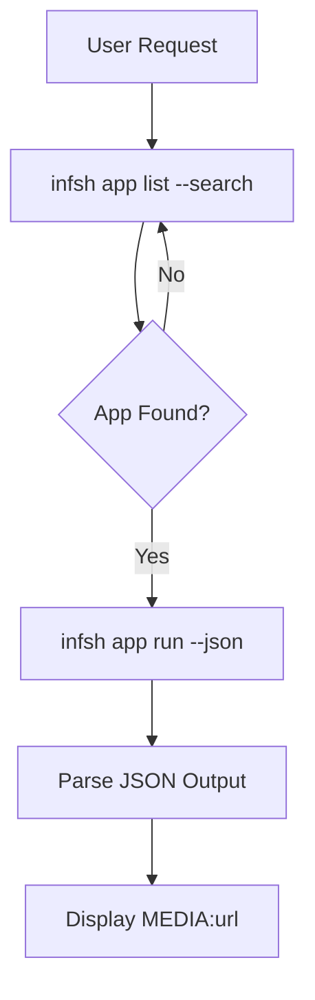

# optional-skills — devops

# DevOps Module

The `devops` module provides a suite of tools for managing cloud-based AI inference and local container infrastructure. It is divided into two primary functional areas: the **inference.sh CLI** for AI application execution and **Docker Management** for container orchestration.

## Inference.sh CLI (`infsh`)

The `inference-sh-cli` sub-module enables the execution of over 150 AI applications (LLMs, image generation, video creation, 3D, and search) directly from the terminal. It abstracts complex provider APIs into a unified command-line interface.

### Core Workflow

The module follows a strict "Search-Run-Parse" pattern to ensure accuracy and handle the dynamic nature of the app catalog.



### Key Commands

*   **Authentication**: Managed via `infsh login` or the `INFSH_API_KEY` environment variable. Use `infsh me` to verify the session.
*   **Discovery**: 
    *   `infsh app list --search <term>`: Always used before execution to find the correct `namespace/app-id`.
    *   `infsh app get <app-id> --json`: Retrieves the input schema (JSON) required for the app.
*   **Execution**:
    *   `infsh app run <app-id> --input '<json>' --json`: Executes the app. The `--json` flag is mandatory for machine-readable output.
    *   **Local File Handling**: The CLI automatically handles uploads if a local path is provided in the input JSON (e.g., `{"image": "./photo.jpg"}`).
*   **Task Management**: For long-running tasks (like video generation), use `infsh task get <task-id>` to poll for completion.

### Implementation Patterns

When contributing to this module, follow these patterns:
1.  **Never Hardcode IDs**: App IDs can change. Always implement a search step.
2.  **Media Presentation**: Output URLs from the JSON response should be prefixed with `MEDIA:` to trigger inline rendering in supported interfaces.
3.  **Timeout Handling**: Video generation can take >60s. Ensure the terminal tool timeout is configured appropriately or use the `--no-wait` flag combined with task polling.

---

## Docker Management

The `docker-management` sub-module provides a standardized interface for managing the lifecycle of containers, images, volumes, and networks. It relies on the native Docker CLI and Docker Compose v2.

### Functional Domains

The module categorizes operations into six domains:

1.  **Container Lifecycle**: `run`, `stop`, `start`, `restart`, `rm`.
2.  **Interaction**: `exec` (shell access), `logs` (debugging), `cp` (file transfer), `stats`.
3.  **Image Management**: `build` (using BuildKit), `pull`, `push`, `tag`, `prune`.
4.  **Docker Compose**: Managing multi-service stacks via `up`, `down`, and `ps`.
5.  **Infrastructure**: Managing `volumes` for persistence and `networks` for service discovery.
6.  **Maintenance**: System-wide cleanup using `docker system df` and `prune`.

### Common Patterns

#### Container Execution
For background services, use detached mode with explicit naming:
```bash
docker run -d --name <name> -p <host>:<container> -e KEY=VAL <image>
```

#### Debugging
To analyze a crashing container, the module utilizes a combination of logs and inspection:
```bash
docker logs --tail 100 <name>
docker inspect <name>
docker stats --no-stream
```

#### Dockerfile Optimization
The module promotes the following best practices for image creation:
*   **Multi-stage builds**: Separating build-time dependencies from the runtime environment.
*   **Layer Caching**: Ordering instructions from least-frequently changed (base image, OS deps) to most-frequently changed (source code).
*   **Base Image Selection**: Preferring `alpine` or `slim` variants to minimize attack surface and footprint.

### Safety and Cleanup
The module includes safeguards for destructive operations. `docker system prune -a --volumes` should never be executed without explicit user confirmation, as it removes all unused images and named volumes.

## Integration with Terminal Tools

Both sub-modules are designed to be invoked via a **terminal toolset**. They expect a shell environment where `infsh` and `docker` binaries are available in the `PATH`. 

*   **Error Handling**: The module interprets exit codes (e.g., 127 for command not found, 137 for OOM kill) to provide actionable feedback.
*   **Output Parsing**: Prefers JSON output (`--json` for `infsh`, `docker inspect` for Docker) to avoid fragile regex-based parsing of stdout.