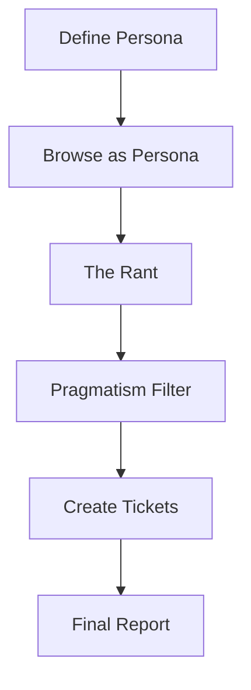

# optional-skills — dogfood

# Dogfood — Advanced QA & Testing Skills

The **Dogfood** module provides specialized QA workflows designed to surface product-level friction that standard automated testing or traditional QA often misses. Unlike unit or integration tests that verify technical correctness, these skills focus on user experience (UX), accessibility, and "cold-start" viability.

## Adversarial UX Test (`adversarial-ux-test`)

The `adversarial-ux-test` skill implements a structured methodology for identifying UX friction by roleplaying a "tech-resistant" persona. It simulates a worst-case user scenario to find where an application fails to provide value or clarity to non-experts.

### Execution Workflow

The skill follows a linear 6-step pipeline to ensure that feedback is both visceral (from the user's perspective) and actionable (from a developer's perspective).

### 1. Persona Engineering
The agent generates or accepts a specific persona characterized by low technical literacy and high skepticism. A valid persona must include:
*   **Tech Comfort Level:** Specific limitations (e.g., "only uses WhatsApp," "hates passwords").
*   **Core Objective:** The single task they need to accomplish.
*   **Friction Threshold:** What specific triggers cause them to abandon the app.

### 2. Adversarial Browsing
The agent navigates the application using browser tools while strictly adhering to the persona's constraints. Key focus areas include:
*   **Terminology:** Identifying developer jargon that confuses laypeople.
*   **Click Depth:** Counting steps to reach the "Aha moment" or core workflow.
*   **Error Recovery:** Testing how the app handles "incorrect" but human inputs.
*   **Visual Accessibility:** Evaluating font sizes, contrast, and click target density.

### 3. The Pragmatism Filter
This is the critical logic layer that separates "persona noise" from actionable product improvements. Every complaint generated during the "Rant" phase is categorized:

| Category | Criteria | Action |
| :--- | :--- | :--- |
| **RED** | Real UX Bug / Accessibility issue | Create high-priority ticket |
| **YELLOW** | Valid but low priority / Edge case | Log in catch-all ticket |
| **GREEN** | Feature Request hidden in complaint | Create feature ticket |
| **WHITE** | Persona Noise ("I hate computers") | Ignore for ticketing; include in report |

### 4. Integration & Output
The module interacts with the project's issue tracker and documentation:
*   **Screenshots:** Captured for every RED and YELLOW finding.
*   **Console Logs:** Checked for JS errors during the browsing phase.
*   **Tickets:** Generated with a mandatory `ux-review` tag. Tickets include the verbatim persona quote to provide context for developers.

### Implementation Guidelines for Contributors

When extending or using this module, adhere to the following patterns:

*   **Context Awareness:** The skill reads project documentation and `DESCRIPTION.md` files to understand the app's purpose before defining the persona.
*   **State Management:** Tests should ideally be run against a "cold start" environment (new user registration) rather than pre-seeded admin accounts to capture onboarding friction.
*   **Constraint Enforcement:** The "Pragmatism Filter" must never be skipped. Raw persona feedback is considered "unprocessed data" and should not be converted directly into tickets without the filtering step.

### Related Skills
*   `dogfood`: The parent skill set for advanced QA workflows.
*   `browser-tools`: Utilized for navigation and DOM inspection during the test.