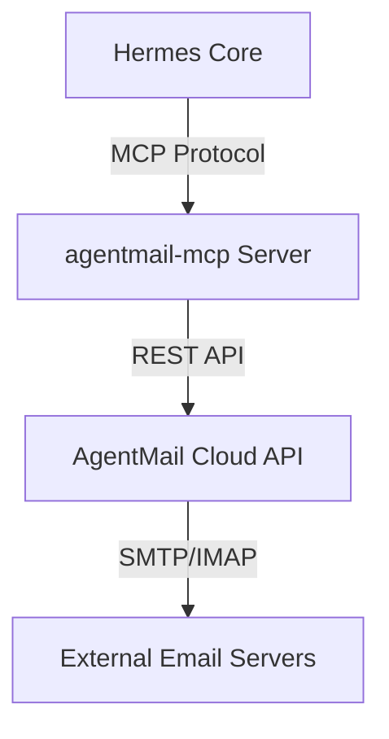

# optional-skills — email

# AgentMail Skill: Autonomous Email Communication

The `agentmail` module provides Hermes agents with dedicated, agent-owned email identities. Unlike traditional email integrations that access a user's existing inbox (like Gmail or IMAP), AgentMail allows the agent to create, manage, and operate its own email addresses (e.g., `agent-name@agentmail.to`) autonomously.

This skill is implemented as an **MCP (Model Context Protocol) server** integration, wrapping the AgentMail API into a set of tools the agent can invoke during execution.

## Architecture

The module operates as a bridge between the Hermes core and the AgentMail cloud infrastructure.



## Configuration

The skill requires an API key from [AgentMail](https://console.agentmail.to). Configuration is handled via the Hermes global config file (`~/.hermes/config.yaml`).

```yaml
mcp_servers:
  agentmail:
    command: "npx"
    args: ["-y", "agentmail-mcp"]
    env:
      AGENTMAIL_API_KEY: "am_your_key_here"
```

### Requirements
- **Node.js 18+**: Required to execute the `agentmail-mcp` package via `npx`.
- **Python `mcp` package**: Required for Hermes to interface with MCP servers.

## Tool Reference

The module exposes 11 tools for comprehensive inbox management.

### Inbox Management
- `create_inbox`: Generates a new email address. Requires a `username`.
- `list_inboxes`: Returns all active inboxes associated with the API key.
- `get_inbox`: Retrieves metadata for a specific inbox ID.
- `delete_inbox`: Permanently removes an inbox.

### Messaging & Threads
- `send_message`: Dispatches a new email. Parameters: `inbox_id`, `to`, `subject`, `text`, and optional `html`.
- `list_threads`: Fetches a list of conversations (threads) for an inbox. This is the primary method for checking for new mail.
- `get_thread`: Retrieves the full history of messages within a specific conversation.
- `reply_to_message`: Sends a reply within an existing thread context.
- `forward_message`: Forwards an existing message to a new recipient.
- `update_message`: Modifies message metadata, such as labels or read/unread status.

### Attachments
- `get_attachment`: Downloads binary data for email attachments.

## Implementation Patterns

### The Polling Pattern
Since the MCP server does not currently support push-based webhooks for local Hermes instances, agents must implement a polling pattern to detect incoming mail:

1.  **Identify Inbox**: Use `list_inboxes` to find the target `inbox_id`.
2.  **Check Threads**: Periodically call `list_threads` to see if the `last_message_at` timestamp has updated.
3.  **Fetch Content**: Use `get_thread` to retrieve the latest message content.

### Identity Management
Agents should typically create a dedicated inbox for specific tasks to maintain context isolation. For example, an agent performing market research might create `research-bot@agentmail.to`, while a support agent uses `support-bot@agentmail.to`.

## Technical Constraints

- **Domain Restrictions**: On the free tier, all addresses use the `@agentmail.to` suffix. Custom domains require a paid AgentMail plan.
- **Rate Limiting**: The free tier is limited to 3,000 emails per month and 3 active inboxes.
- **Persistence**: Inboxes and threads are persisted on the AgentMail servers, allowing agents to maintain long-running conversations across different Hermes sessions.
- **Environment Variables**: Note that `AGENTMAIL_API_KEY` must be hardcoded in the `config.yaml` or provided by the shell environment where Hermes is launched; the MCP configuration does not automatically expand `.env` files from the skill directory.

## Error Handling
The MCP server returns standard JSON-RPC error codes. Common failures include:
- `401 Unauthorized`: Invalid or missing `AGENTMAIL_API_KEY`.
- `404 Not Found`: Attempting to access an `inbox_id` or `thread_id` that has been deleted.
- `429 Too Many Requests`: Exceeding the AgentMail plan limits.