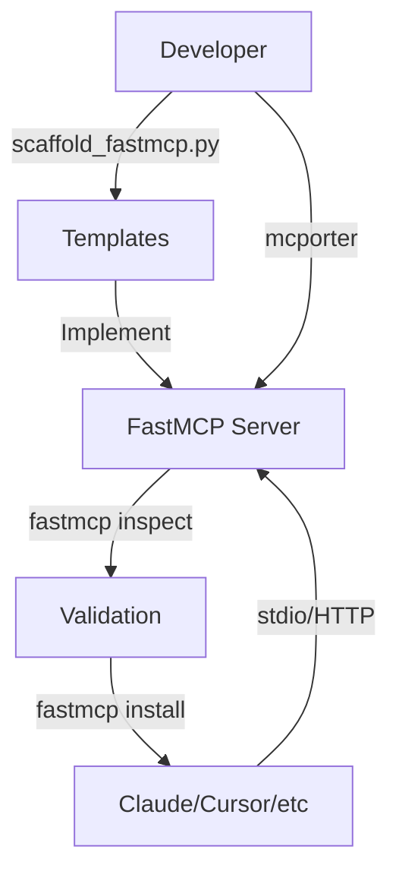

# optional-skills — mcp

# MCP (Model Context Protocol) Module

The `mcp` module provides a comprehensive toolkit for building, testing, and managing Model Context Protocol (MCP) servers. It is divided into two primary sub-modules: **FastMCP** for Python-based server development and **mcporter** for CLI-based server interaction and management.

## Module Architecture

The module facilitates the lifecycle of an MCP server from initial scaffolding to deployment and client integration.



---

## FastMCP: Server Development

FastMCP is the primary framework for creating new MCP servers in Python. It simplifies the exposure of tools, resources, and prompts.

### Scaffolding and Templates
The `scripts/scaffold_fastmcp.py` utility automates server creation by populating templates and replacing the `__SERVER_NAME__` placeholder.

**Usage:**
```bash
python scripts/scaffold_fastmcp.py --template api_wrapper --name "MyAPI" --output ./my_server.py
```

Available templates include:
- `api_wrapper.py`: A REST API integration using `httpx`. It centralizes logic in `_request` and `_headers` to handle authentication and timeouts.
- `database_server.py`: A read-only SQLite interface. It uses `_reject_mutation` to enforce safety by blocking non-`SELECT` queries and `_validate_table_name` to prevent injection.
- `file_processor.py`: A utility for inspecting local files. It uses a shared `_read_text` helper to handle encoding and file-not-found errors.

### Core Decorators
FastMCP servers are built using three primary decorators:
1.  **`@mcp.tool`**: Defines executable functions.
    - *Example:* `summarize_text_file(path: str)` in the file processor template.
2.  **`@mcp.resource`**: Exposes stable, read-only data via URIs.
    - *Example:* `read_file_resource` uses the URI pattern `file://{path}`.
3.  **`@mcp.prompt`**: Provides reusable LLM instruction templates.

### Validation and Testing
Before deployment, servers should be validated using the FastMCP CLI:
- **Inspection**: `fastmcp inspect server.py:mcp` verifies the server object and its capabilities.
- **Local Execution**: `fastmcp run server.py:mcp` starts a stdio session.
- **Direct Calling**: `fastmcp call server.py tool_name arg=value` tests specific tool logic without a full client.

---

## mcporter: Client and Management

`mcporter` is a Node-based CLI tool used to interact with existing MCP servers, whether they are local stdio servers or remote HTTP endpoints.

### Key Capabilities
- **Discovery**: `mcporter list` identifies servers configured in Claude Desktop, Cursor, and other local clients.
- **Ad-hoc Interaction**: Connect to servers without permanent configuration:
  - HTTP: `mcporter list --http-url <url>`
  - Stdio: `mcporter list --stdio "npx @modelcontextprotocol/server-filesystem"`
- **Tool Execution**: Supports multiple argument formats:
  - Key=Value: `mcporter call server.tool key=value`
  - JSON: `mcporter call server.tool --args '{"key": "value"}'`
- **Code Generation**: `mcporter generate-cli` creates standalone CLI wrappers for specific MCP servers, while `mcporter emit-ts` generates TypeScript clients and types.

### Authentication and Persistence
For servers requiring OAuth, `mcporter auth <server>` initiates the browser-based flow. For persistent background connections, the `mcporter daemon` commands manage a long-running process that keeps server connections active.

---

## Deployment Patterns

### HTTP Transport
While MCP often defaults to stdio, FastMCP supports HTTP transport for remote deployment:
```bash
fastmcp run server.py:mcp --transport http --host 0.0.0.0 --port 8000
```

### Client Integration
The `fastmcp install` command automates the registration of servers into specific environments:
- `claude-code`: Installs for the Claude CLI.
- `claude-desktop`: Updates the `claude_desktop_config.json`.
- `cursor`: Configures the server for the Cursor editor.

### Quality Checklist
A production-ready MCP server within this module must:
1. Pass `fastmcp inspect`.
2. Return structured, JSON-serializable data.
3. Handle environment variables for sensitive data (e.g., `API_TOKEN` in `api_wrapper.py`).
4. Implement input validation (e.g., `_validate_table_name` in `database_server.py`).