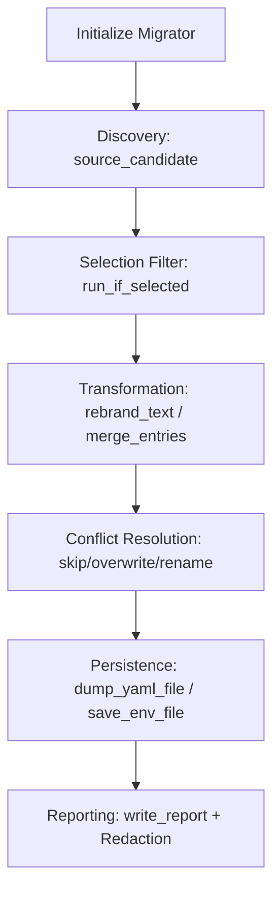

# optional-skills — migration

# Optional Skills — Migration

The `optional-skills/migration` module provides workflows for importing user state, personas, and configurations from external agent systems into Hermes. The primary implementation is the **OpenClaw Migration** skill, which facilitates the transition from OpenClaw/ClawdBot environments to Hermes.

## OpenClaw Migration Skill

This skill encapsulates the logic required to transform an OpenClaw footprint (typically located in `~/.openclaw`) into a Hermes-compatible structure. It handles file transformation, memory merging, and credential migration.

### Core Components

- **`SKILL.md`**: Defines the agentic interface, CLI commands, and user interaction protocols. It instructs the agent on how to use the `clarify` tool for interactive conflict resolution.
- **`scripts/openclaw_to_hermes.py`**: The execution engine. It contains the `Migrator` class which performs the heavy lifting of file I/O, text transformation, and report generation.

### The Migrator Engine

The `Migrator` class is the central coordinator for the migration process. It manages the source/target paths, execution state, and the collection of migration results.

#### Key Data Structures

- **`ItemResult`**: A dataclass that tracks the status of every individual item (file, setting, or memory entry) processed during the run.
- **`MIGRATION_OPTION_METADATA`**: A registry of all migratable categories (e.g., `soul`, `memory`, `mcp-servers`).
- **`MIGRATION_PRESETS`**: Predefined groups of options, such as `user-data` (safe) and `full` (includes secrets).

#### Execution Flow

The migration follows a strict pipeline to ensure data integrity and prevent partial configuration corruption:



### Data Transformation Logic

#### 1. Brand Rewriting
The `rebrand_text` function uses case-preserving regex patterns to replace "OpenClaw", "ClawdBot", and "MoltBot" with "Hermes". This ensures that imported `SOUL.md` and memory files reflect the new agent identity while maintaining valid lowercase filesystem paths.

#### 2. Memory Merging
The `merge_entries` function handles the transition of `MEMORY.md` and `USER.md`. 
- It parses existing Hermes memories and incoming OpenClaw entries.
- It deduplicates entries based on normalized text.
- It respects `memory_char_limit` and `user_char_limit` from the Hermes `config.yaml`.
- Overflowing entries are diverted to an `overflow/` directory within the migration output for manual review.

#### 3. Configuration Mutation
The script modifies `config.yaml` and `.env`. To prevent leaving the system in an inconsistent state, the `_config_apply_blocked` flag is triggered if any YAML write encounters a conflict or error. Subsequent config-mutating options are automatically skipped during that run.

### Safety and Security

#### Secret Redaction
Migration reports often contain sensitive data. The `redact_migration_value` function recursively scans the migration report before it is written to disk. It:
- Replaces values for keys matching `_SECRET_KEY_MARKERS` (e.g., `apikey`, `password`).
- Uses regex (`_SECRET_VALUE_PATTERNS`) to find and redact strings matching common token formats (e.g., `sk-...`, `xoxb-...`, `Bearer ...`).

#### Dry-Run Mode
By default, the `Migrator` runs in dry-run mode (`execute=False`). It populates the `ItemResult` list with `STATUS_PLANNED` or `STATUS_MIGRATED` (with a "Would copy" reason) to allow users to preview changes before any files are modified.

### Skill Integration Patterns

When the Hermes Agent invokes this skill, it follows a specific protocol:
1. **Discovery**: Run a dry run to identify conflicts (e.g., existing `SOUL.md`).
2. **Clarification**: Use the `clarify` tool to resolve specific blocking decisions (e.g., `skill-conflict` policy).
3. **Execution**: Call the script with the `--execute` flag and the user-selected parameters.
4. **Reporting**: Parse the `report.json` generated in the migration output directory to provide a final summary to the user.

### CLI Usage

The script can be executed directly for manual migrations:

```bash
# Preview migration of user data
python3 openclaw_to_hermes.py --preset user-data

# Execute full migration including secrets, overwriting conflicts
python3 openclaw_to_hermes.py --execute --preset full --migrate-secrets --overwrite
```

### Path Resolution Fallbacks
The `source_candidate` method implements a robust search strategy for OpenClaw data, checking:
1. Standard `workspace/` paths.
2. Legacy `workspace.default/` paths.
3. Renamed `workspace-main/` or `workspace-assistant/` paths.
4. Custom workspace paths defined in the source `openclaw.json` under `agents.defaults.workspace`.