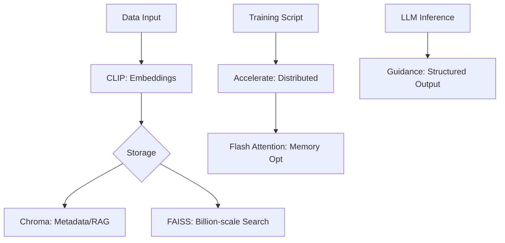

# optional-skills — mlops

# MLOps Optional Skills Module

The **MLOps Optional Skills** module provides a curated set of high-performance tools for distributed training, vector search, multimodal intelligence, and constrained LLM generation. These modules are designed to be integrated into production machine learning pipelines to improve scalability, efficiency, and output reliability.

## Module Overview

The toolkit is divided into four functional areas:
1.  **Distributed Training**: `accelerate`
2.  **Vector Databases & Search**: `chroma`, `faiss`
3.  **Multimodal Intelligence**: `clip`
4.  **Inference Optimization**: `flash-attention`, `guidance`



---

## Distributed Training: HuggingFace Accelerate

The `accelerate` module provides a unified API for launching PyTorch scripts across any hardware configuration (Single GPU, Multi-GPU, TPU, or Multi-node) with minimal code changes.

### Core API: The `Accelerator` Class
The primary entry point is the `Accelerator` object, which manages device placement and gradient scaling.

```python
from accelerate import Accelerator

accelerator = Accelerator()

# Automatic device placement and sharding
model, optimizer, dataloader = accelerator.prepare(model, optimizer, dataloader)

# Distributed backward pass
accelerator.backward(loss)
```

### Key Features
*   **Mixed Precision**: Supports `fp16`, `bf16`, and `fp8` (H100+) via the `mixed_precision` argument.
*   **Gradient Accumulation**: Managed via `accelerator.accumulate(model)` context manager to handle synchronization across micro-batches.
*   **DeepSpeed/FSDP Integration**: Supports ZeRO-2/3 and Fully Sharded Data Parallelism through `DeepSpeedPlugin` and `FullyShardedDataParallelPlugin`.

---

## Vector Search: Chroma & FAISS

This module provides two distinct approaches to vector similarity search: **Chroma** for metadata-heavy RAG applications and **FAISS** for high-performance, large-scale retrieval.

### Chroma (AI-Native Database)
Best for local development and applications requiring complex metadata filtering.
*   **Persistence**: Use `chromadb.PersistentClient(path="./db")` for on-disk storage.
*   **Filtering**: Supports MongoDB-style queries (e.g., `where={"category": {"$eq": "tutorial"}}`).
*   **Embedding Functions**: Built-in support for OpenAI, HuggingFace, and Sentence Transformers.

### FAISS (Billion-Scale Search)
Best for pure similarity search where speed and memory efficiency are the primary constraints.
*   **Index Types**:
    *   `IndexFlatL2`: Exact search (baseline).
    *   `IndexIVFFlat`: Inverted file index for fast approximate search (requires `train()`).
    *   `IndexHNSWFlat`: Graph-based search for the best speed/accuracy trade-off.
*   **Quantization**: `IndexPQ` (Product Quantization) reduces memory usage by up to 32x.

---

## Multimodal Intelligence: CLIP

The `clip` module enables zero-shot image classification and cross-modal retrieval by connecting vision and language in a shared embedding space.

### Key Functions
*   **`model.encode_image(image)`**: Generates a visual embedding from a preprocessed PIL image.
*   **`model.encode_text(text)`**: Generates a semantic embedding from tokenized text.
*   **Zero-Shot Classification**: By comparing image embeddings against a list of candidate text embeddings using cosine similarity.

```python
# Normalize for cosine similarity
image_features /= image_features.norm(dim=-1, keepdim=True)
text_features /= text_features.norm(dim=-1, keepdim=True)
similarity = (image_features @ text_features.T)
```

---

## Inference Optimization

### Flash Attention
Optimizes the transformer attention mechanism by reducing memory complexity from $O(N^2)$ to $O(N)$.

*   **Native Support**: PyTorch 2.2+ uses `F.scaled_dot_product_attention` (SDPA) to automatically trigger Flash Attention kernels.
*   **Advanced Features**: The `flash_attn_func` supports Multi-Query Attention (MQA), Sliding Window Attention, and FP8 precision on Hopper (H100) architectures.
*   **Performance**: Typically yields a 2-4x speedup for sequences longer than 512 tokens.

### Guidance (Constrained Generation)
Ensures LLM outputs adhere to specific formats (JSON, Regex, or Grammars) to prevent parsing errors in production.

*   **Token Healing**: Automatically fixes token boundary issues at the prompt/generation interface.
*   **Context Managers**: Uses `system()`, `user()`, and `assistant()` blocks to manage chat state.
*   **Constraints**:
    *   `select([...])`: Forces the model to choose from a specific list.
    *   `gen(regex=...)`: Enforces strict pattern matching (e.g., emails, dates).

```python
from guidance import models, gen, select

lm = models.OpenAI("gpt-4")
lm += "Sentiment: " + select(["positive", "negative"], name="sentiment")
lm += "\nConfidence: " + gen(regex=r"[0-9]+", name="score") + "%"
```

---

## Hardware & Performance Guidelines

| Skill | Hardware Requirement | Primary Benefit |
| :--- | :--- | :--- |
| **Accelerate** | Multi-GPU / TPU | Distributed scaling with 4 lines of code. |
| **FAISS** | CPU or GPU (CUDA) | Sub-millisecond search over millions of vectors. |
| **Flash Attention** | Ampere+ (A100/A10/H100) | 10-20x memory reduction for long sequences. |
| **Guidance** | API or Local (Llama.cpp) | 100% valid JSON/Structured output guarantee. |
| **CLIP** | GPU Recommended | Zero-shot visual understanding without labels. |