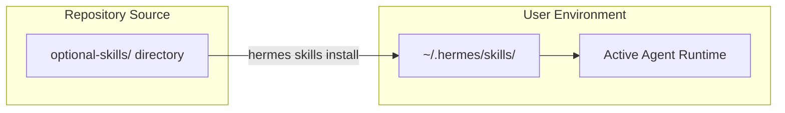

# optional-skills — optional-skills

# Optional Skills Registry

The `optional-skills` module serves as a curated repository for official Hermes skills that are maintained by Nous Research but excluded from the default installation. This directory acts as a "Skills Hub" source, allowing the agent to remain lightweight while providing a path for users to opt-in to specialized functionality.

## Purpose and Design Philosophy

Skills in this module are categorized as "Official" but are kept optional for three primary reasons:

1.  **Dependency Management:** Skills requiring heavy third-party libraries or complex system-level setup.
2.  **Niche Utility:** Specialized tools (e.g., specific paid API integrations) that are not universally applicable.
3.  **Stability Tiers:** Experimental features that are functional but have not yet met the criteria for the core skill set.

## Skill Lifecycle

Optional skills reside within the `hermes-agent` source tree but are not active until explicitly moved to the user's local environment.



### Discovery
The Hermes CLI interacts with this module to facilitate discovery. When a user runs `hermes skills browse`, the CLI scans this directory and labels entries as `official`.

*   **Browse all:** `hermes skills browse`
*   **Filter by source:** `hermes skills browse --source official`
*   **Search:** `hermes skills search <query>`

### Installation
The installation process is a filesystem operation managed by the CLI. Running `hermes skills install <identifier>` performs the following:
1.  Locates the skill directory within `optional-skills/`.
2.  Copies the skill assets to `~/.hermes/skills/`.
3.  Triggers the agent's skill discovery mechanism to load the new capabilities.

## Directory Structure

Each subdirectory within `optional-skills/` represents a standalone skill. To be compatible with the registry, a skill must follow the standard Hermes skill structure:

```text
optional-skills/
└── <skill-identifier>/
    ├── skill.yaml          # Metadata, permissions, and configuration
    ├── main.py             # Entry point and logic
    └── requirements.txt    # Dependencies (installed during 'hermes skills install')
```

## Contributing an Optional Skill

When developing a new skill for the `hermes-agent` repository, place it in `optional-skills/` if it meets any of the "optionality" criteria mentioned above. 

### Requirements for Inclusion
*   **Metadata:** The `skill.yaml` must be fully populated with a clear description and versioning.
*   **Isolation:** The skill must not have hard dependencies on other optional skills.
*   **Documentation:** A `README.md` within the skill's subdirectory explaining any required API keys or environment variables.

By placing a skill here, you ensure it is discoverable via the `hermes skills` command suite while preventing "dependency bloat" for users who do not require the specific functionality.