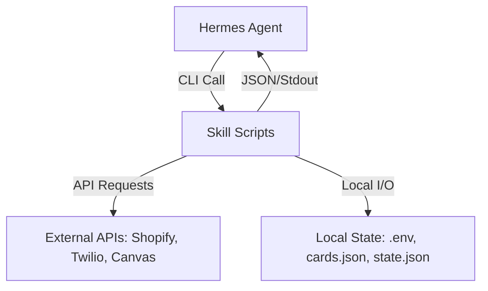

# optional-skills — productivity

# Optional Skills — Productivity Module

The **productivity** module is a collection of specialized skills designed to extend the agent's capabilities into external platforms, learning systems, and communication infrastructure. These skills are primarily implemented as CLI wrappers (Python and Bash) that interface with REST and GraphQL APIs.

## Module Overview

The module consists of six primary integrations:
- **Canvas LMS**: Academic course and assignment management.
- **here.now**: Static site deployment and private cloud storage (Drives).
- **Memento Flashcards**: A local spaced-repetition system (SRS) with YouTube integration.
- **Shopify**: E-commerce management via GraphQL Admin APIs.
- **SiYuan**: Interaction with self-hosted knowledge bases.
- **Telephony**: SMS, MMS, and AI-driven voice calling via Twilio, Bland.ai, and Vapi.

## Architecture & Data Flow

Most skills follow a "Sidecar CLI" pattern: the agent invokes a script located in the skill's `scripts/` directory, which handles authentication, network I/O, and data normalization.



---

## Canvas LMS (`canvas`)

The Canvas skill provides read-only access to the Canvas Learning Management System.

### Core Components
- **`scripts/canvas_api.py`**: A Python CLI using `requests`.
- **Pagination**: Implemented in `_paginated_get()`, which follows the `Link` headers provided by the Canvas API to aggregate results up to a `max_items` limit (default 200).

### Key Functions
- `list_courses(args)`: Fetches enrolled courses. Filters by `enrollment_state` (active, invited, etc.).
- `list_assignments(args)`: Fetches assignments for a specific `course_id`. Truncates descriptions to 500 characters to manage context window size.

---

## here.now (`here-now`)

A deployment and storage skill for publishing static content and managing private files.

### Site Publishing (`publish.sh`)
The publishing flow is a three-step atomic operation:
1. **Create/Update**: Initiates a session with the API.
2. **Upload**: Iterates through local files, calculating SHA256 hashes to skip unchanged files.
3. **Finalize**: Commits the version to make the site live.

### Drive Storage (`drive.sh`)
Provides a filesystem-like interface for private cloud storage.
- **`resolve_drive()`**: Maps friendly names (e.g., "default") to internal `drv_` IDs.
- **`put_file()`**: Handles multipart-like uploads with ETag validation (`If-Match` or `If-None-Match`) to prevent overwriting concurrent changes.

---

## Memento Flashcards (`memento-flashcards`)

A local Spaced Repetition System (SRS) that uses an adaptive scheduling algorithm.

### Storage Logic
Data is stored in `~/.hermes/skills/productivity/memento-flashcards/data/cards.json`. The `memento_cards.py` script uses `tempfile.mkstemp` and `os.replace` to ensure atomic writes, preventing JSON corruption during updates.

### Spaced Repetition Algorithm (`cmd_rate`)
The system tracks an `ease_streak` and updates `next_review_at` based on user ratings:
- **Hard**: +1 day, resets streak.
- **Good**: +3 days, resets streak.
- **Easy**: +7 days, increments streak.
- **Retire**: If `ease_streak >= 3` or manually triggered, the card is moved to `retired` status.

### YouTube Integration (`youtube_quiz.py`)
Uses `youtube-transcript-api` to fetch video text. The agent then processes this text to generate 5 discrete Q/A pairs, which are batch-added via `cmd_add_quiz`.

---

## Shopify (`shopify`)

A pure `curl` and `jq` implementation for interacting with Shopify's GraphQL Admin API.

### Implementation Pattern
The skill relies on a standard GraphQL POST pattern. Developers should use the `shop_gql` bash pattern for consistency:
```bash
curl -sS -X POST "https://${SHOPIFY_STORE_DOMAIN}/admin/api/${SHOPIFY_API_VERSION}/graphql.json" \
  -H "X-Shopify-Access-Token: ${SHOPIFY_ACCESS_TOKEN}" \
  --data "$(jq -nc --arg q "$QUERY" --argjson v "$VARS" '{query: $q, variables: $v}')"
```

### Key Resources
- **Products**: Managed via `productCreate` and `productVariantsBulkCreate`.
- **Inventory**: Uses `inventoryAdjustQuantities` for deltas and `inventorySetQuantities` for absolute values.
- **Bulk Operations**: Supports `bulkOperationRunQuery` for large datasets, returning a JSONL file.

---

## SiYuan Note (`siyuan`)

Interfaces with the SiYuan kernel API for block-based note management.

### Block Architecture
SiYuan treats everything as a block. The skill interacts with these via:
- **SQL Query**: `/api/query/sql` allows complex retrieval (e.g., `SELECT * FROM blocks WHERE content LIKE '%...'`).
- **Kramdown**: `/api/block/getBlockKramdown` retrieves content in SiYuan's specific Markdown flavor.
- **Attributes**: Custom metadata is managed via `/api/attr/setBlockAttrs`, requiring the `custom-` prefix for user-defined keys.

---

## Telephony (`telephony`)

A comprehensive telephony wrapper for Twilio (infrastructure) and Bland.ai/Vapi (AI Voice).

### State Management
The skill maintains `telephony_state.json` to track:
- **Owned Numbers**: SIDs and E.164 formatted numbers.
- **Inbox Checkpoints**: The `last_seen_message_sid` to allow `twilio-inbox --since-last` polling without a persistent webhook server.

### Execution Logic (`telephony.py`)
- **`twilio-call`**: Supports direct TwiML generation. It can wrap text in `<Say>` tags or point to an external MP3 via `<Play>`.
- **`ai-call`**: Routes requests to either Bland.ai or Vapi.
    - **Bland.ai**: Uses a single POST to `/v1/calls`.
    - **Vapi**: Requires a `phone_number_id`. The script includes `vapi-import-twilio` to link Twilio SIDs to the Vapi platform.

### Authentication Handling
The script implements `_json_request` using `urllib.request` (stdlib) to ensure zero-dependency execution. It handles Basic Auth for Twilio and Bearer tokens for AI providers.

---

## Configuration & Environment

All skills in this module look for credentials in `~/.hermes/.env`. Key variables include:

| Skill | Required Variables |
| :--- | :--- |
| **Canvas** | `CANVAS_API_TOKEN`, `CANVAS_BASE_URL` |
| **here.now** | `HERENOW_API_KEY` |
| **Shopify** | `SHOPIFY_ACCESS_TOKEN`, `SHOPIFY_STORE_DOMAIN` |
| **SiYuan** | `SIYUAN_TOKEN`, `SIYUAN_URL` |
| **Telephony** | `TWILIO_ACCOUNT_SID`, `TWILIO_AUTH_TOKEN`, `BLAND_API_KEY`, `VAPI_API_KEY` |