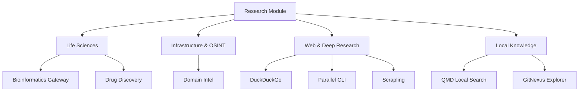

# optional-skills — research

# Research Skills Module

The `optional-skills/research` module provides a suite of specialized tools for scientific discovery, infrastructure reconnaissance, advanced web scraping, and local knowledge retrieval. Unlike core tools, these skills are domain-specific and often interface with external biological databases, OSINT sources, or local RAG (Retrieval-Augmented Generation) engines.

## Module Architecture

The module is organized into functional domains, each containing a `SKILL.md` definition and supporting scripts or reference materials.

---

## Life Sciences & Chemistry

### Bioinformatics Gateway
This skill acts as a dynamic index for two major open-source repositories. It does not bundle the data but provides a standardized way to fetch expert reference material on demand.

*   **Sources**: 
    *   `bioSkills`: 385+ reference skills (code patterns, tool flags).
    *   `ClawBio`: 33+ runnable pipelines (Python/Conda).
*   **Workflow**: Identify the domain (e.g., `variant-calling`), perform a shallow clone of the target repo to `/tmp`, and read the specific `SKILL.md` or `README.md` as a domain guide.

### Drug Discovery
Focused on medicinal chemistry and pharmaceutical research, utilizing the ChEMBL, PubChem, OpenFDA, and OpenTargets APIs.

*   **Key Scripts**:
    *   `ro5_screen.py`: Performs batch Lipinski Rule of Five and Veber screening. The `main()` function orchestrates `fetch()` (PubChem API), `check()` (logic validation), and `report()` (formatting).
    *   `chembl_target.py`: Maps biological targets to active compounds. `main()` calls `get()` to query the ChEMBL API for bioactivity data (pChEMBL values).
*   **Capabilities**: Bioactivity lookups, ADMET profiling, drug-drug interaction analysis, and bioisosteric replacement suggestions.

---

## Infrastructure & OSINT

### Domain Intelligence
A zero-dependency passive reconnaissance tool implemented in `domain_intel.py`. It uses Python's standard library (`socket`, `ssl`, `urllib`) to gather data without active port scanning.

*   **Core Functions**:
    *   `check_ssl()`: Inspects TLS certificates. Internally calls `flat()` for RDN parsing and `parse_date()` for expiry validation.
    *   `whois_lookup()`: Queries authoritative WHOIS servers on TCP port 43.
    *   `dns_records()`: Resolves A, AAAA, MX, NS, and TXT records via system DNS and Google DNS-over-HTTPS.
    *   `bulk_check()`: Orchestrates parallel execution of checks across multiple domains using `ThreadPoolExecutor`.
*   **Data Sources**: crt.sh (Subdomains), Google DoH (DNS), and 100+ TLD-specific WHOIS servers.

---

## Web & Deep Research

### Scrapling
An advanced scraping framework that provides three distinct fetching strategies:
1.  **`Fetcher`**: Standard HTTP requests for static content.
2.  **`DynamicFetcher`**: Playwright-based JS rendering for SPAs.
3.  **`StealthyFetcher`**: Specialized browser automation to bypass Cloudflare Turnstile and anti-bot fingerprints.

It includes a `Spider` class for multi-page crawling with link-following logic and session management.

### Parallel CLI
A vendor-specific tool for "agentic" research. It is preferred for:
*   **Enrichment**: Researching and filling missing columns in CSV/JSON datasets.
*   **FindAll**: Large-scale entity discovery (e.g., "Find all AI startups in London").
*   **Deep Research**: Long-running, multi-step research jobs with async polling (`status` and `poll` commands).

### DuckDuckGo Search
A fallback search utility that requires no API keys. It prioritizes the `ddgs` CLI for environment isolation but provides a Python API for integrated workflows.

---

## Local Knowledge & Code Exploration

### QMD (Query Markup Documents)
A local RAG engine designed for personal notes and documentation. It implements a hybrid search pipeline:
1.  **BM25**: Keyword matching via SQLite FTS5.
2.  **Vector Search**: Semantic retrieval using `embeddinggemma-300M`.
3.  **Reranking**: LLM-based scoring via `qwen3-reranker`.

QMD can run as a persistent MCP (Model Context Protocol) daemon to keep models warm in memory, reducing query latency from ~19s (cold) to ~2s (warm).

### GitNexus Explorer
Indexes codebases into a visual knowledge graph.
*   **Indexing**: `npx gitnexus analyze` generates a symbol and call graph index in `.gitnexus/`.
*   **Serving**: Uses `proxy.mjs` to bridge the GitNexus backend API (port 4747) and the production Web UI.
*   **Proxy Logic**: `proxy.mjs` implements `proxyToApi()` for backend requests and `serveStatic()` for the Vite-built frontend, enabling access through Cloudflare tunnels without CORS issues.

---

## Implementation Patterns

### CLI vs. Python Integration
Most modules in this suite follow a "CLI-First" pattern to ensure compatibility across different runtimes (Terminal vs. Code Sandbox).

| Skill | Primary Interface | Script/Entrypoint |
| :--- | :--- | :--- |
| **Domain Intel** | CLI | `scripts/domain_intel.py` |
| **Drug Discovery** | CLI/Python | `scripts/ro5_screen.py` |
| **GitNexus** | CLI/Web | `scripts/proxy.mjs` |
| **QMD** | MCP/CLI | `qmd query` |
| **Scrapling** | Python/CLI | `scrapling extract` |

### Error Handling
*   **Network**: OSINT and Pharma tools use `urllib.request` with explicit timeouts (typically 10-15s) to prevent hanging on unresponsive APIs.
*   **Auth**: Parallel CLI and Scrapling check for environment variables (`PARALLEL_API_KEY`) or local browser binaries before execution.
*   **Platform**: `domain_intel.py` is cross-platform (pure Python), while `qmd` and `gitnexus` require Node.js environments.