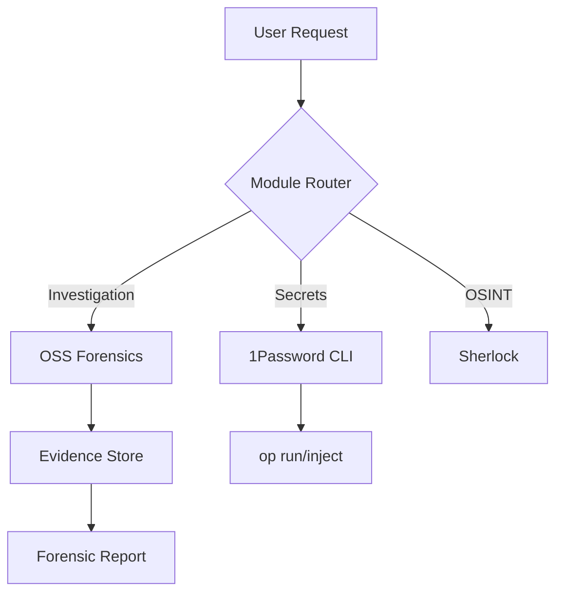

# optional-skills — security

# Optional Skills: Security Module

The **Security** module provides a suite of tools for secrets management, open-source supply chain forensics, and OSINT reconnaissance. It is designed to integrate external security CLI tools into the Hermes environment while maintaining strict guardrails for data integrity and credential safety.

## Module Overview

The module is divided into three primary functional areas:
1.  **Secrets Management (`1password`)**: Integration with the 1Password CLI (`op`) for secure credential retrieval.
2.  **OSS Forensics (`oss-forensics`)**: A multi-phase framework for investigating repository compromises and supply chain attacks.
3.  **OSINT (`sherlock`)**: Username reconnaissance across social networks.

---

## 1Password CLI Integration

This sub-module manages interactions with the `op` CLI. It supports multiple authentication flows, prioritizing non-interactive methods suitable for automated environments.

### Authentication Patterns

| Method | Configuration | Use Case |
| :--- | :--- | :--- |
| **Service Account** | `OP_SERVICE_ACCOUNT_TOKEN` | Recommended for headless/CI environments. Persists across terminal calls. |
| **Desktop App** | Biometric/App Unlock | Interactive developer use. Requires `tmux` session management. |
| **Connect Server** | `OP_CONNECT_HOST` & `OP_CONNECT_TOKEN` | Self-hosted enterprise environments. |

### Non-Interactive Session Management
Because Hermes terminal calls are stateless, the module utilizes a `tmux` socket strategy to maintain authentication context for the Desktop App flow. This prevents repeated biometric prompts by wrapping `op signin` and subsequent commands in a persistent session.

```bash
# Pattern for maintaining auth context
SOCKET="/tmp/hermes-tmux-sockets/hermes-op.sock"
tmux -S "$SOCKET" new -d -s "op-session"
tmux -S "$SOCKET" send-keys -t "op-session" -- "eval \"\$(op signin)\"" Enter
```

---

## OSS Forensics Framework

The `oss-forensics` sub-module implements a 7-phase investigation framework inspired by the RAPTOR system. It is designed to detect force-pushes, recovered deleted commits, and identify Indicators of Compromise (IOCs).

### Investigation Phases
1.  **Initialization**: Setup of the working directory and `evidence.json` store.
2.  **IOC Extraction**: Parsing handles, SHAs, and domains from the initial report.
3.  **Parallel Collection**: Spawning specialized investigators (Local Git, GitHub API, Wayback Machine, BigQuery).
4.  **Consolidation**: Aggregating findings into the evidence store.
5.  **Hypothesis Formation**: Creating evidence-backed claims (e.g., "Maintainer Compromise").
6.  **Validation**: Mechanical verification of evidence IDs and cross-source consistency.
7.  **Reporting**: Generating a structured `forensic-report.md`.

### Evidence Management (`evidence-store.py`)
The `evidence-store.py` script acts as the source of truth for an investigation. It enforces data integrity using SHA-256 hashing of evidence content.

**Key Data Structures:**
*   **Evidence Types**: `git`, `gh_api`, `gh_archive`, `web_archive`, `ioc`, `analysis`.
*   **Verification States**: `unverified`, `single_source`, `multi_source_verified`.

```python
# Example: Adding evidence via CLI
python3 evidence-store.py --store evidence.json add \
  --source "git fsck" \
  --content "dangling commit abc123..." \
  --type git \
  --verification single_source
```

### Investigator Roles
The framework enforces **Role Boundaries** to prevent data contamination:
*   **Local Git**: Uses `git fsck --lost-found` and `reflog` to find orphaned objects.
*   **GitHub Archive**: Queries BigQuery `githubarchive.month.*` tables to find `PushEvents` where `distinct_size = 0` (indicating a force-push).
*   **Wayback Machine**: Uses the CDX API to recover deleted Issue or PR content.

---

## Sherlock OSINT

The `sherlock` sub-module provides a wrapper for the Sherlock Project CLI to perform username reconnaissance.

### Execution Pattern
The module executes `sherlock` with specific flags to ensure output is machine-readable and performant:
*   `--print-found`: Filters output to only show successful matches.
*   `--no-color`: Removes ANSI escape codes for cleaner parsing.
*   `--timeout 90`: Prevents hanging on slow social network responses.

### Result Handling
Findings are parsed from the terminal output and saved to a local `<username>.txt` file. The module categorizes these links for the user, distinguishing between social media, professional networks, and forums.

---

## Security Guardrails

Developers contributing to this module must adhere to the following safety rules:

1.  **Evidence-First Rule**: No claim may be made in a forensic report without a corresponding `EV-XXXX` ID in the evidence store.
2.  **Secret Redaction**: Any credentials discovered (API keys, tokens) must be redacted to `[REDACTED]` in final reports.
3.  **Static Analysis Only**: Never execute code found within an investigated repository. Use `execute_code` only in sandboxed environments for static analysis or regex extraction.
4.  **BigQuery Cost Control**: All BigQuery queries must include a `--dry_run` and use `_TABLE_SUFFIX` to limit scanned data.



## Component Reference

| Component | Path | Description |
| :--- | :--- | :--- |
| **Evidence Store** | `oss-forensics/scripts/evidence-store.py` | Python CLI for managing investigation state. |
| **Report Template** | `oss-forensics/templates/forensic-report.md` | Standardized markdown structure for findings. |
| **Recovery Docs** | `oss-forensics/references/recovery-techniques.md` | Guide for fetching orphaned SHAs from GitHub. |
| **1Password Skill** | `1password/SKILL.md` | Logic for `op` CLI authentication and usage. |