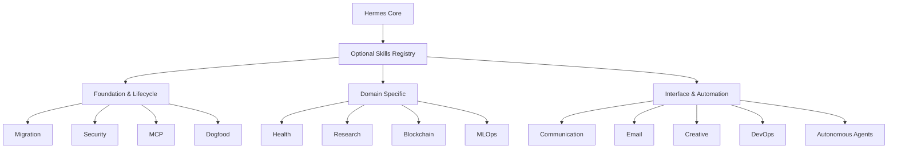

# optional-skills

# Optional Skills Registry

The `optional-skills` module is a curated repository of official Hermes skills maintained by Nous Research. It functions as an opt-in "Skills Hub," allowing the agent to remain lightweight by excluding specialized tools, experimental features, or modules with heavy third-party dependencies from the default installation.

## Module Architecture

The registry organizes capabilities into functional domains that extend the agent's reach from local system management to specialized scientific research and autonomous external delegation.

## Functional Groups

### Foundation & Lifecycle
These modules manage the agent's environment, security, and evolution.
*   **[Migration](migration.md):** Facilitates the transition from external systems like OpenClaw into the Hermes ecosystem.
*   **[Security](security.md):** Provides secrets management via **1Password** and supply chain forensics to ensure the integrity of the agent's workspace.
*   **[MCP](mcp.md):** The backbone for extending agent capabilities using the Model Context Protocol, featuring **FastMCP** for server development.
*   **[Dogfood](dogfood.md):** Advanced QA workflows, such as **Adversarial UX Testing**, to identify friction in the agent's own implementations.

### Infrastructure & Automation
Tools for managing code, deployments, and external AI orchestration.
*   **[DevOps](devops.md):** Orchestrates containers and AI inference via the **inference.sh CLI (`infsh`)**.
*   **[Autonomous AI Agents](autonomous-ai-agents.md):** Enables Hermes to act as an orchestrator, delegating complex coding tasks to the **Blackbox CLI** or managing long-term memory via **Honcho**.
*   **[MLOps](mlops.md):** High-performance tools for distributed training (**Accelerate**) and vector search (**Chroma**, **FAISS**).
*   **[Web Development](web-development.md):** Implements the **page-agent** for in-page GUI interaction and AI-native UX patterns.

### Communication & Productivity
Extends the agent's ability to interact with users and external platforms.
*   **[Communication](communication.md):** Implements structured frameworks like the **1-3-1 Rule** for technical decision-making.
*   **[Email](email.md):** Provides autonomous, agent-owned identities through the **AgentMail** MCP server.
*   **[Productivity](productivity.md):** A suite of integrations for **Shopify**, **Canvas LMS**, and **SiYuan** knowledge bases.

### Domain-Specific Research
Specialized toolsets for technical and scientific fields.
*   **[Research](research.md):** Tools for bioinformatics, OSINT reconnaissance, and deep web scraping.
*   **[Blockchain](blockchain.md):** Zero-dependency CLI tools for auditing **Base** and **Solana** networks.
*   **[Health](health.md):** Integrates physical fitness tracking via **USDA/wger APIs** and real-time biometric monitoring through **NeuroSkill BCI**.
*   **[Creative](creative.md):** Programmatic control over **Blender** for 3D modeling and automated asset generation.

## Cross-Module Workflows

The power of the `optional-skills` registry lies in the synergy between modules:
*   **Secure Automation:** Use **Security (1Password)** to retrieve credentials for **Productivity (Shopify)** or **DevOps (infsh)** tasks.
*   **Enhanced Memory:** Combine **Autonomous AI Agents (Honcho)** with **Research** modules to maintain persistent context across long-term scientific investigations.
*   **Full-Stack Development:** Utilize **Web Development (page-agent)** to test frontends while **DevOps** manages the backend containerization and **Creative (Blender)** generates visual assets.