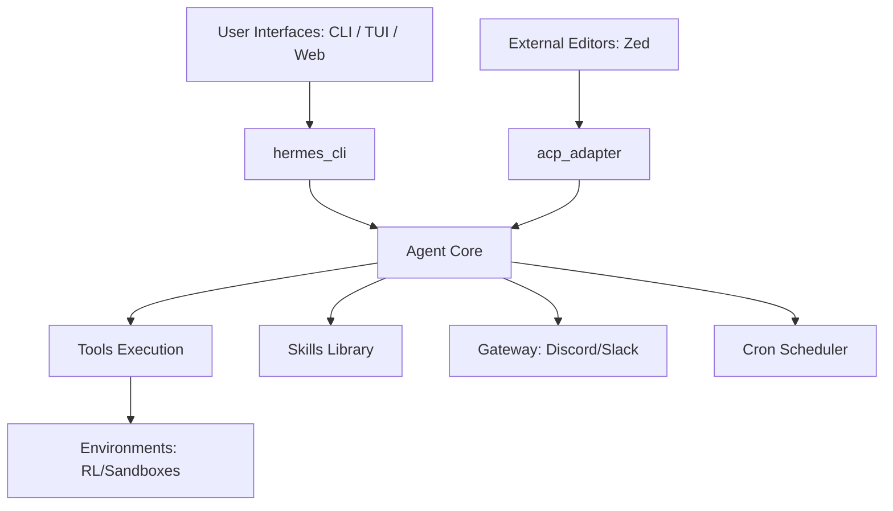

# hermes-agent — Wiki

# Hermes Agent ☤

Welcome to the **Hermes Agent** repository. Built by [Nous Research](https://nousresearch.com), Hermes is a self-improving AI agent designed with a focus on advanced tool-calling and a unique learning loop that allows it to evolve its capabilities through experience.

Unlike static agents, Hermes features a flexible toolset system and the ability to create new "skills" from its interactions, making it a powerful foundation for autonomous software engineering, research, and complex task orchestration.

## System Architecture

Hermes is built on a modular architecture that decouples the "brain" (LLM orchestration) from the "hands" (tool execution) and the "senses" (platform interfaces).



## Core Components

The ecosystem is organized into several functional layers:

### 1. Orchestration & Logic
The [agent](agent.md) module serves as the central nervous system. It manages multi-provider LLM communication, enforces safety guardrails, and handles the lifecycle of agentic "skills." It relies on the [Root](root.md) module for persistent state management and global configuration.

### 2. Interfaces & Entry Points
Users primarily interact with the system through the [hermes_cli](hermes_cli.md), which handles command parsing and service orchestration. For a more immersive experience, the [ui-tui](ui-tui.md) provides a high-performance terminal interface, while the [web](web.md) module offers a React-based dashboard for monitoring sessions and configurations. Developers using editors like Zed can connect via the [acp_adapter](acp_adapter.md), which implements the Agent Communication Protocol.

### 3. Execution & Capabilities
The [tools](tools.md) module is the execution engine that allows the agent to interact with the real world—performing web searches, executing terminal commands, or processing multimodal inputs. Higher-level logic is organized into the [skills](skills.md) module, which contains standardized methodologies for DevOps, task decomposition, and more. Specialized or heavy-dependency capabilities are maintained in the [optional-skills](optional-skills.md) registry to keep the core agent lightweight.

### 4. Connectivity & Automation
The [gateway](gateway.md) module allows Hermes to live across different platforms (like Discord), maintaining consistent session state regardless of where the conversation happens. For recurring tasks, the [cron](cron.md) module provides a robust scheduling system to execute jobs in isolated sessions.

### 5. Training & Evaluation
Hermes is designed for continuous improvement. The [environments](environments.md) module integrates the agent with reinforcement learning frameworks, allowing it to generate trajectories in isolated sandboxes. These trajectories can be processed using the [datagen-config-examples](datagen-config-examples.md) to create high-quality data for model fine-tuning.

## Getting Started

To begin developing or running the agent locally:

1.  **Installation**: Clone the repository and run the setup scripts.
    ```bash
    npm install
    # The postinstall script will handle initial environment setup
    ```
2.  **Configuration**: Use the CLI to configure your preferred LLM providers.
    ```bash
    hermes configure
    ```
3.  **Testing**: Ensure your environment is correctly configured by running the [test suite](tests.md).
    ```bash
    pytest tests/
    ```

For detailed information on specific sub-systems, please navigate to the respective module pages linked above.