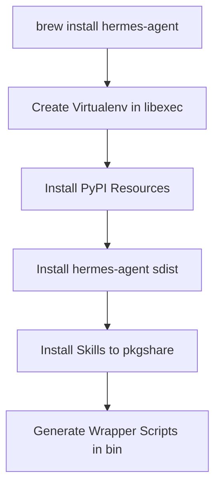

# packaging

# Packaging

The `packaging` module provides the configuration and scripts necessary to distribute Hermes Agent via system package managers. Currently, it focuses on **Homebrew** for macOS and Linux environments.

## Homebrew Distribution

The Homebrew implementation is located in `packaging/homebrew/`. It utilizes a Ruby formula to automate the creation of a Python virtual environment, dependency resolution, and binary wrapping.

### Formula Architecture (`hermes-agent.rb`)

The formula uses the `Language::Python::Virtualenv` mixin to ensure a clean, isolated installation that does not interfere with the system Python environment.



### Key Components

#### 1. Virtual Environment & Dependencies
The formula targets `python@3.14` and manages dependencies through two layers:
- **System Dependencies:** `libyaml`, `certifi`, and `cryptography` are handled as Homebrew dependencies.
- **Python Resources:** Transitive dependencies are defined via `resource` stanzas (generated by `brew update-python-resources`).
- **Exclusions:** `certifi`, `cryptography`, and `pydantic` are explicitly ignored in the `pypi_packages` list to prevent conflicts with Homebrew-linked libraries or to handle specific versioning requirements.

#### 2. Skill Management
Hermes Agent requires access to skill definitions at runtime. The formula relocates these from the source tree to the Homebrew `pkgshare` directory:
- `skills/` -> `HOMEBREW_PREFIX/share/hermes-agent/skills`
- `optional-skills/` -> `HOMEBREW_PREFIX/share/hermes-agent/optional-skills`

#### 3. Binary Wrapping
The formula generates executable wrappers for `hermes`, `hermes-agent`, and `hermes-acp`. These wrappers inject environment variables that inform the application it is running in a managed context:

| Variable | Purpose |
| :--- | :--- |
| `HERMES_BUNDLED_SKILLS` | Points the agent to the read-only skills in `pkgshare`. |
| `HERMES_OPTIONAL_SKILLS` | Points the agent to the optional skills in `pkgshare`. |
| `HERMES_MANAGED` | Set to `homebrew`. This disables internal self-update mechanisms. |

### Runtime Behavior
When `HERMES_MANAGED=homebrew` is set, the agent's internal update logic is modified. If a user attempts to run `hermes update`, the application detects the Homebrew environment and instructs the user to run `brew upgrade hermes-agent` instead.

## Maintenance Workflow

To update the Homebrew package for a new release, follow these steps:

1.  **Identify the Asset:** Locate the semver-named source distribution (`.tar.gz`) attached to the GitHub release. Do not use the CalVer-named source code tarball automatically generated by GitHub.
2.  **Update Formula Metadata:**
    - Update the `url` to the new sdist link.
    - Update the `sha256` hash.
    - Update the `version` if necessary.
3.  **Refresh Resources:**
    Run the following command to update the Python dependency stanzas:
    ```bash
    brew update-python-resources --print-only hermes-agent
    ```
4.  **Validation:**
    - Run `brew audit --new --strict hermes-agent` to ensure compliance with Homebrew standards.
    - Run `brew test hermes-agent` to verify the version output and the "managed" update logic.

## Design Considerations

- **Voice Extra:** The `faster-whisper` dependency is excluded from the base Homebrew formula and moved to the `voice` extra. This avoids including heavy, wheel-only transitive dependencies that are difficult to build from source within the Homebrew environment.
- **Stable vs. Bleeding Edge:** The formula is designed to track stable releases via `sdist` assets rather than tracking the `main` branch, ensuring reproducible builds for end-users.