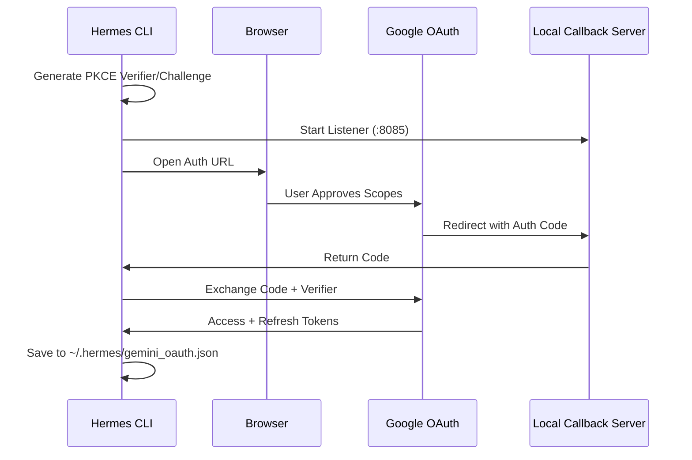

# plans

# Gemini OAuth Provider

The `plans/gemini-oauth-provider.md` defines the architecture and implementation strategy for integrating Google Gemini as a first-class provider within the Hermes ecosystem. Unlike standard API key configurations, this module implements a browser-based OAuth 2.0 flow to allow users to authenticate using their Google AI or Gemini API subscriptions.

## Overview

The provider utilizes the standard Gemini API (`generativelanguage.googleapis.com/v1beta`) rather than the Cloud Code Assist API to avoid internal rate limits and account restrictions. It leverages the OpenAI SDK's `chat_completions` compatibility layer, ensuring that no new `api_mode` is required within the core agent logic.

## OAuth Architecture

The implementation follows the **Authorization Code Flow with PKCE (S256)**, which is the security standard for desktop applications where client secrets cannot be fully protected.

### Authentication Flow
1. **Initiation**: The CLI triggers `start_oauth_flow()`, generating a 32-byte random verifier and a SHA-256 code challenge.
2. **Authorization**: The system opens the user's default browser to `https://accounts.google.com/o/oauth2/v2/auth` with the required scopes:
   - `https://www.googleapis.com/auth/cloud-platform`
   - `https://www.googleapis.com/auth/userinfo.email`
3. **Callback**: A temporary localhost server (listening on `http://localhost:8085/oauth2callback`) captures the authorization code.
4. **Exchange**: The `exchange_code()` function sends the code and PKCE verifier to `https://oauth2.googleapis.com/token` to receive access and refresh tokens.

## Token Lifecycle & Storage

Tokens are persisted locally to enable long-lived sessions without repeated browser interactions.

- **Storage Path**: `~/.hermes/gemini_oauth.json`
- **Permissions**: Restricted to `0o600` to prevent unauthorized local access.
- **Concurrency**: Implements file locking to prevent corruption when multiple agent sessions attempt to refresh tokens simultaneously.
- **Refresh Logic**: The `get_valid_access_token()` utility checks the `expires_at` field. If the token is within 5 minutes of expiration, it automatically triggers a `grant_type=refresh_token` POST request to the Google token endpoint.

## Key Components

### `agent/google_oauth.py`
The core logic for the OAuth lifecycle:
- `start_oauth_flow()`: Orchestrates the browser opening and callback server.
- `exchange_code()`: Handles the initial token swap.
- `refresh_access_token()`: Uses the refresh token to obtain a new access token.
- `load_credentials()` / `save_credentials()`: Manages secure I/O and file locking.

### `hermes_cli/runtime_provider.py`
The bridge between the OAuth credentials and the API client. It retrieves a valid access token and injects it into the OpenAI SDK client configuration, targeting the Gemini base URL.

## Integration Strategy

The provider is integrated across the following layers:

1.  **CLI Setup**: `hermes_cli/setup.py` includes a dedicated Gemini auth flow that triggers the browser-based login.
2.  **Model Catalog**: `hermes_cli/models.py` includes Gemini-specific models (e.g., `gemini-2.0-flash`, `gemini-1.5-pro`) and their respective context window limits.
3.  **Runtime Resolution**: `agent/auxiliary_client.py` and `hermes_cli/runtime_provider.py` handle the conditional logic to route requests to the Gemini endpoint when the `gemini` provider is selected.
4.  **Environment Overrides**: Supports `HERMES_GEMINI_CLIENT_ID` and `HERMES_GEMINI_CLIENT_SECRET` environment variables for developers using their own GCP projects.

## Configuration

The provider configuration is stored in the standard Hermes config as `auth_type="oauth_google"`. This distinguishes it from standard `api_key` providers, signaling the runtime to look for credentials in the `gemini_oauth.json` file rather than environment variables or the primary config file.