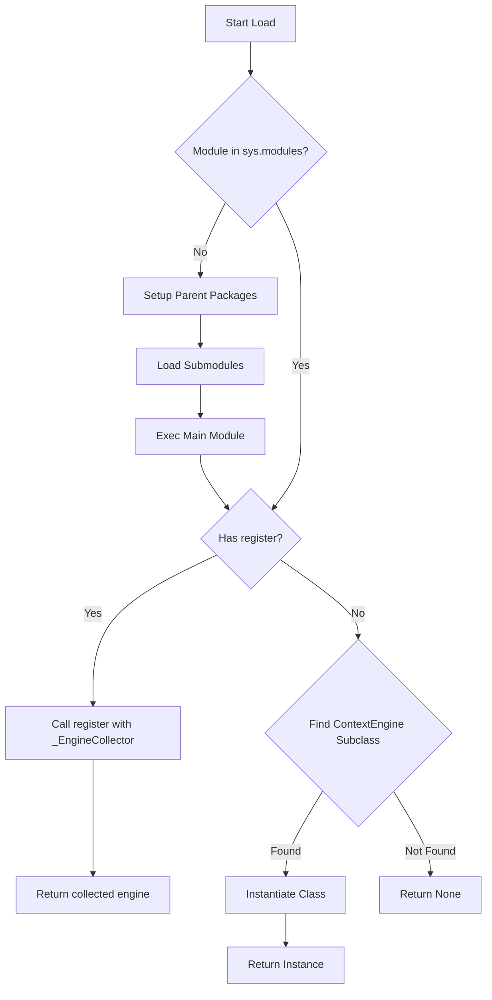

# plugins — context_engine

# Plugins — Context Engine

The `plugins.context_engine` module provides a discovery and loading mechanism for context engine plugins. Unlike general plugins, context engines are built-in components located within the repository at `plugins/context_engine/`. They are responsible for managing, compressing, or transforming the agent's conversation context before it is sent to a Model Provider.

Only one context engine can be active at a time, determined by the `context.engine` setting in `config.yaml`. The default engine is `compressor`.

## Plugin Structure

Each context engine must reside in its own subdirectory within `plugins/context_engine/`.

```text
plugins/context_engine/
├── my_engine/
│   ├── __init__.py    # Entry point
│   ├── plugin.yaml    # Metadata (optional)
│   └── logic.py       # Implementation details
```

### Metadata (`plugin.yaml`)
The discovery system reads `plugin.yaml` to extract descriptive information.
```yaml
description: "A context engine that uses Long Context Memory (LCM) techniques."
```

## Discovery and Loading

The module provides two primary entry points for interacting with engines.

### `discover_context_engines()`
Scans the filesystem for valid engine directories. For each directory, it:
1.  Checks for an `__init__.py`.
2.  Reads the `description` from `plugin.yaml`.
3.  Performs a lightweight availability check by attempting to load the engine and calling its `is_available()` method (if implemented).

**Returns:** A list of tuples: `[(name, description, is_available), ...]`

### `load_context_engine(name)`
Attempts to instantiate a specific engine by name. It handles the complexities of dynamic Python imports, including:
*   Ensuring parent packages (`plugins` and `plugins.context_engine`) are registered in `sys.modules`.
*   Registering submodules within the engine's directory so that relative imports work correctly.
*   Executing the module and extracting the engine instance.

## Implementation Patterns

The loader supports two patterns for defining a context engine. In both cases, the engine must eventually implement the `ContextEngine` abstract base class (ABC) defined in `agent.context_engine`.

### 1. The Registration Pattern (Recommended)
This pattern mimics the general plugin system. The module defines a `register` function that receives a context object.

```python
# plugins/context_engine/my_engine/__init__.py
from .logic import MyCustomEngine

def register(ctx):
    engine = MyCustomEngine()
    ctx.register_context_engine(engine)
```

The loader uses an internal `_EngineCollector` to shim the `ctx` object and capture the registered engine.

### 2. The Class Pattern (Fallback)
If no `register` function is found, the loader scans the module's top-level attributes for any class that is a subclass of `ContextEngine`. If found, it instantiates it without arguments.

```python
# plugins/context_engine/my_engine/__init__.py
from agent.context_engine import ContextEngine

class MyCustomEngine(ContextEngine):
    def shrink_context(self, messages, limit):
        # Implementation
        pass
```

## Internal Execution Flow

The following diagram illustrates how `_load_engine_from_dir` processes a plugin directory to return an executable engine instance.



## Error Handling
*   **Missing Engines:** If `load_context_engine` is called with a name that does not exist on disk, it logs a debug message and returns `None`.
*   **Import Failures:** If a plugin has syntax errors or missing dependencies, the loader catches the exception, logs a warning, and ensures the failed module is removed from `sys.modules` to prevent side effects.
*   **Availability:** Engines can define an `is_available()` method. If this returns `False` during discovery, the engine is marked as unavailable in the UI/CLI but can still be attempted to be loaded.