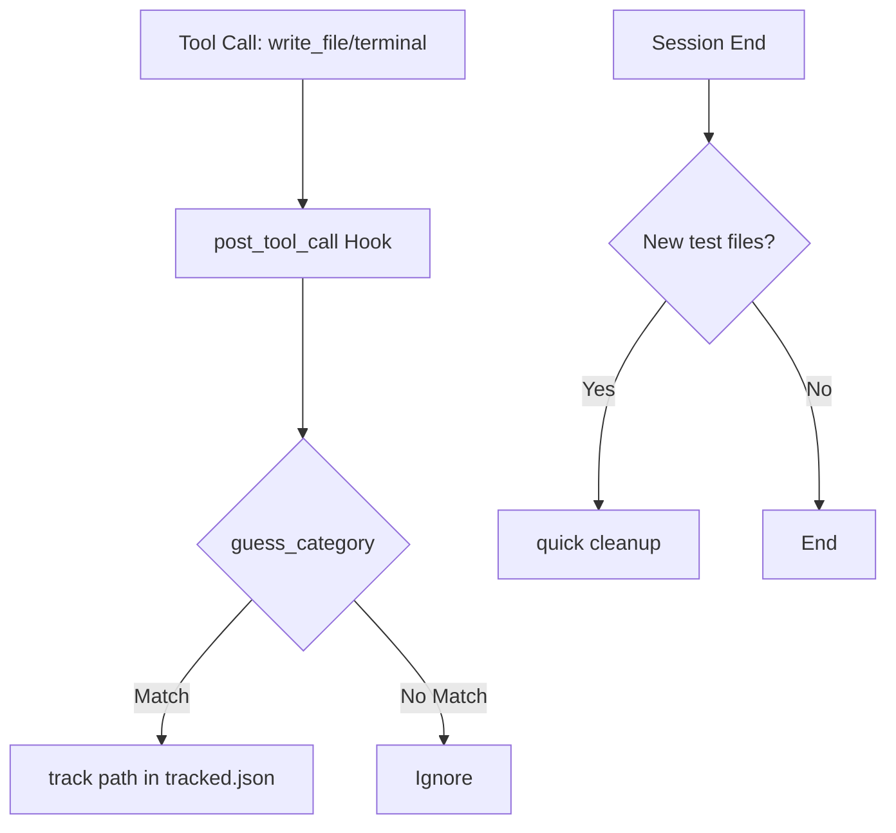

# plugins — disk-cleanup

# disk-cleanup

The `disk-cleanup` plugin provides automated lifecycle management for ephemeral files created during Hermes Agent sessions. It tracks files generated by tools like `write_file` and `terminal`, categorizes them, and applies deterministic cleanup rules to prevent disk bloat within `$HERMES_HOME`.

The module is designed to be "zero-compliance," meaning the agent does not need to manually invoke cleanup tools; the behavior is wired directly into the agent's tool-call and session hooks.

## Architecture and Lifecycle

The plugin integrates with the Hermes Agent via three primary entry points:

1.  **`post_tool_call` Hook**: Intercepts the results of `write_file`, `patch`, and `terminal`. It parses file paths and uses `guess_category()` to determine if a file should be tracked.
2.  **`on_session_end` Hook**: Triggered when a session finishes. If any files categorized as `test` were created during the session, it automatically invokes `disk_cleanup.quick()`.
3.  **Slash Command**: Provides a manual interface via `/disk-cleanup` for status reporting and deep cleaning.

## File Tracking and Categorization

Tracking is handled by `disk_cleanup.track()`. Before a path is added to the tracking database, it must pass `is_safe_path()`.

### Safety Constraints
- **Allowed Scopes**: Strictly `$HERMES_HOME` or `/tmp/hermes-*`.
- **Exclusions**: Rejects Windows mounts (e.g., `/mnt/c`), system directories, and internal Hermes state directories (e.g., `logs/`, `memories/`, `sessions/`, `plugins/`).
- **Persistence**: Tracking data is stored in `$HERMES_HOME/disk-cleanup/tracked.json`.

### Categories and Retention Rules
The `quick()` cleanup function processes files based on the following logic:

| Category | Pattern / Source | Retention Policy | Cleanup Type |
| :--- | :--- | :--- | :--- |
| `test` | `test_*`, `*.test.py`, etc. | Delete at session end | Automatic |
| `temp` | `tmp_*`, `cache/` | Delete after 7 days | Automatic |
| `cron-output` | `cron/`, `cronjobs/` | Delete after 14 days | Automatic |
| `empty-dirs` | Any empty dir in home | Delete immediately | Automatic |
| `research` | Manual / Pattern | Keep 10 newest; prompt >30 days | Deep Only |
| `chrome-profile`| Chrome automation | Prompt after 14 days | Deep Only |
| `large-files` | Files > 500 MB | Always prompt | Deep Only |

## Core Components

### `disk_cleanup.py` (Logic Engine)
- **`quick()`**: The primary automated cleanup function. It iterates through `tracked.json`, unlinks expired files, removes empty directories (excluding protected top-level dirs like `skills`), and updates the state file.
- **`deep(confirm_callable)`**: An interactive cleanup mode. It performs a `quick()` pass and then identifies "risky" items (large files or old research) that require a confirmation callback to delete.
- **`guess_category(path)`**: Heuristic engine that maps file names and locations to categories.
- **`load_tracked()` / `save_tracked()`**: Handles atomic I/O for the tracking database. It uses a `.tmp` -> `.bak` -> rename pattern to prevent data loss during crashes.

### `__init__.py` (Plugin Integration)
- **`_on_post_tool_call`**: Extracts paths from tool arguments. For `terminal` calls, it tokenizes the command string and regex-scans the output to find created files.
- **`_on_session_end`**: Manages a thread-safe set of `_recent_test_tracks`. This ensures that cleanup only triggers if the current session actually produced ephemeral test artifacts.

## Manual Control (Slash Commands)

Developers can interact with the plugin using the `/disk-cleanup` command:

- `/disk-cleanup status`: Displays a breakdown of tracked files by category and lists the top 10 largest files.
- `/disk-cleanup dry-run`: Previews which files would be deleted by `quick` vs. which would require prompts in `deep`.
- `/disk-cleanup quick`: Manually triggers the deterministic cleanup.
- `/disk-cleanup deep`: Runs `quick` and lists items requiring manual deletion.
- `/disk-cleanup track <path> <category>`: Manually adds a file to the tracking system.
- `/disk-cleanup forget <path>`: Removes a file from `tracked.json` without deleting the physical file.

## Data Persistence and Logging
All actions are logged to `$HERMES_HOME/disk-cleanup/cleanup.log`. This log is independent of the standard agent logs to ensure auditability of filesystem changes even if session logs are rotated or cleared.