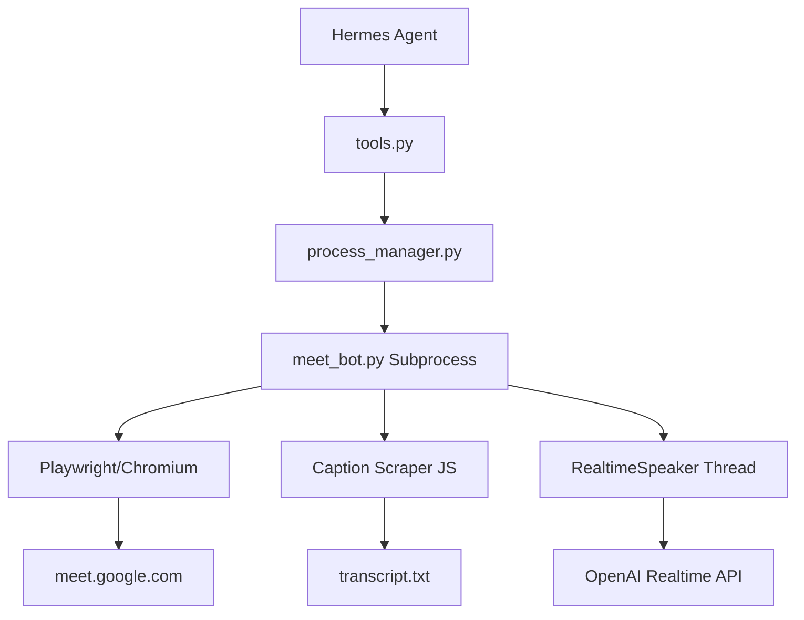

# plugins — google_meet

# google_meet Plugin

The `google_meet` plugin enables the Hermes agent to participate in Google Meet calls. It supports live transcription via caption scraping, real-time duplex audio for agent speech, and remote execution via node hosts.

## Architecture

The module is designed to be "explicit-by-design," meaning it only joins URLs provided by the user and does not perform automated calendar scanning or dialing.

## Core Components

### 1. Bot Orchestration (`meet_bot.py`)
The `meet_bot.py` script runs as a standalone subprocess. It uses Playwright to automate a Chromium instance.
- **Caption Scraping**: Instead of intercepting WebRTC audio, the bot enables Google Meet's built-in live captions and uses a `MutationObserver` (defined in `_CAPTION_OBSERVER_JS`) to scrape text from the DOM.
- **Safety Gate**: The `_is_safe_meet_url` function enforces a regex check to ensure the bot only navigates to valid `meet.google.com` domains.
- **State Management**: The `_BotState` class flushes internal state (e.g., `inCall`, `lobbyWaiting`, `transcriptLines`) to a `status.json` file every second.

### 2. Process Lifecycle (`process_manager.py`)
This module manages the lifecycle of the bot subprocess.
- **Single Instance**: It enforces a "one active meeting" rule. Calling `start()` while a bot is already running triggers `stop()` on the existing process.
- **Active Tracking**: It maintains a `.active.json` file in `$HERMES_HOME/workspace/meetings/` containing the PID, meeting ID, and output directory.
- **Cleanup**: The `stop()` function sends `SIGTERM` to the bot, waiting up to 10 seconds for a clean exit before falling back to `SIGKILL`.

### 3. Audio Bridge (`audio_bridge.py`)
For `realtime` mode, the plugin provisions a virtual audio device to feed generated speech into Chromium's microphone input.
- **Linux**: Uses `pactl` to create a `module-null-sink` and a `module-virtual-source`. The bot sets the `PULSE_SOURCE` environment variable so Chromium picks up the virtual mic.
- **macOS**: Requires `BlackHole 2ch`. The module verifies installation but requires the user to manually set the system input to BlackHole to avoid unexpected system audio changes.

### 4. Real-time Speech (`realtime/openai_client.py`)
When `mode='realtime'` is enabled:
- **RealtimeSession**: Establishes a WebSocket connection to OpenAI's Realtime API.
- **PCM Pump**: The `RealtimeSpeaker` thread monitors `say_queue.jsonl`. When the agent calls `meet_say`, text is enqueued, sent to OpenAI, and the resulting PCM audio is streamed into the virtual audio device.
- **Barge-in**: The bot monitors incoming captions. If a human speaker is detected while the bot is speaking, it calls `session.cancel_response()` to stop the agent's speech immediately.

## Remote Node Execution (`node/`)
The plugin supports running the browser on a different machine (e.g., a user's Mac with a signed-in Google profile) while the gateway runs on a server.

- **NodeServer**: A WebSocket server that wraps `process_manager.py` and executes commands locally on the node host.
- **NodeClient**: A synchronous RPC client used by the gateway to send commands (`start_bot`, `say`, `status`) to the remote node.
- **Protocol**: Uses a JSON-over-WebSocket envelope defined in `protocol.py`. All requests require a 32-character hex bearer token generated by the server and approved on the gateway via `hermes meet node approve`.

## Data Layout
All meeting data is stored under `$HERMES_HOME/workspace/meetings/<meeting-id>/`:
- `status.json`: Live telemetry (timestamps, error states, audio metrics).
- `transcript.txt`: The accumulated meeting transcript.
- `say_queue.jsonl`: A queue of text for the bot to speak (realtime mode only).
- `speaker.pcm`: The raw PCM audio buffer being fed to the virtual mic.
- `bot.log`: Combined stdout/stderr from the Playwright subprocess.

## Tool Integration
The plugin registers five primary tools via `tools.py`:
1. `meet_join`: Spawns the bot. Accepts `mode` (`transcribe` or `realtime`) and `node` (for remote execution).
2. `meet_status`: Returns the current state of the bot and meeting admission status.
3. `meet_transcript`: Reads the `transcript.txt` file, optionally returning only the `last` N lines.
4. `meet_say`: Enqueues text for the bot to speak (requires `realtime` mode).
5. `meet_leave`: Terminates the bot process and cleans up the active session pointer.