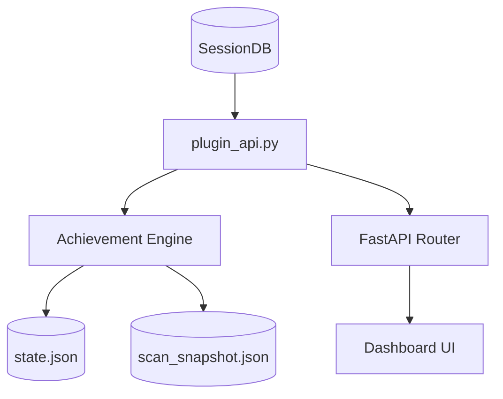

# plugins — hermes-achievements

# Hermes Achievements

The `hermes-achievements` module is a built-in dashboard plugin that implements a tiered achievement system. It analyzes local Hermes session history to unlock badges based on agent autonomy, debugging patterns, "vibe coding" behaviors, and model usage.

## Architecture Overview

The plugin consists of a FastAPI backend (`plugin_api.py`) and a pre-bundled frontend. It integrates directly with the Hermes `SessionDB` to perform retrospective analysis of all user interactions.



## The Achievement Engine

The engine operates by transforming raw session messages into a set of metrics, which are then evaluated against achievement definitions.

### 1. Message Analysis
The `analyze_messages` function is the core parser. It iterates through session messages and uses regular expressions and tool-call inspection to extract:
*   **Tool Usage:** Counts for terminal, web, browser, and file tools.
*   **Error Patterns:** Detection of port conflicts (`PORT_RE`), permission denials, and stack traces.
*   **Context Signals:** Mentions of token limits, prompt caching, or rollbacks.
*   **Model Metadata:** Identification of providers (OpenRouter, Anthropic, etc.) and local vs. cloud models.

### 2. Evaluation Logic
Achievements are defined in the `ACHIEVEMENTS` list. Each definition uses one of three evaluation strategies via `evaluate_definition`:
*   **Tiered (`kind: "best_session"` or `"lifetime"`):** Uses `threshold_metric` to map progress to a ladder (Copper → Silver → Gold → Diamond → Olympian).
*   **Multi-condition (`kind: "multi_condition"`):** Requires multiple metrics to meet specific thresholds (e.g., "Full Send" requires terminal, file, and web tool usage).
*   **Boolean:** A simple check for the presence of a specific event.

### 3. Achievement States
*   **Unlocked:** Requirements met; `unlocked_at` timestamp and `evidence` (the specific session) are recorded.
*   **Discovered:** Requirements not met, but the user has made progress.
*   **Secret:** Hidden from the UI until the first relevant signal is detected (e.g., `port_3000_taken`).

## Scanning & Performance

Because session histories can grow to thousands of entries, the module implements a multi-layered performance strategy.

### Incremental Scanning
`scan_sessions` uses a checkpoint system (`scan_checkpoint.json`) to avoid redundant processing.
1.  **Fingerprinting:** Each session is fingerprinted using `(id, started_at, last_active, model, title)`.
2.  **Reuse:** If the fingerprint matches the checkpoint, the previously analyzed stats are reused.
3.  **Re-scan:** Only new or mutated sessions are passed to `analyze_messages`.

### Background Execution
To prevent blocking the Dashboard UI, `evaluate_all` manages a daemon thread (`_BACKGROUND_SCAN_THREAD`):
*   **Stale-While-Revalidate:** If a cached snapshot exists but is older than `SNAPSHOT_TTL_SECONDS` (120s), the API returns the stale data immediately and triggers a background scan.
*   **Single-Flight:** A `_SCAN_LOCK` ensures only one scan runs at a time.
*   **Partial Updates:** During long scans, the engine publishes intermediate snapshots so the UI can show incremental progress.

## API Reference

The backend router is mounted at `/api/plugins/hermes-achievements/`.

| Endpoint | Method | Description |
| :--- | :--- | :--- |
| `/achievements` | `GET` | Returns the full list of achievements, counts, and scan metadata. |
| `/scan-status` | `GET` | Returns the current state of the background scanner (`idle`, `running`, `failed`). |
| `/recent-unlocks` | `GET` | Returns the 20 most recently earned badges. |
| `/sessions/{id}/badges` | `GET` | Returns badges specifically earned within a single session. |
| `/rescan` | `POST` | Forces a synchronous, full re-scan of the database. |
| `/reset-state` | `POST` | Deletes all unlocks, snapshots, and checkpoints. |

## Data Persistence

All data is stored in the Hermes home directory (typically `~/.hermes/plugins/hermes-achievements/`):

*   **`state.json`**: The permanent record of unlocked achievements and their timestamps. This file is preserved during plugin updates.
*   **`scan_snapshot.json`**: A cached version of the full `/achievements` response for fast subsequent loads.
*   **`scan_checkpoint.json`**: Internal mapping of session fingerprints to their calculated metrics, used for incremental scanning.

## Development & Testing

The module includes a test suite in `tests/test_achievement_engine.py` that validates regex accuracy and evaluation logic without requiring a live Dashboard instance.

To run tests:
```bash
python3 -m unittest tests/test_achievement_engine.py -v
```

When adding new achievements to the `ACHIEVEMENTS` list, ensure the `id` is stable, as it serves as the key in `state.json`. Renaming an ID will cause users to lose that specific unlock progress.