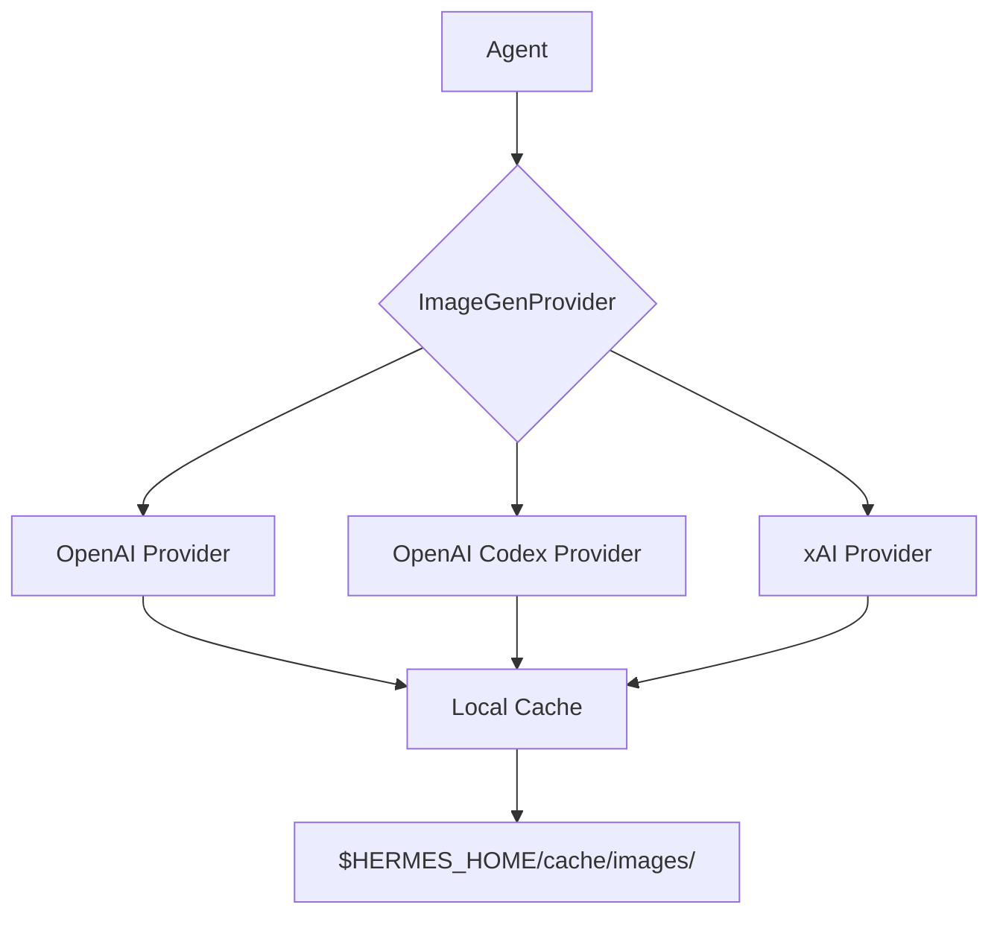

# plugins — image_gen

# Image Generation Plugins

The `plugins/image_gen` module provides a suite of backends for generating images within the Hermes ecosystem. Each plugin implements the `ImageGenProvider` interface, allowing the system to swap between different providers (OpenAI, OpenAI Codex, and xAI) while maintaining a consistent API for the agent.

## Architecture Overview

All image generation plugins follow a standardized lifecycle:
1.  **Registration**: The `register(ctx)` function adds the provider to the global registry.
2.  **Availability Check**: `is_available()` verifies environment variables or OAuth tokens.
3.  **Model Resolution**: `_resolve_model()` determines the specific model tier based on environment variables, `config.yaml`, or defaults.
4.  **Generation**: `generate()` handles the API request, processes the response, and persists the image to the local cache.

---

## OpenAI Provider (`openai`)

The standard OpenAI provider interfaces with the `images.generate` REST endpoint. It exposes the `gpt-image-2` model through three virtual quality tiers.

### Model Tiers
| Tier ID | Quality | Speed | Use Case |
| :--- | :--- | :--- | :--- |
| `gpt-image-2-low` | `low` | ~15s | Fast iteration |
| `gpt-image-2-medium` | `medium` | ~40s | Default balanced |
| `gpt-image-2-high` | `high` | ~2min | High fidelity |

### Implementation Details
- **Authentication**: Requires `OPENAI_API_KEY`.
- **Response Handling**: Prefers `b64_json` from the OpenAI response. If the API returns a URL instead, it falls back to the URL reference.
- **Persistence**: Uses `save_b64_image` to store the result as a PNG in the local cache.

---

## OpenAI Codex Provider (`openai-codex`)

This provider uses the ChatGPT/Codex OAuth variant. It is designed for users authenticated via `hermes auth codex`, removing the need for a standalone OpenAI API key.

### Key Differences from Standard OpenAI
- **Routing**: Instead of the `images.generate` endpoint, it routes requests through the Codex Responses API using the `image_generation` tool.
- **Host Model**: Uses `gpt-5.4` as the host model to trigger the tool call.
- **Authentication**: Delegates token management to `agent.auxiliary_client._read_codex_access_token`. It handles JWT decoding and credential pool selection (via `agent.credential_pool`).
- **Streaming**: Uses `_collect_image_b64` to stream the response and extract the image data from `response.output_item.done` or `response.image_generation_call.partial_image` events.

---

## xAI Provider (`xai`)

The xAI provider interfaces with the `grok-imagine-image` model. It offers more granular control over aspect ratios and resolutions compared to the OpenAI-based providers.

### Configuration
- **Resolution**: Supports `1k` (1024px) and `2k` (2048px), configurable via `image_gen.xai.resolution`.
- **Aspect Ratios**: Maps internal Hermes ratios to xAI-specific strings (e.g., `landscape` -> `16:9`, `portrait` -> `9:16`).
- **User Agent**: Uses `tools.xai_http.hermes_xai_user_agent()` for identification.

### Implementation Details
- **Authentication**: Requires `XAI_API_KEY`.
- **HTTP Client**: Uses the `requests` library with a 120s timeout to handle high-resolution generation.

---

## Common Logic and Utilities

### Model Selection Precedence
All providers implement a `_resolve_model()` helper that follows this priority:
1.  **Environment Variable**: (e.g., `OPENAI_IMAGE_MODEL` or `XAI_IMAGE_MODEL`).
2.  **Provider-Specific Config**: `image_gen.<provider>.model` in `config.yaml`.
3.  **Global Config**: `image_gen.model` in `config.yaml`.
4.  **Default**: Hardcoded `DEFAULT_MODEL` (usually the "medium" tier).

### Image Persistence
Images are saved using `agent.image_gen_provider.save_b64_image`. 
- **Path**: `$HERMES_HOME/cache/images/`
- **Format**: PNG
- **Naming**: Prefixed by the provider and model ID (e.g., `openai_codex_gpt-image-2-medium_...png`).

### Error Handling
Providers use `error_response` to return standardized error dictionaries. Common `error_type` values include:
- `auth_required`: Missing API keys or expired OAuth tokens.
- `invalid_argument`: Empty prompts or unsupported aspect ratios.
- `api_error`: Non-200 responses from the upstream provider.
- `io_error`: Failures during image caching.