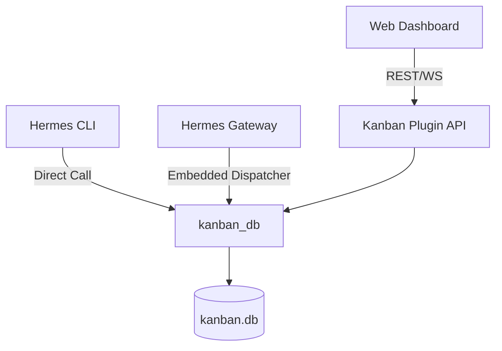

# plugins — kanban

# Kanban Plugin

The Kanban module provides a multi-agent collaboration board for the Hermes dashboard. It allows users to manage tasks through a drag-and-drop interface, track agent execution in real-time, and manage task dependencies and comments.

The module consists of a FastAPI backend (`plugin_api.py`) that wraps the core `hermes_cli.kanban_db` logic, providing a REST and WebSocket interface for the dashboard frontend.

## Architecture Overview

The Kanban system operates as a thin API layer over a shared SQLite database. It is designed to be used by three concurrent surfaces: the CLI, the Gateway, and the Dashboard.

### Data Persistence
All state is stored in `kanban.db`. The API uses `kanban_db.init_db()` to ensure the schema exists on the first request. It utilizes SQLite's WAL (Write-Ahead Logging) mode to allow the dashboard to perform reads while the dispatcher or gateway performs immediate write transactions.

## Backend API

The backend is mounted at `/api/plugins/kanban/`.

### Board and Task Management
*   **`GET /board`**: Returns the full state of the board. It aggregates tasks into columns (`triage`, `todo`, `ready`, `running`, `blocked`, `done`), calculates progress rollups for parent/child tasks, and provides metadata for UI filters (tenants and assignees).
*   **`GET /tasks/{task_id}`**: Fetches full task details, including comment threads, event history, run history, and link relationships.
*   **`POST /tasks`**: Creates a new task. If a task is created in the `ready` state and assigned to a profile, the API performs a "dispatcher presence check" to warn the user if no worker is available to pick it up.
*   **`PATCH /tasks/{task_id}`**: Updates task attributes. This endpoint handles complex state transitions:
    *   **Status Changes**: Uses structured verbs like `complete_task`, `block_task`, or `archive_task`.
    *   **Direct Moves**: For transitions not covered by specific verbs (e.g., `todo` to `ready`), it uses `_set_status_direct`.
    *   **Run Management**: If a task is moved out of the `running` state manually via the dashboard, the API automatically closes the active run with a `reclaimed` outcome to prevent orphaned run records.

### Bulk Operations
The `POST /tasks/bulk` endpoint allows applying status, assignee, or priority changes to multiple tasks simultaneously. It processes updates independently, returning a list of successes and failures per ID to ensure one invalid task doesn't block the entire batch.

### Real-time Updates (`/events`)
Live updates are delivered via a WebSocket at `/events`. 
*   **Mechanism**: The server tails the `task_events` table using a short poll interval (300ms).
*   **Cursor-based**: Clients provide a `since` parameter (event ID) to resume the stream without missing data.
*   **Authentication**: Since browsers cannot set custom headers on WebSocket upgrade requests, authentication is handled via a `?token=` query parameter, which is compared against the dashboard's internal session token using `hmac.compare_digest`.

## Task Execution & Dispatching

Tasks in the `ready` state are picked up by a dispatcher. 

1.  **Gateway Integration**: By default, the dispatcher runs inside the Hermes Gateway (`kanban.dispatch_in_gateway: true`).
2.  **Manual Nudge**: The `POST /dispatch` endpoint allows the dashboard to trigger an immediate dispatch cycle, bypassing the standard 60-second poll interval.
3.  **Logs**: Worker output (stdout/stderr) is written to disk. The `GET /tasks/{task_id}/log` endpoint provides a tail of these logs, capped by a `tail` byte parameter to prevent browser memory issues.

## Configuration

The plugin reads preferences from the global `~/.hermes/config.yaml` under the `dashboard.kanban` section. The `GET /config` endpoint exposes these to the frontend:
*   `default_tenant`: Pre-selects a tenant filter.
*   `lane_by_profile`: Toggles sub-grouping tasks by assignee.
*   `render_markdown`: Controls whether task bodies and comments are rendered as HTML.

## Security Model

*   **Network Binding**: The dashboard binds to `localhost` by default. Consequently, the `/api/plugins/` routes skip standard HTTP authentication to simplify local development.
*   **Remote Access**: If the dashboard is hosted on `0.0.0.0`, these routes become public. Users must ensure network-level security (SSH tunneling or VPN) in such configurations.
*   **WebSocket Security**: Unlike the HTTP routes, the WebSocket endpoint strictly validates the session token to prevent cross-site hijacking.