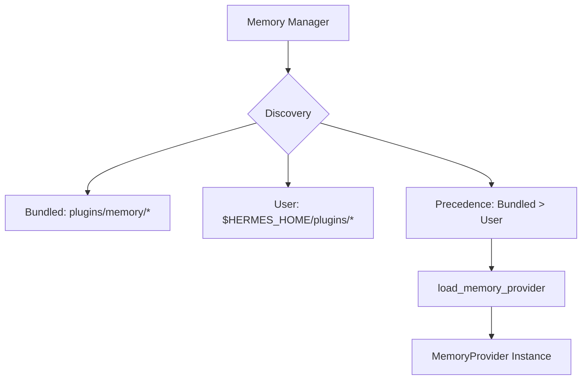

# plugins — memory

# Plugins — Memory

The `plugins.memory` module is the discovery and orchestration layer for Hermes Agent memory providers. It allows the system to dynamically scan, load, and switch between different long-term memory backends (e.g., Hindsight, ByteRover, Holographic) while maintaining a unified interface for the agent.

## Architecture Overview

The module implements a plugin architecture where only **one** provider is active at a time, determined by the `memory.provider` setting in the global `config.yaml`.

## Plugin Discovery

Discovery is handled by `discover_memory_providers()`, which yields a list of available backends.

### Search Locations
1.  **Bundled Providers:** Located in `plugins/memory/<name>/`. These are shipped with the `hermes-agent` core.
2.  **User-installed Providers:** Located in `$HERMES_HOME/plugins/<name>/`.

### Discovery Heuristics
To avoid importing every directory in the plugin path, the module uses `_is_memory_provider_dir(path)`. This function performs a "cheap" text scan of the first 8KB of the plugin's `__init__.py` looking for the strings `register_memory_provider` or `MemoryProvider`.

## Loading Mechanism

The `load_memory_provider(name)` function resolves a provider name to a directory and invokes `_load_provider_from_dir(path)`.

### Namespace Isolation
To prevent collisions between bundled and user-installed plugins, the module uses distinct namespaces:
*   Bundled: `plugins.memory.<name>`
*   User: `_hermes_user_memory.<name>`

### Instantiation Patterns
The loader supports two patterns for plugin entry points:
1.  **Registration Pattern:** The module defines a `register(ctx)` function. The loader passes a `_ProviderCollector` (a fake context) to capture the `MemoryProvider` instance via `ctx.register_memory_provider(instance)`.
2.  **Subclass Pattern:** The loader scans the module's attributes for any class that is a subclass of `agent.memory_provider.MemoryProvider` and instantiates it.

### Relative Import Support
The loader manually registers submodules in `sys.modules` during the import process. This ensures that relative imports within a plugin (e.g., `from .store import MemoryStore`) function correctly even when the plugin is loaded from an arbitrary filesystem path outside the standard Python path.

## CLI Integration

Memory plugins can extend the `hermes` CLI by providing a `cli.py` file. The `discover_plugin_cli_commands()` function handles this integration.

*   **Active-Only:** Only the CLI commands for the currently active provider (defined in config) are loaded.
*   **Lightweight Scan:** It imports only the `cli.py` file, not the full provider module, making it safe to call during `argparse` setup.
*   **Registration:** It looks for a `register_cli(subparser)` function and a handler function (typically named `<provider>_command`).

## Provider Implementations

The module includes several reference implementations of the `MemoryProvider` ABC:

### Hindsight (`hindsight`)
A sophisticated long-term memory provider featuring:
*   **Modes:** Cloud, Local Embedded (starts a background daemon), and Local External.
*   **Logic:** Uses a knowledge graph with entity resolution.
*   **Lifecycle:** Implements `on_session_switch` to handle session branching and resets without data loss.

### ByteRover (`byterover`)
A local-first memory provider that interfaces with the `brv` CLI.
*   **Storage:** Hierarchical knowledge tree.
*   **Execution:** Uses `subprocess` to run `brv query` and `brv curate`.
*   **Background Sync:** Conversation turns are curated in a background thread to avoid blocking the agent's response.

### Holographic (`holographic`)
A local SQLite-based fact store.
*   **Retrieval:** Uses HRR (Holographic Reduced Representations) for compositional retrieval.
*   **Trust Scoring:** Includes a `fact_feedback` tool to adjust the trust scores of stored facts based on their utility.

## Key Functions Reference

| Function | Description |
| :--- | :--- |
| `discover_memory_providers()` | Returns `[(name, desc, available), ...]` for all found plugins. |
| `load_memory_provider(name)` | Returns an instantiated `MemoryProvider` or `None`. |
| `find_provider_dir(name)` | Resolves a provider name to its `Path` on disk. |
| `discover_plugin_cli_commands()` | Returns metadata for CLI subcommands of the active plugin. |