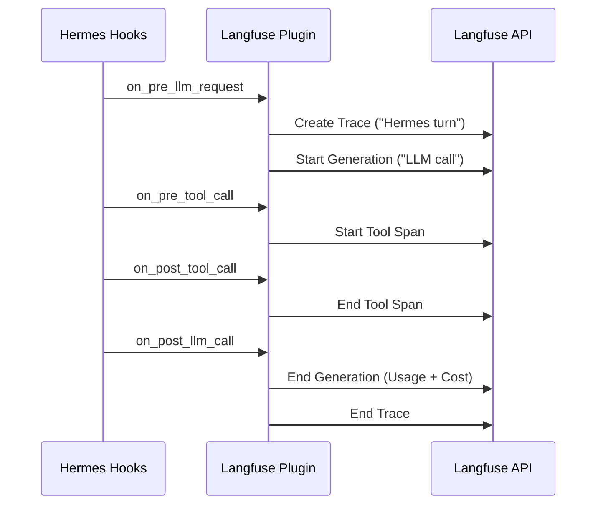

# plugins — observability

# Langfuse Observability Plugin

The `plugins/observability/langfuse` module provides deep integration with [Langfuse](https://langfuse.com/) to trace Hermes conversations, LLM generations, and tool executions. It is designed as an **opt-in, fail-open** plugin: if the SDK is missing or credentials are not configured, the plugin remains inert without interrupting the main execution flow.

## Architecture Overview

The plugin operates by subscribing to Hermes' internal hook system. It maintains a global, thread-safe state of active traces, mapping Hermes `task_id` or `session_id` to Langfuse trace objects.

### Trace Lifecycle

The plugin manages three levels of Langfuse objects:
1.  **Trace (Root):** Represents a single "turn" or task in Hermes.
2.  **Generation:** Represents an LLM API call (input prompts, output text, and usage metadata).
3.  **Span/Tool:** Represents the execution of a specific tool.

## Key Components

### State Management
The module uses a `TraceState` dataclass to track active observations.
- `_TRACE_STATE`: A dictionary mapping task keys to `TraceState`.
- `_STATE_LOCK`: A threading lock ensuring thread safety during concurrent chat sessions.
- `_trace_key()`: Generates a unique key based on `task_id`, `session_id`, or the current thread identity.

### Data Sanitization and Normalization
To prevent oversized payloads and protect sensitive data, the plugin passes all inputs/outputs through `_safe_value()`:
- **Truncation:** Strings exceeding `HERMES_LANGFUSE_MAX_CHARS` (default 12,000) are truncated.
- **Depth Limiting:** Recursive structures are limited to a depth of 4 to prevent stack overflows.
- **JSON Parsing:** Strings that look like JSON (common in tool arguments/results) are automatically parsed into objects for better UI visualization in Langfuse.

### Specialized Tool Handling
The plugin includes specific logic for the `read_file` tool via `_normalize_read_file_payload`. Instead of sending massive file contents to Langfuse, it:
1.  Parses the line-numbered output.
2.  Extracts a "Head" (first 25 lines) and "Tail" (last 15 lines).
3.  Reports metadata like `total_lines` and `file_size`.

## Hook Implementations

The plugin registers for multiple hook variants to ensure compatibility across different Hermes versions.

### LLM Tracing
- **`on_pre_llm_request` / `on_pre_llm_call`**: Initializes the root trace if it doesn't exist and starts a new `generation` observation. It captures the serialized message history.
- **`on_post_llm_call`**: Finalizes the generation. It extracts the assistant's response, reasoning, and tool calls. It also triggers the cost calculation logic.

### Tool Tracing
- **`on_pre_tool_call`**: Starts a `tool` type observation.
- **`on_post_tool_call`**: Ends the observation, capturing the tool's return value and normalizing it (e.g., handling the `read_file` preview logic).

## Usage and Cost Integration

The plugin integrates with the `agent.usage_pricing` module to provide accurate financial tracking.

Inside `_usage_and_cost()`, the plugin:
1.  Converts raw provider usage into a `CanonicalUsage` object.
2.  Maps tokens to Langfuse-specific keys (e.g., `cache_read_input_tokens`, `cache_creation_input_tokens`) so the Langfuse dashboard correctly aggregates cache savings.
3.  Calculates USD cost using `estimate_usage_cost` and `get_pricing_entry`, providing a per-type breakdown (input vs. output vs. cache) to Langfuse.

## Configuration

The plugin is configured via environment variables, typically stored in `~/.hermes/.env`.

| Variable | Description |
| :--- | :--- |
| `HERMES_LANGFUSE_PUBLIC_KEY` | Langfuse Project Public Key |
| `HERMES_LANGFUSE_SECRET_KEY` | Langfuse Project Secret Key |
| `HERMES_LANGFUSE_BASE_URL` | Server URL (defaults to Langfuse Cloud) |
| `HERMES_LANGFUSE_SAMPLE_RATE` | Float 0.0-1.0 to control trace volume |
| `HERMES_LANGFUSE_MAX_CHARS` | Max length for any single text field |
| `HERMES_LANGFUSE_DEBUG` | Enables verbose logging for plugin troubleshooting |

## Fail-Open Logic

The `_get_langfuse()` function ensures the plugin never crashes the host application:
- It checks if the `langfuse` SDK is installed.
- It verifies the presence of required API keys.
- If any check fails, it sets an internal `_INIT_FAILED` sentinel and returns `None`, causing all subsequent hook calls to return immediately.