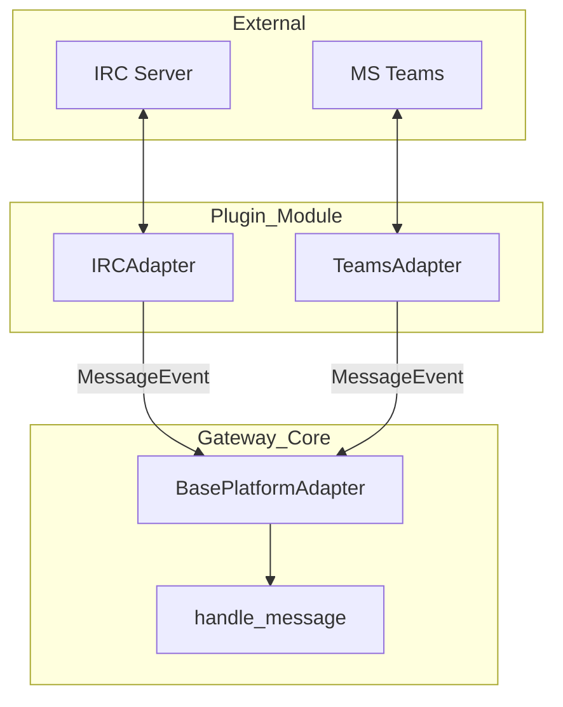

# plugins — platforms

# Plugins: Platforms

The `plugins/platforms` module contains gateway adapters that bridge the Hermes Agent with external communication networks. Each sub-module implements the `BasePlatformAdapter` interface, translating platform-specific protocols (like IRC or the Microsoft Bot Framework) into a unified `MessageEvent` format for the Hermes gateway.

## Architecture Overview

Platform adapters are discovered and loaded as plugins. They handle the connection lifecycle, message serialization/deserialization, and platform-specific UI features (like Adaptive Cards in Teams or raw text splitting in IRC).

---

## IRC Platform (`plugins/platforms/irc`)

The IRC adapter provides a lightweight, zero-dependency gateway to IRC networks. It uses Python's `asyncio` and `ssl` standard libraries to implement the IRC protocol.

### Key Components

- **`IRCAdapter`**: The primary class managing the socket connection and protocol state.
- **`_receive_loop`**: An asynchronous task that reads raw bytes from the server, handles PING/PONG keep-alives, and buffers lines for processing.
- **`_handle_line`**: Dispatches parsed IRC commands. It handles registration (RPL_WELCOME), nickname collisions (ERR_NICKNAMEINUSE), and incoming messages (PRIVMSG).
- **`_split_message`**: IRC has a strict ~512-byte line limit. This method performs binary search on UTF-8 boundaries to split long agent responses into multiple `PRIVMSG` commands without breaking characters.

### Protocol Handling
- **Markdown Stripping**: Since IRC is a plain-text protocol, `_strip_markdown` removes bold, italic, and code block syntax before transmission.
- **Authentication**: Supports server passwords (`PASS`) and NickServ identification.
- **Access Control**: Implements nick-based filtering via `allowed_users`. Note that IRC nicks are not inherently authenticated; for production use, this should be paired with a network that enforces NickServ registration.

---

## Microsoft Teams Platform (`plugins/platforms/teams`)

The Teams adapter integrates with the Microsoft Bot Framework using the `microsoft-teams-apps` SDK and `aiohttp`.

### Webhook Integration
Unlike the IRC adapter's persistent socket, Teams operates via webhooks. 
- **`_AiohttpBridgeAdapter`**: A shim that captures the SDK's route registrations and wires them into an `aiohttp.web.Application`. This allows Hermes to avoid the SDK's default dependency on FastAPI/Uvicorn.
- **`_on_message`**: Processes incoming `Activity` objects, strips bot @mentions using regex, and handles image attachments by caching them via `cache_image_from_url`.

### Interactive Features
- **Adaptive Cards**: The adapter uses `send_exec_approval` to dispatch interactive cards for sensitive tool executions.
- **`_on_card_action`**: Handles `Action.Execute` events. When a user clicks "Approve" or "Deny" on a card, this method invokes `resolve_gateway_approval` in the `tools.approval` module to unblock the agent's execution flow.
- **Conversation References**: The adapter maintains a mapping of `chat_id` to `ConversationReference` in `self._conv_refs`. This allows the bot to send proactive messages and cards to the correct conversation context (Personal, Group, or Channel).

---

## Plugin Registration

Every platform must implement a `register(ctx)` function. This function provides the gateway with:

1.  **`adapter_factory`**: A lambda or function that instantiates the adapter class.
2.  **`setup_fn`**: An `interactive_setup` routine used by the `hermes gateway setup` CLI command.
3.  **`platform_hint`**: Guidance for the LLM on how to format its responses for this specific platform (e.g., "Use plain text for IRC").
4.  **Requirements Check**: `check_fn` and `validate_config` ensure the environment has the necessary libraries (like `aiohttp` for Teams) and credentials (like `IRC_SERVER`).

### Common Configuration Pattern
Platforms support configuration via `config.yaml` under `gateway.platforms.<name>` or via environment variables. Environment variables always take precedence.

| Platform | Required Environment Variables |
| :--- | :--- |
| **IRC** | `IRC_SERVER`, `IRC_CHANNEL`, `IRC_NICKNAME` |
| **Teams** | `TEAMS_CLIENT_ID`, `TEAMS_CLIENT_SECRET`, `TEAMS_TENANT_ID` |

---

## Implementation Details

### Message Deduplication
The `TeamsAdapter` utilizes `gateway.platforms.helpers.MessageDeduplicator` to prevent processing the same `activity.id` multiple times, which can occur during webhook retries.

### Connection Lifecycle
- **`connect()`**: Initializes the underlying transport (socket or webhook server). For IRC, this includes the `NICK`/`USER` handshake and waiting for `RPL_WELCOME`.
- **`disconnect()`**: Performs a graceful shutdown (e.g., sending an IRC `QUIT` message) and cleans up resources like `aiohttp` runners or background tasks.
- **`_set_fatal_error()`**: If a connection fails (e.g., invalid credentials or port conflict), adapters call this base method to update the gateway's runtime status, which is visible via `hermes status`.