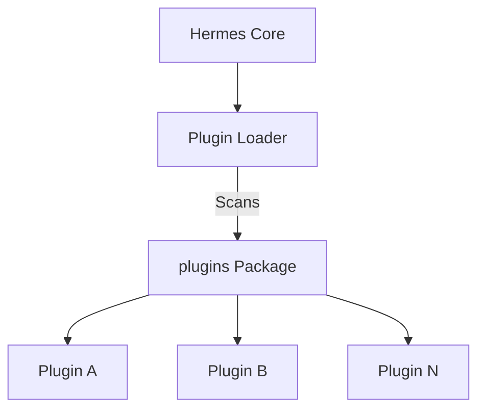

# plugins — plugins

# Hermes Plugins Module

The `plugins` module serves as the central namespace and container for all extensible components within the Hermes ecosystem. It is structured as a Python package to allow for modular discovery and loading of external or internal feature sets.

## Purpose

The primary role of this module is to provide a standardized location for plugin implementations. By grouping extensions under the `plugins` namespace, Hermes maintains a clean separation between core logic and optional or specialized functionality.

Currently, the `plugins/__init__.py` file acts as a package marker, ensuring that any subdirectories or modules within this folder are treatable as part of the `plugins` hierarchy.

## Architecture and Integration

The module is designed to be a passive container. In a typical Hermes execution flow, a plugin loader (located in the core system) will scan this directory to identify and initialize specific plugin classes.

### Plugin Discovery Flow

## Adding New Plugins

To contribute a new plugin to the Hermes system, developers should follow these structural guidelines:

1.  **Create a Sub-package**: Create a new directory within `plugins/` (e.g., `plugins/my_feature/`).
2.  **Initialize the Sub-package**: Include an `__init__.py` in your sub-directory.
3.  **Implement the Interface**: Ensure your plugin follows the expected Hermes plugin interface (typically defined in the core documentation) to ensure the loader can successfully register your code.

## Current State

As of the current version, the `plugins` package is an empty namespace. It does not contain internal logic or execution flows, serving strictly as the architectural anchor for future extensions. Developers looking to modify the plugin loading mechanism should look for the discovery logic in the Hermes core modules rather than within this package.