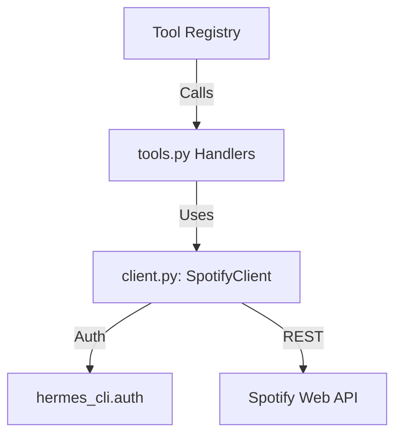

# plugins — spotify

# Spotify Plugin

The `spotify` plugin provides a native integration with the Spotify Web API, exposing seven distinct tools for playback control, catalog searching, and library management. It is implemented as a bundled backend plugin that auto-loads on startup.

## Architecture Overview

The module follows a tiered architecture that separates the raw API communication from the tool-specific logic and the Hermes plugin registration system.

### Key Components

1.  **`__init__.py`**: The entry point. It defines the `_TOOLS` metadata and the `register(ctx)` function used by the Hermes plugin loader to bind handlers to the toolset.
2.  **`client.py`**: A specialized HTTP client (`SpotifyClient`) that manages authentication headers, token refreshing, and Spotify-specific error parsing.
3.  **`tools.py`**: Contains the JSON schemas for the LLM and the handler functions (e.g., `_handle_spotify_playback`) that translate tool arguments into client calls.
4.  **`plugin.yaml`**: Metadata defining the plugin as a `kind: backend` and listing the provided tools.

## Authentication and Gating

The plugin relies on the `hermes auth spotify` flow. It does not manage credentials directly but interfaces with `hermes_cli.auth`.

*   **Gating**: Every tool is registered with a `check_fn` pointing to `_check_spotify_available()`. This function checks `get_auth_status("spotify")`. If the user is not logged in, the tools remain visible in the system but will not execute.
*   **Runtime Resolution**: The `SpotifyClient` calls `resolve_spotify_runtime_credentials()` during initialization.
*   **Token Refresh**: The `SpotifyClient.request` method automatically catches `401 Unauthorized` responses, attempts to refresh the token via the auth module, and retries the request once before failing.

## The Spotify Client (`client.py`)

The `SpotifyClient` is a thin wrapper around `httpx`. It centralizes logic for:

*   **Base URL & Headers**: Automatically applies the `Authorization: Bearer <token>` header.
*   **Response Handling**: Distinguishes between successful content (200 OK), successful empty responses (204 No Content), and structured API errors.
*   **Error Normalization**: Converts raw Spotify API error objects into `SpotifyAPIError` exceptions with developer-friendly messages via `_friendly_spotify_error_message`.

### Data Normalization
Spotify identifies items using IDs, URIs (`spotify:track:...`), and URLs. The client provides utility functions to ensure consistency:
*   `normalize_spotify_id`: Extracts the raw ID from any format.
*   `normalize_spotify_uri`: Ensures a string is in the `spotify:<type>:<id>` format.
*   `normalize_spotify_uris`: Handles lists of identifiers, removing duplicates and validating types.

## Tool Implementation (`tools.py`)

Tools are implemented using an "Action Pattern." Instead of creating dozens of small tools, related capabilities are grouped into a single tool with an `action` parameter.

| Tool Name | Primary Actions |
| :--- | :--- |
| `spotify_playback` | `play`, `pause`, `next`, `previous`, `seek`, `set_volume`, `recently_played` |
| `spotify_devices` | `list`, `transfer` |
| `spotify_queue` | `get`, `add` |
| `spotify_search` | Search tracks, albums, artists, playlists, etc. |
| `spotify_playlists` | `list`, `get`, `create`, `add_items`, `remove_items` |
| `spotify_albums` | `get`, `tracks` |
| `spotify_library` | `list`, `save`, `remove` (supports both tracks and albums via `kind`) |

### Handler Logic
Each handler (e.g., `_handle_spotify_playback`) follows a standard flow:
1.  Extract and sanitize arguments (using helpers like `_coerce_bool` and `_coerce_limit`).
2.  Instantiate a `SpotifyClient`.
3.  Dispatch to the appropriate client method based on the `action` argument.
4.  Wrap the result in `tool_result()` or catch exceptions to return a `tool_error()`.

## Error Handling

The module uses a hierarchy of exceptions to provide specific feedback:
*   **`SpotifyAuthRequiredError`**: Raised when credentials are missing or the session has expired.
*   **`SpotifyAPIError`**: Raised when the Spotify API returns a 4xx or 5xx status code. It includes the `status_code` and the original response body.
*   **`SpotifyError`**: A general base class for validation errors (e.g., invalid URI format).

The `_spotify_tool_error` function in `tools.py` ensures these exceptions are formatted correctly for the Hermes tool execution environment, preventing raw stack traces from being returned to the LLM.